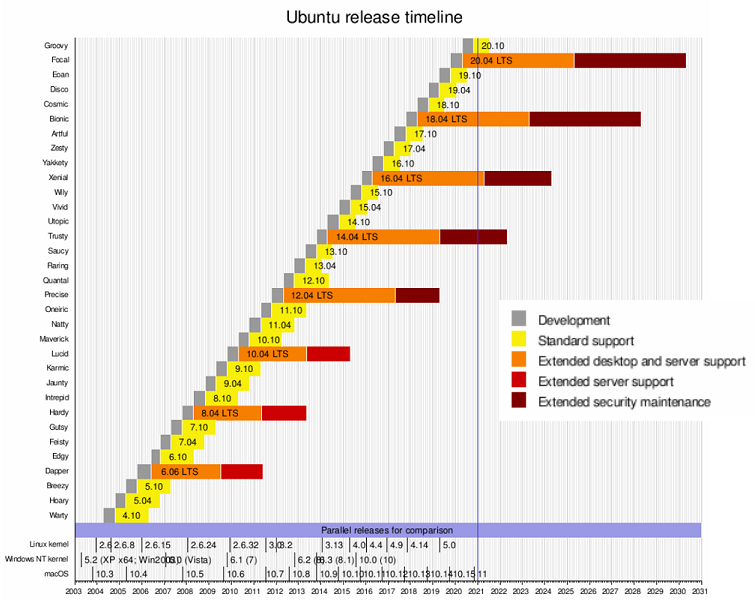

# linux-01

---

# Om Ubuntu

--

Är baserat på (fork av) Debian.

Finns tre officiella versioner: Desktop, Server, Core (IoT)

--

Kommer en ny version var sjätte månad, t.ex 20.04 är släppt 2020 - april.

Som standard är supporttiden sex månader.

Med två års mellanrum släpps det en version som är LTS.

LTS = Long-term support, fem år.

--

[https://en.wikipedia.org/wiki/Ubuntu_version_history](https://en.wikipedia.org/wiki/Ubuntu_version_history)

--

Finns en hel drös med distar som bygger på Ubuntu, t.ex:

- Kubuntu (KDE)
- Lubuntu (LXQt)
- Xubuntu (XFCE)

--

Kolla in denna [https://upload.wikimedia.org/wikipedia/commons/1/1b/Linux_Distribution_Timeline.svg.](https://upload.wikimedia.org/wikipedia/commons/1/1b/Linux_Distribution_Timeline.svg)

---

# Installation

--

## Ladda ner ISO-filen

Börja med att surfa till [https://ubuntu.com/download/server](https://ubuntu.com/download/server)

Klicka på **Option 3**

Klicka på **Download Ubuntu Server 20.04.1 LTS** för att ladda ner ISO-filen.

--

## VirtualBox

Skapa en ny virtuell dator med följande inställningar:

- **Name**: Ubuntu
- **Type**: Linux
- **Version**: Ubuntu (64-bit)
- **Memorysize**: 2048MB
- **HDD**: 30GB

Lägg till ISO:n i **Virtual Media Manager** innan du startar datorn.

--

Följ anvisningarna i dokumentationen som finns [https://ubuntu.com/server/docs/install/step-by-stepp](https://ubuntu.com/server/docs/install/step-by-step).

Se även [https://youtu.be/dfH21eBHpyw](https://youtu.be/dfH21eBHpyw)

--

## Frågor och svar

--

**Fråga:** Det händer inget när jag skriver in lösenordet. Vad är fel?

**Svar:** Det är inget som är fel, det visas inte i Linux när du skriver in lösenordet, så inga ***** kommer att visas.

--

**Fråga:** Jag har ingen muspekare längre!

**Svar:** Du är i din virtuella dator. Tryck på **höger CTRL** för att komma loss.

--

**Fråga:** Hur stänger jag av systemet?

**Svar:** `sudo shutdown -h now` eller `shutdown` och vänta en minut.

--

**Fråga:** Hur startar jag av systemet?

**Svar:** `sudo shutdown -r now` eller `reboot`

--

**Fråga:** Hur loggar jag ut?

**Svar:** `logout`

---

# Slut!
