# linux-05

---

# Filsystemet

--

<span class="fragment">Ett filsystem i Linux är väldigt standardiserat och ser ungefär likadant i alla stora distributionerna.</span>

<span class="fragment">**Filesystem Hierarchy Standard** är en standard som de flesta distributioner följer.</span>

<span class="fragment">I Linux finns inga "enheter" A:, C:, osv</span>

--

<span class="fragment">Längst upp i filsystemet har vi roten och under den återfinns allt.</span>

<span class="fragment">Tänk dig ett rotsystemet på ett träd.</span>

<span class="fragment">Ett filsystem kan spänna över flera diskar/partitioner</span>

<span class="fragment">Montering</span>

--

<span class="fragment">Ett filsystem "monteras ihop" av flera olika små filsystem.</span>

<span class="fragment">En katalog i ett filsystem blir en monteringspunkt för ett annat filsystem.</span>

<span class="fragment">Alla delar i filsystemet utgår från roten "/"och kataloger åtskiljs med snedstreck "/".</span>

<span class="fragment">Ett exempel på ett filnamn är: **/home/pelle/filen.pdf**</span>

--

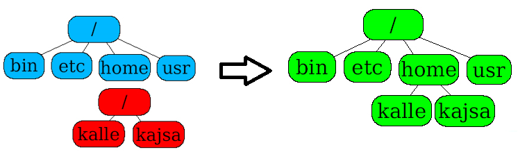

--

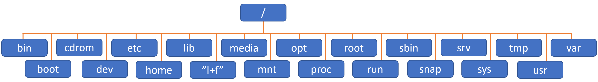

--

**/**

Rotem av filsystemet.

Under denna katalog finns allt annat.

--

**/bin**

Binärfiler, vanliga användarkommandon.

Är i Ubuntu en genväg till **/usr/bin**

--

**/boot**

Filer för att starta systemet inkl. kärnan.

--

**/cdrom**

Montering av optiska media.

--

**/dev**

Enhetsfiler, ex.hårddiskar och ssd:er.

--

**/etc**

Konfigurationsfiler för systemet och dess tjänster.

--

**/home**

Hemkataloger för användarna.

Motsvararande i Microsoft Windows = C:\Users

--

**/lib, /lib32, /lib64, /libx32**

Biblioteksfiler för kärnan samt C-bibliotek.

Är i Ubuntu en genväg till **/usr/lib** osv.

--

**/lost+found**

Vid en krasch räddas filerna till denna katalog.

--

**/media**

Användarmonterade enheter brukar hamna här.

--

**/mnt**

Monteringspunkt för temporära enheter, t.ex nätverksdelningar.

--

**/opt**

Programvaror som inte hanteras av pakethanteraren.

--

**/proc**

Här ligger alla processer som körs i systemet.

--

**/root**

Detta är root:s (systemadministratörens) hemkatalog.

I Ubuntu är rootanv. inaktiverad.

--

**/run**

Innehåller bland annat system pid-filer (run-time variable data).

--

**/sbin**

Här ligger systemets exekverbara (körbara) file.

Är i Ubuntu en genväg till **/usr/sbin** osv.

--

**/snap**

Här installeras program som levereras via snap.

--

**/srv**

Kommersiella tjänster installeras ibland här.

--

**/sys**

Specialfiler för systemets kärna.

--

**/tmp**

Temporära filer.

--

**/usr**

Program och filer som oftast är tillgängliga för alla användare (users) att komma åt.

--

**/var**

Loggfiler

---

# Hemkatalog

--

<span class="fragment">Alla användare i systemet har en egen hemkatalog.</span>

<span class="fragment">Återfinns i **/home**, t.ex **/home/pelle**</span>

<span class="fragment">Det är här vi hamnar när vi loggar in.</span>

<span class="fragment">Förkortas **~**</span>

<span class="fragment">Din användare äger allt i katalogen.</span>

---

# Absoluta- och relativa sökvägar

--

**Absolut sökväg** = utgår från rooten, t.ex `cd /home/pelle`

--

**Relativ sökväg** = utgår från mappen man står i, t.ex `cd pelle`

---

# Navigera

--

`cd` = Change Directory

--

```
cd /etc/apt/
```

Förflyttar dig till katalogen **/etc/apt** oavsett var i filträdet du befinner dig.

--

```
cd /
```

Förflyttar dig till roten på filträdet oavsett var i filträdet du befinner dig.

--

```
cd ~
cd
```

Förflyttar dig till din hemkatalog (t.ex **/home/pelle**) oavsett var i filträdet du befinner dig.

--

```
cd ..
```

Förflyttar dig ett steg bakåt/uppåt i filträdet, t.ex från **/home/pelle** till **/home/**

--

```
cd ../..
```

Förflyttar dig ett steg bakåt/uppåt i filträdet, t.ex från **/home/pelle** till **/**

--

```
cd musik
```

Förflyttar dig in i katalogen **musik**, som återfinns i katalogen där du befinner dig.

---

# Lista

--

`ls` = list directory contents ("ell-ess")

--

## Enkel listning

`ls`

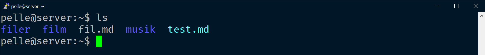

Vit = fil, blå = katalog, turkos = mjuk länk

--

## Lista i långt format

```
ls -l
```

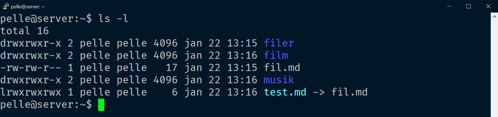


--

## Lista dolda filer/kataloger

```
ls -a
```

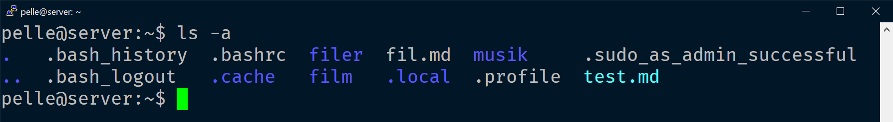

```
ls -A
```

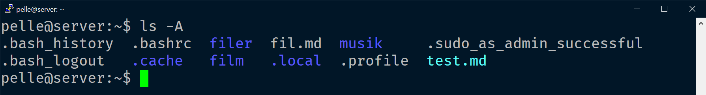

--

## Kombinera flera växlar

```
ls -Al
```

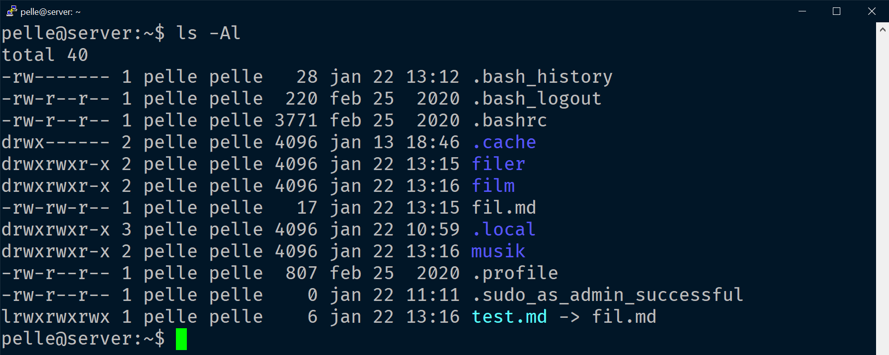

--

## Lista annan plats

```
ls ~/start
```

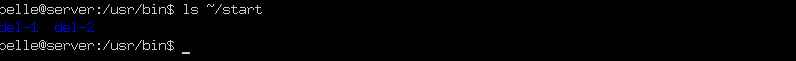

---

# Se vart man är

--

`pwd` = print name of current/working directory

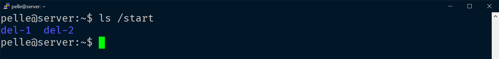

---

# Se innehållet i en fil

--

`cat` = concatenate files and print on the standardoutput

--

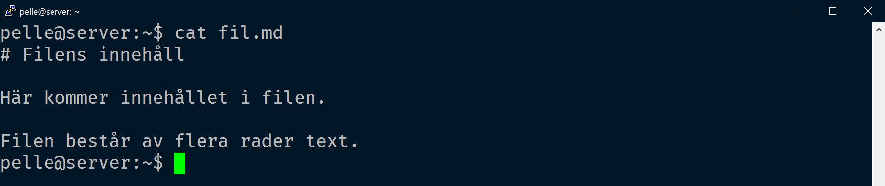

--

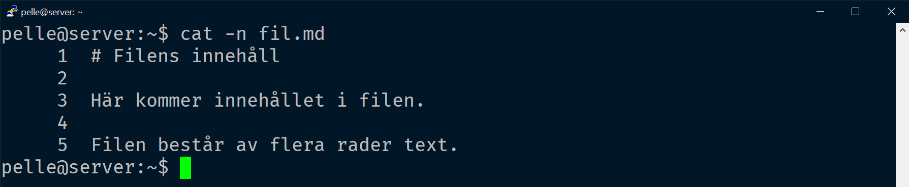

---

## Långt innehåll

--

Ibland får inte innehållet plats på skärmen och då vi inte kan skrolla så kommer vi inte att kunna se all information. Det här kan vi lösa mha kommandona `more` eller `less`.

--

`more`

**Enter** = hoppa fram en rad.

**Mellanslag** = hoppa fram en sida

--

```
ls /etc | more
more dump
```

--

`less`

Med `less` kan du använda upp/ned-pil för att förflytta dig i utdatat.

---

# Skapa filer

--

`touch` = change file timestamps

--

```
touch kaka
```

Skapar en tom fil med namnet kaka

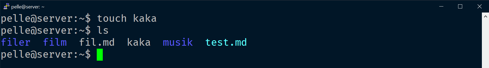

--

```
touch anka1 anka2 anka3
```

Skapar tre tomma filer

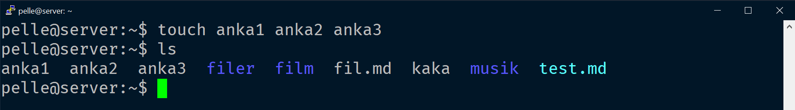

--

```
touch --date="2020-12-24 15:00:00" anka1
```


--

`cat >`, avsluta med `CTRL + D`

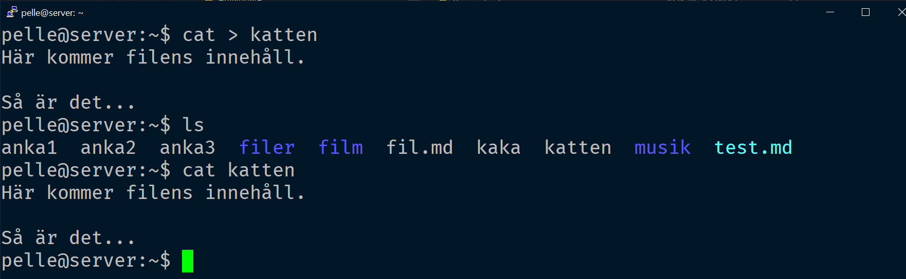

---

# Information om en fil

--

`stat` = Display file or file system status

--

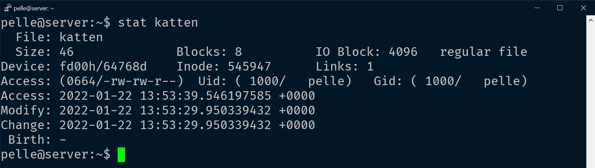

Här kan vi bland annat se när filen senast öppnades eller modifierades.

---

# Skapa kataloger

--

`mkdir` = make directories

--

```
mkdir test
```

Skapar en katalog där du befinner dig.

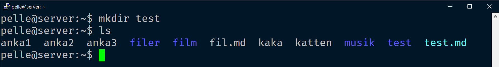

--

```
mkdir ~/test
```

Skapar en katalog i din hemkatalog oavsett var du befinner dig.

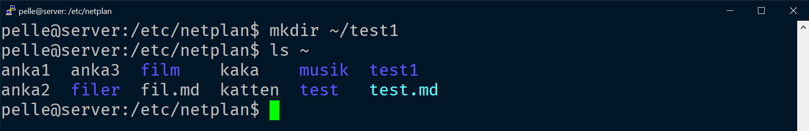

--

```html
mkdir -p start/del-1
mkdir -p start/del-2
```

Skapar katalogen start(om den inte finns) för att sedan skapa katalogen del-1 i den.

Skapar del-2 i mappen start (som vi skapade på raden innan).

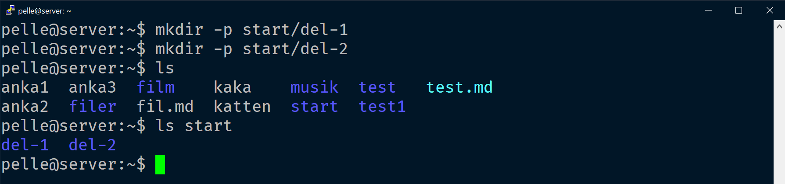

---

# Ta bort filer

--

`rm` = remove files or directories

--

```
rm kaka
```

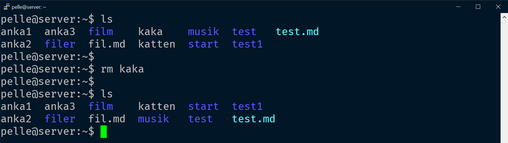

--

```
rm *.txt
```

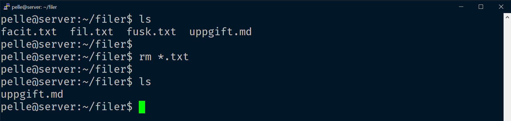

---

# Ta bort kataloger

--

`rmdir` = remove empty directories

--

```
rmdir musik
```

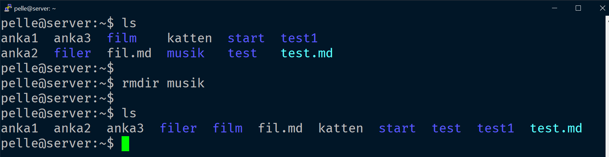

--

```
rmdir filer
```

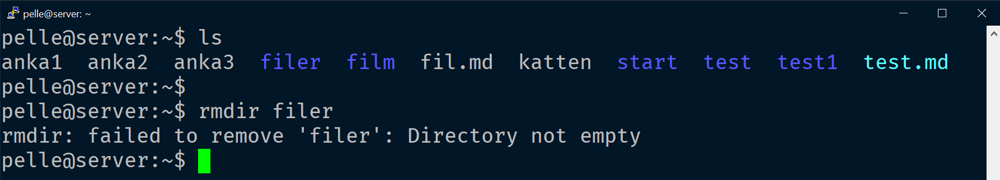

--

```
rm -rf filer
```

---

# Kopiera filer/kataloger

--

`cp` = copy files and directories

--

```
cp fil.md fil2.md
```

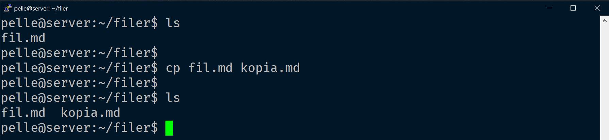

--

```
cp /etc/rsyslog.conf .
```

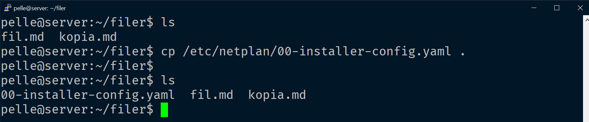

--

```
cp -r ../filer .
```

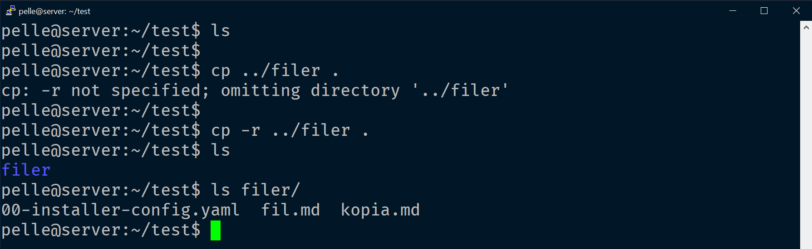

--

```html
cp -r filer/ backup
```

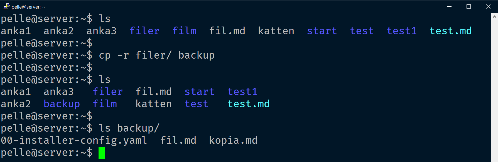

---

# Flytta filer/kataloger

--

`mv` = move (rename) files

--

## Filer

```
mv fil.md filer/
```


--

## Kataloger

```
mv backup/ filer/
```

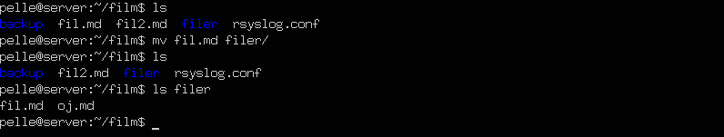

--

# Döpa om filer/kataloger

`mv` = move (rename) files

--

```
mv fil2.md haha.md
```

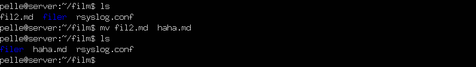

---

# Länkar

--

`ln` = make links between files

--

## Mjuka länkar

--

<span class="fragment">Fungerar (nästan) som genvägarna i Microsoft Windows.</span>

<span class="fragment">Tar man bort genvägen finns originalfilen kvar.</span>

<span class="fragment">Tar man bort originalfilen så finns genvägen kvar, men den pekar till något som inte finns.</span>

--

```
ln -s orginalet linken
```


--

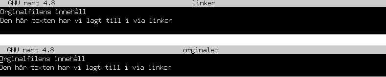

<span class="fragment">Vi öppnar nu länken (linken) i nano och skriver in lite text för att sedan avsluta nano (givetvis sparar vi).</span>

<span class="fragment">Om vi nu öppnar originalet ser vi att ändringen finns kvar.</span>

<span class="fragment">**Kom ihåg!** Mjuka länkar kan ses som genvägar i Microsoft Windows.</span>

--

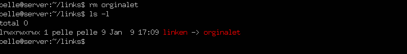

Här har vi raderat originalet och då ser vi att vår länk blir röd = trasig

--

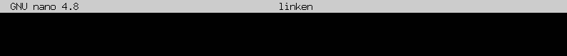

Öppnar vi länken (linken) i nano så ser vi att det är tomt.

--


Vi passar på att skriva in lite innehåll… och spar ändringarna.

--

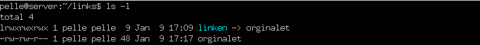

Aha! Nu skapas originalet igen

--

## Hårda länkar

--

<span class="fragment">Hårda länkar är pekare till en fil.</span>

<span class="fragment">Flera hårda länkar kan peka på samma fil.</span>

<span class="fragment">Filen försvinner först efter att alla hårda länkar har raderats.</span>

<span class="fragment">Om du raderar originalfilen men inte de hårda länkarna finns de hårda länkarna kvar, liksom fildatan.</span>

--

```
ln orginalet link
```

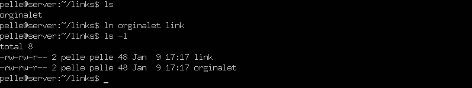

--

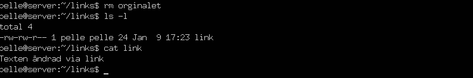

Tar vi bort originalet så kommer länken fortfarande att fungera.

--

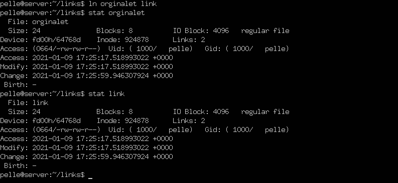

---

# Jokertecken

--

* = Okänt antal tecken

- *.txt = Alla txt-filer
- f*.txt = Alla txt-filer som börjar på f
- i*.* = Alla filer som börjar på i

--

? = Ett okänt tecken

- ?.txt = Alla txt-filer som har ett tecken i filnamnet
- f??.txt = Alla txt-filer som börjar på f och har två tecken därefter
- f*.p? = Alla filer som börjar på f och vars filändelse börjar på p och följs av ett tecken

--

[] = Område

- [bf]*.txt = Alla txt-filer som börjar på b eller f
- *[2-4].html = Alla html-filer som slutar på 2, 3 eller 4.

---

# Filmer

--

**TIF275 Datorintroduktion, Chalmers**

- [Linux 1: Grunderna](https://www.youtube.com/watch?v=yzeY5H-8nVk)
- [Linux: Knep i terminalen](https://www.youtube.com/watch?v=V-tLqN5yp90)

--

**dbwebb - Blekinge Tekniska Högskola**

- [02 cat](https://www.youtube.com/watch?v=a2P26Zgy_mE)

--

**Linux Commands for Beginners**
- [Navigating the Filesystem](https://www.youtube.com/watch?v=MnY0K-3_Fjk)
- [Moving and Renaming Files](https://www.youtube.com/watch?v=cSBYvSA9rDM)

--

**HakTip - Linux Terminal 101**
- [Getting Started](https://www.youtube.com/watch?v=b5NmtmNwMgU)
- [File Manipulation](https://www.youtube.com/watch?v=e13o3DcjT6Y)
- [Using CAT with Standard Inputs](https://www.youtube.com/watch?v=SfuEdUiEFtw)

---

# Slut!