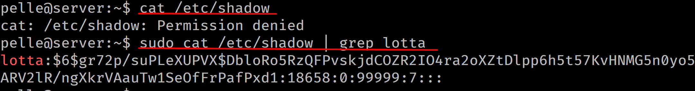

# Linux-07

## Rättigheter och användare m.m

---

# Rättigheter

--


--

## Första tecknet

\- = fil

d = mapp/katalog

l = mjuk/symbolisk länk

--

## rwx

**r** = Read = Läs

**w** = Write = Skriv

**x** = Execute = Kör

**Observera!** Mappar har **x** för att man ska kunna komma in i dem.

--

## Ägare - Grupp - Övriga


--

## T-biten


--

Betyder att även om en användare har skrivrättigheter i mappen, så får denne bara skrivrättighet på filer som man är ägare till, och kan således inte ta bort andra användares filer eller mappar själv (om denne inte är ägare till mappen eller medlem i gruppen som äger mappen).

En typisk sådan mapp är **/tmp**, i denna kan alla användare skriva, men inte radera saker som inte är deras egna.

Inte heller kan de radera själva mappen **/tmp**.

---

# Ändra rättigheter

--


--

```html
rw- rw- rw-
110 110 110
421 421 421
--- --- ---
420 420 420 => 6 6 6
```

--

## chmod


--


Mappen har **rwx rwx r-x**, vi vill ändra så att ägaren läsa och skriva i mappen, gruppen får läsa, medan övriga inte får tillgång till mappen alls.

--

```html
rw- r-- ---
110 100 000
421 421 421
--- --- ---
420 400 000 => 6 4 0
```

--


Nehepp… det där gick ju inget vidare!

--

```html
rwx r-x ---
110 100 000
421 421 421
--- --- ---
421 401 000 => 7 5 0
```

Kom ihåg! Mappar måste ha **x**

--


---

# Standardrättigheter

--

## umask


0**002** = Ägare - Grupp - Övriga

```html
000 000 010
rwx rwx r-x
```

--


Varför stämmer standardrättigheterna för mappen och inte för filen?

Jo, filer får INTE x (execute) som standard av säkerhetsskäl.

--

Om vi vill ändra standard-rättigheterna till rwx r-x ---

```html
rwx r-x ---
000 010 111 = 027
```

--


Filen **ny_fil** får **rw- r-- ---** och mappen **ny_mapp** får **rwx r-x ---** vilket stämmer med vår standardrättighet.

---

# Skapa en användare

--

## /etc/skel


Mappen /etc/skel innehåller skelettet för nya användare.

--


Om vi t.ex lägger till en mapp i **/etc/skel** så kommer alla nya användare få en mapp med samma namn i sin hemkatalog.

--

## /etc/passwd

Innehåller alla användare i systemet

"Vanliga användare" == 1000 och uppåt

--


--


1. Användarnamn
2. Lösenord, hanteras i **/etc/shadow**
3. Användarid (UID)
4. Gruppid (GID)
5. Hela namnet

--


6. Rumsnummer
7. Arbetstelefon
8. Hemtelefon
9. Övrigt
10. Hemkatalog
11. Skal

--

## /etc/shadow



Här återfinns lösenorden för användarna i krypterad form. Innehåller även annan information, t ex när kontot senast bytte lösenord.

Kvällsläsning (inget som kommer på något prov):
- [https://www.cyberciti.biz/faq/understanding-etcshadow-file/](https://www.cyberciti.biz/faq/understanding-etcshadow-file/)

--

## /etc/group


1. Gruppnamn = projekt
2.Lösenord (används inte…)
3. GID = 1004
4. Medlemmar i gruppen = kurt och kalle

--

## Skapa användare


--


---

# Ta bort en användare

--


När man tar bort en användare kommer användarens hemkatalog att finnas kvar

---

# Ändra lösenord

--

## Uppdatera eget lösenord


--

## Uppdatera annans lösenord


---

# Skapa en ny admin

--

En ny admin skapar vi genom att lägga till användaren till gruppen sudo


---

# Ta bort en admin, men inte användaren

--

Vi kan använda oss av kommandot **deluser** för att ta bort en användare från gruppen sudo.


---

# Ändra ägare - chown

--


--


--


--


---

# Ändra grupp - chgrp

--


---

# Ändra både ägare och grupp

--


---

Slut!