# Linux-09

---

# Omdirigering av data

--


--

| Vad             | Fildeskriptor |
| --------------- | ------------- |
| standard input  | 0             |
| standard output | 1             |
| standard error  | 2             |

En **fildeskriptor** är ett nummer som hänvisar till vilken dataström vi vill komma åt eller omdirigera.

--

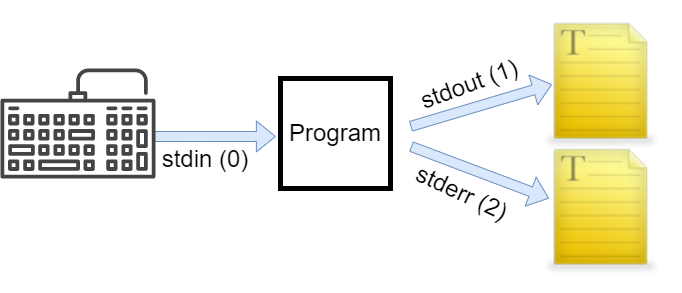

---

# Omdirigering av utdata

--

## Enkel omdirigering

--

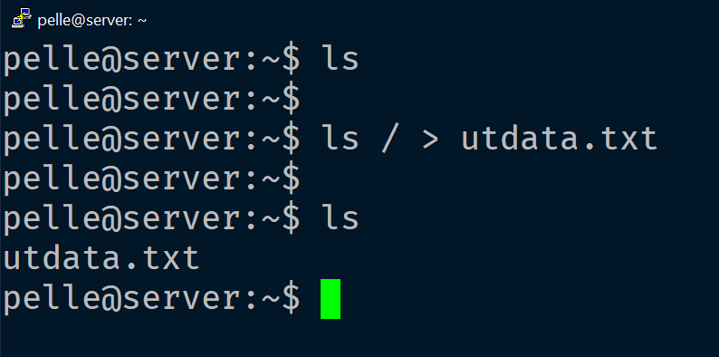

--

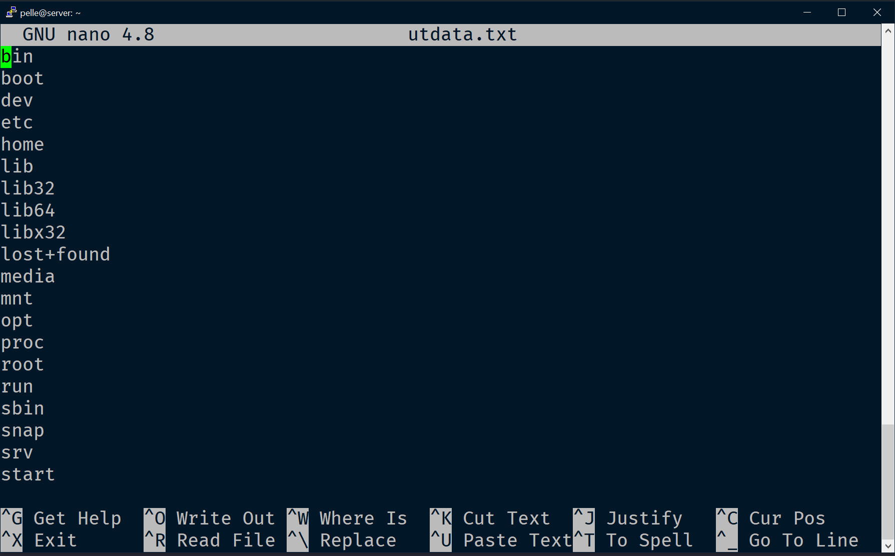

--

## Avancerad omdirigering

--

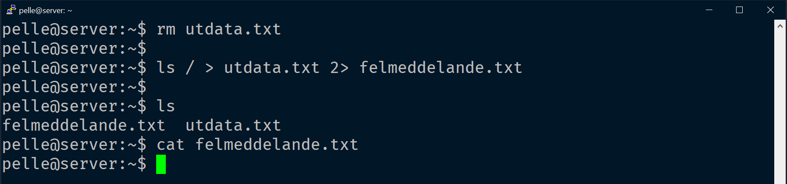

Kommandot vi körde gav inget fel, därför är **felmeddelande.txt** tom.

Filen **utdata.txt** kommer innehålla resultatet av vår listning.

--

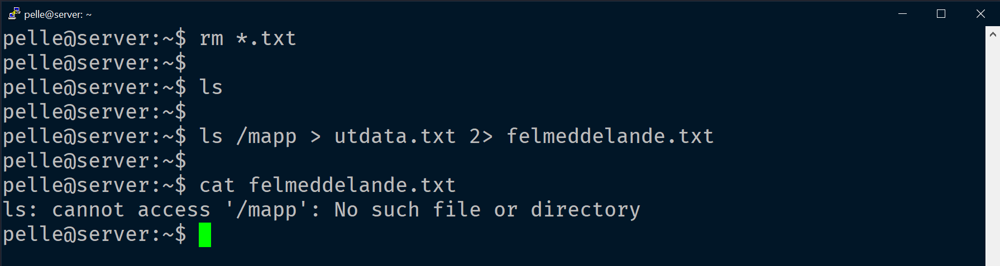

Kommandot vi körde gav fel, vilket vi ser i **felmeddelande.txt** .

Filen **utdata.txt** kommer att vara tom.

--

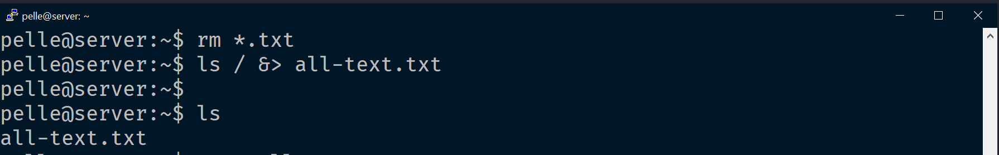

Vill vi få både **stdout** och **stderr** till samma fil använder vi **&>**

--

## Lägga till data

--

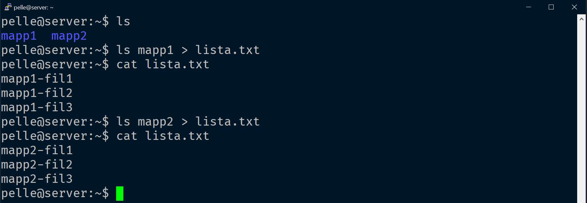

**Problem!** När vi kör den andra omdirigeringen skrivs resultatet från den första över.

--

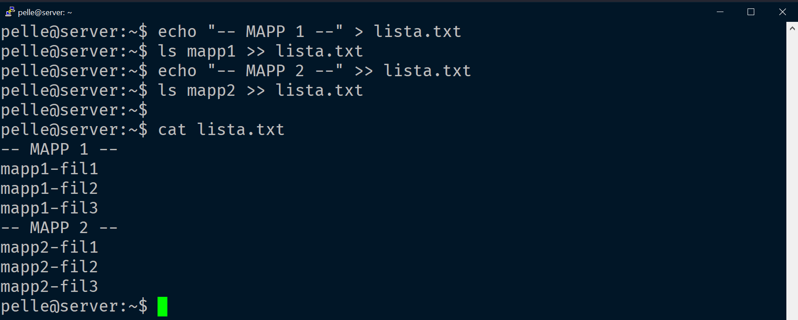

**Lösning!** Vi använder **>>** för att lägga till (_append_) i filen.

**Fundering...** Vad gör första raden?

---

# Omdirigering av indata

--

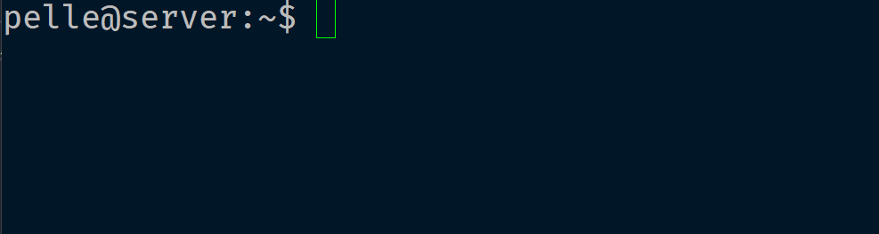

**wc** = Word Count (avsluta med **CTRL + D**)

2 = Två rader

6 = Sex ord

28 = 28 tecken

--

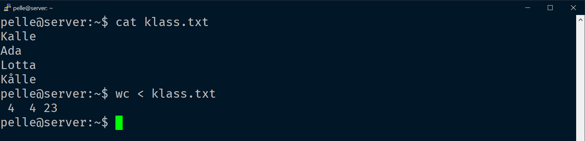

Klassen har fyra rader, fyra ord och 23 tecken.

--

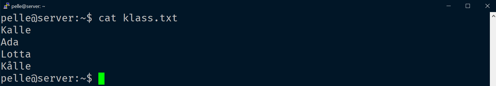

Klassen är osorterad.

--

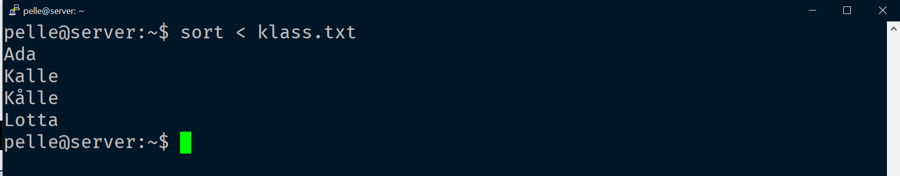

Vi sorterar klassen vid utskrift på skärmen.

--

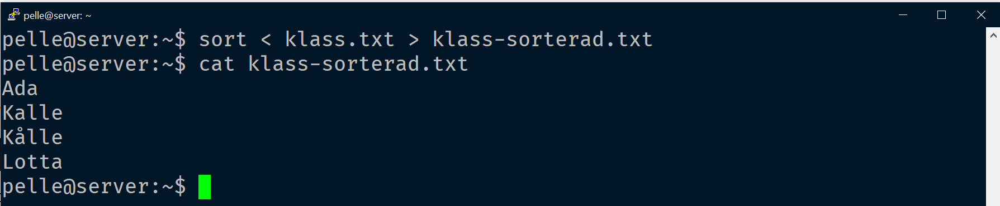

Vi sorterar klassen och skriver den sorterade klassen till filen **klass-sorterad.txt**

---

# Rörledningar

--

Utdata (**stdout**) från ett program skickas som indata (**stdin**) till ett annat program.

--

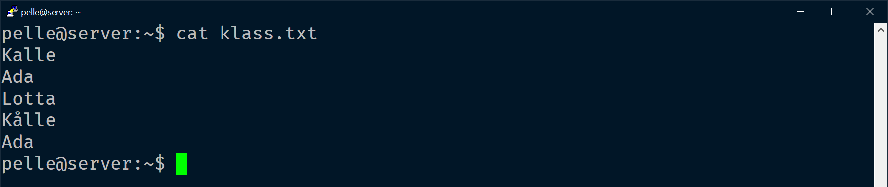

--

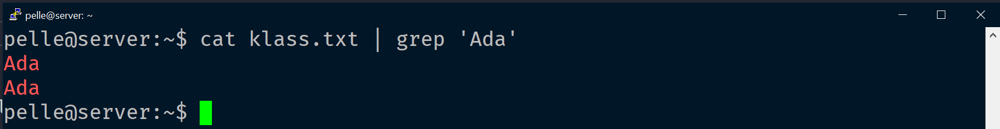

--

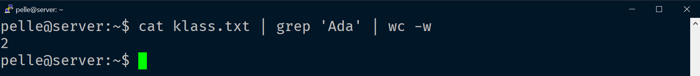

--

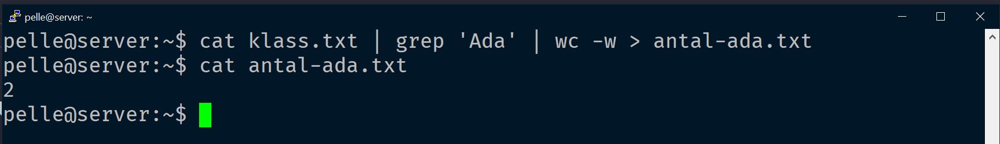

---

# Flera kommandon på samma rad

--

## Listoperatorer

**&&** AND (och)

**||** OR (eller)

**;** Kör nästa kommando

--

## &&

--

```html
kommando1 && kommando2
```

Kommando2 kommer enbart att köras om kommando1 avslutas korrekt.

--

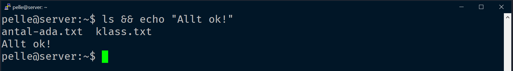

--

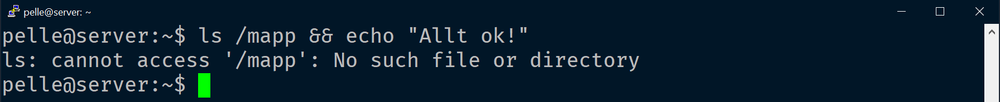

--

## ||

--

```html
kommando1 || kommando2
```

Kommando2 kommer enbart att köras om kommando1 INTE avslutas korrekt.

--

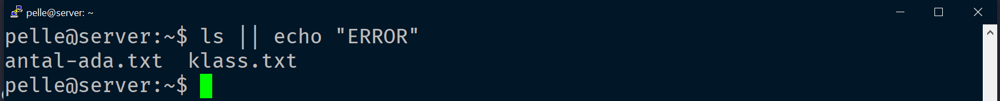

--

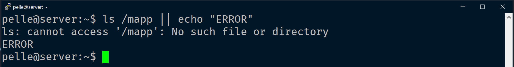

--

## ;

--

```html
kommando1 ; kommando2
```

Kommando2 kommer att köras oavsett vad kommando1 gör.

--

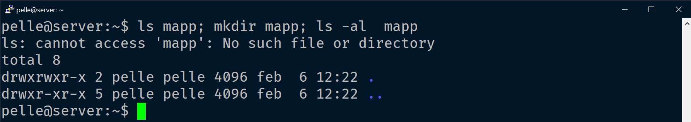

---

# Slut!
