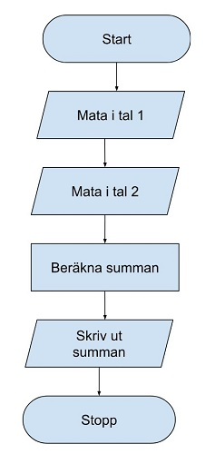
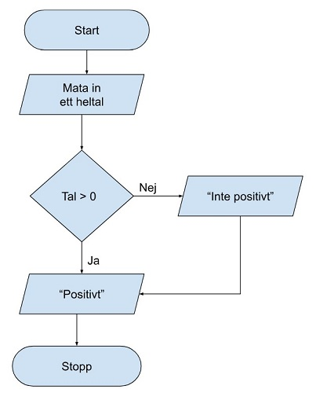
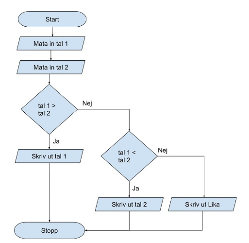
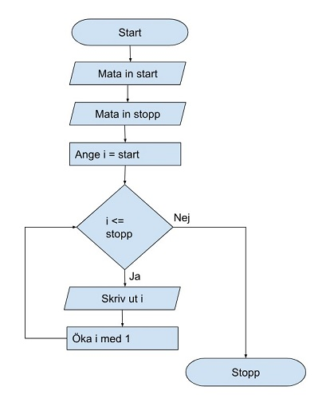
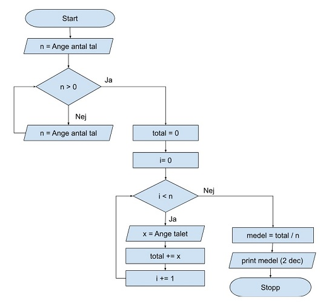
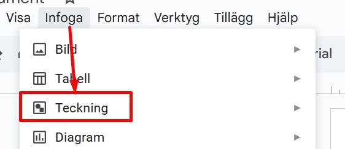
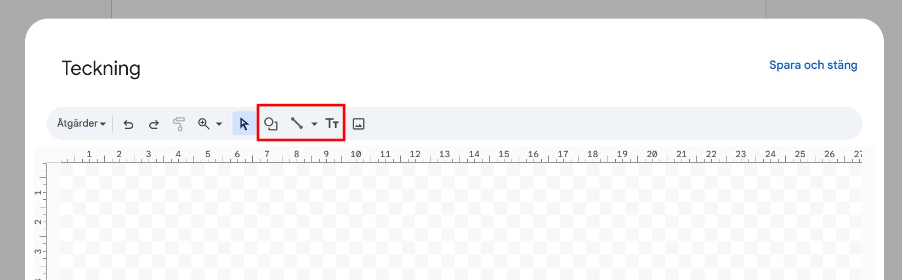
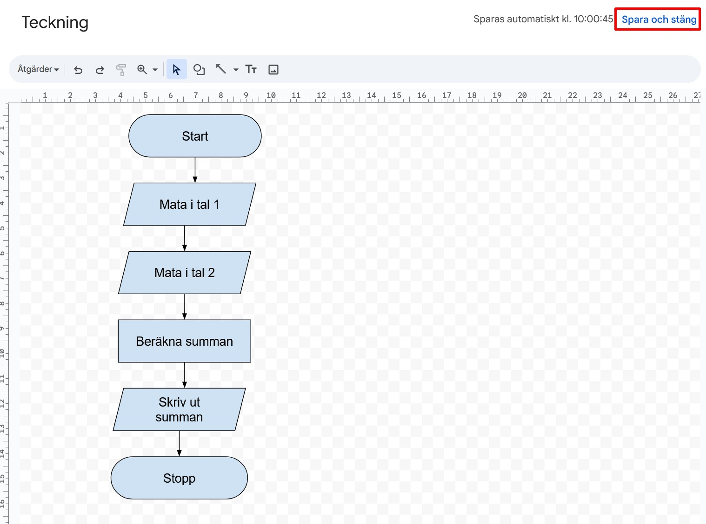
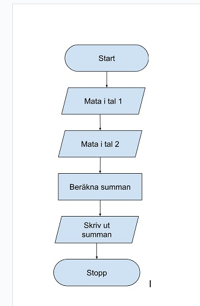
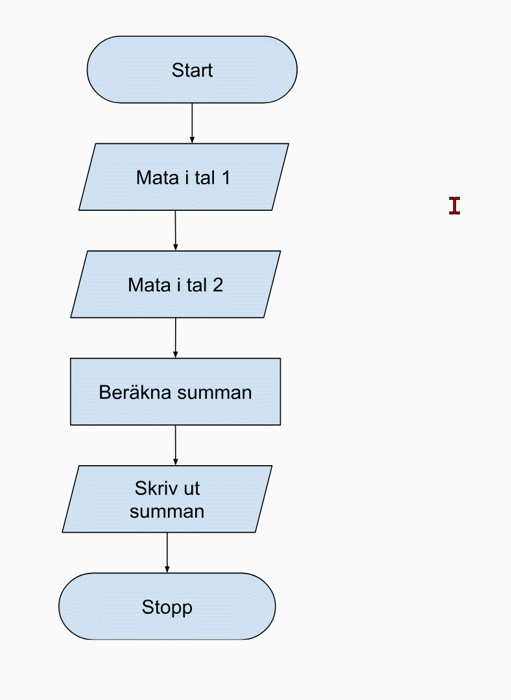

# Flödesschema

---

# Vad är ett flödesschema?

--

En grafisk beskrivning av hur ett program arbetar.

Visar steg för steg vad som ska göras.

Hjälper till att planera och förstå programflödet.

---

# Varför använder vi flödesscheman?

--

Tydligör tankegångar innan kodning.

Lättare att hitta fel.

Underlättar förklaringar för andra.

---

# Grundläggande symboler

--

**Oval**: Start / Stopp

**Rektangel**: Process (t.ex. beräkning)

**Parallellogram**: Input / Output

**Romb**: Beslut (villkor)

---

# Sekvens

--

---

# Villkor

--

--

---

# Loop

--

---

# Lite mer

--

---

# Skapa flödesschema i Google Docs

--

--

--

--

--

---

# SLUT!
