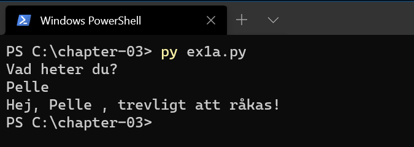
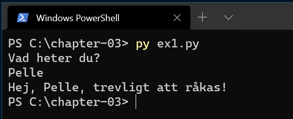
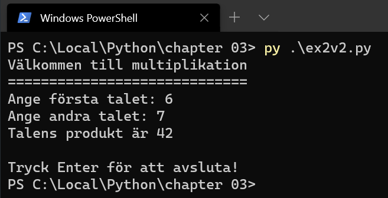
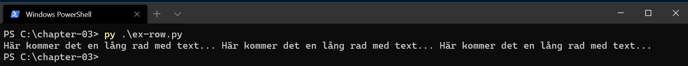
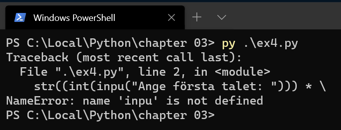

# Python - Kapitel 3

---

# Inledning

--

**Kom ihåg!** Filändelsen är `.py`

---

# Exempel 1

--

```python [ ]
# Mitt första program

# Fråga efter namnet och skriv ut hälsning
namn = input("Vad heter du?\n")
print("Hej,", namn ,", trevligt att råkas!")
```



--

```python [ ]
# Mitt första program

# Fråga efter namnet och skriv ut hälsning
namn = input("Vad heter du?\n")
print("Hej, " + namn + ", trevligt att råkas!")
```



--

```python [ ]
# Mitt första program

# Fråga efter namnet och skriv ut hälsning
print("Hej, ", input("Vad heter du?\n"), ", trevligt att råkas!")
```


---


# Exempel 2

--

```python [ ]
# Mitt andra program

# Fråga efter två tal och beräkna dess produkt
print("Välkommen till multiplikation")
print("=============================")
tal1 = input("Ange första talet: ")
tal1 = int(tal1)
tal2 = input("Ange andra talet: ")
tal2 = int(tal2)
prod = tal1 * tal2
print("Produkten av {0} och {1} är {2}".format(tal1, tal2, prod))

# Håll kvar utskriften till användare trycker på Enter
input("\nTryck Enter för att avsluta!")
```

--

```python [ ]
# Mitt andra program

# Fråga efter två tal och beräkna dess produkt
print("Välkommen till multiplikation")
print("=============================")
tal1 = input("Ange första talet: ")
tal1 = int(tal1)
tal2 = input("Ange andra talet: ")
tal2 = int(tal2)
prod = tal1 * tal2
print(f"Produkten av {tal1} och {tal2} är {prod}")

# Håll kvar utskriften till användare trycker på Enter
input("\nTryck Enter för att avsluta!")
```

--


--

```python [ ]
# Mitt andra program, version 2

# Fråga efter två tal och beräkna dess produkt
print("Välkommen till multiplikation")
print("=============================")
print("Talens produkt är " +
    str(
        (int(input("Ange första talet: "))) * 
        (int(input("Ange andra talet: ")))
    )
)

# Håll kvar utskriften till användare trycker på Enter
input("\nTryck Enter för att avsluta!")
```

Här tar vi emot input:arna och int:ar dessa för att sedan multiplicera talen och dess produkt omvandlar vi till en sträng.

--



---

# Radlängd

--

För att koden skall vara debuggbar vill vi inte skriva hur långa rader som helst.

--

En gammal regel säger att rader bör brytas innan 80:e tecknet.

--

```python [ ]
txt="Här kommer det en lång rad med text... \
Här kommer det en lång rad med text... \
Här kommer det en lång rad med text..."

print(txt)
```

Med backslash \ kan man markera att koden fortsätter på nästa rad, men det är inte nödvändigt.

--



---

# Kommentarer

--

All välskriven kod är välkommenterad.

--

Kommentarer i ett program har två syften.
Den som programmerar skall komma ihåg varför denne gjorde på ett visst sätt.

--

Andra som läser koden skall kunna förstå vad koden gör.

--

Kommentarer skall inte vara triviala utan upplysa om väsentliga saker.

--

Bra val på variabelnamn kompletterar kommentarerna.

--

```python [ ]
# Dålig kommentar och namn:

# Öka x med 1
x += 1
```

--

```python [ ]
# Bra kommentar och namn:

# Gå till nästa iteration
position -= 1
```

---

# Felmeddelanden

--

Innan man avlusat sitt program får man felmeddelanden i Python-tolken.

--

Ofta är det rena syntax-fel som gör att programmet inte startar alls eller också runtime-fel där exekveringen avbryts då fel uppstått.

--

Går vi tillbaka till källkoden står ofta markören i närheten av den rad där felet finns (på eller precis efter).

--

```python [ ]
>>> print('123' + 123)
Traceback (most recent call last):
  File "<stdin>", line 1, in <module>
TypeError: can only concatenate str (not "int") to str

```

--


```python [ ]
>>> print(int('123') + 123)
246
```

--

```python [ ]
print("Talens produkt är " +
      str((int(inpu("Ange första talet: "))) * \
          (int(input("Ange andra talet: "))) ))
```



---

# SLUT