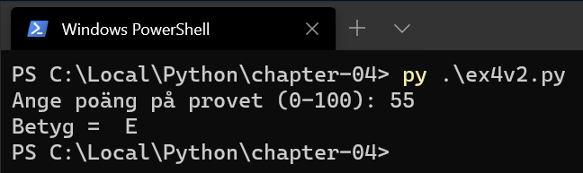

# Python - Kapitel 4

---

# Inledning

--

* Satser (instruktioner i tur och ordning)
* Val med villkor
* Iterationer (upprepningar, ”loopar”)

--

Idag tar vi oss an **villkor**

I många programmeringsspråk används if-konstruktionen för att göra olika val, ofta i kombination med olika boolska uttryck och logiska operatorer.

---

# If-satsen

--

```python []
if test expression:
	statement(s)
```

If-satserna består alltså av _if + villkor + kolon_, och sedan ett program-block om en eller flera rader som skrivs med lämpligt indrag (4 tecken är standard).

Hela programblocket som hör till if-satsen **måste** ha samma indrag.

--

```python []
if test expression:
	statement(s)
	if other test expression:
		other statement(s)

```

If-satsen kan nästlas (även om det kanske inte blir vackert)

---

# Exempel 1

--

```python []
# If the number is positive, we print a message
num = 3

if num > 0:
    print(num, "is a positive number.")

print("This is always printed.")

num = -1

if num > 0:
    print(num, "is a positive number.")

print("This is also always printed.")
```

--


---

# Relationsoperatorer

--

| Tecken | Betydelse                |
|--------|--------------------------|
| <      | Mindre än                |
| >      | Större än                |
| <=     | Mindre än eller lika med |
| >=     | Större än eller lika med |
| ==     | Lika med                 |
| !=     | Ej lika med              |

---

# Exempel 2

--

```python []
num = int(input("Give a number: "))

if num > 0:
	print(num, "is a positive number.")
else:
	print(num, "is zero or a negative number.")

print("This is always printed.")
```

`Else` fångar upp allt som inte passar in i if-villkoret

--


---

# Exempel 3

--

```python []
num = int(input("Give a number: "))

if num > 0:
	print(num, "is a positive number.")
elif num < 0:
	print(num, "is a negative number.")
else:
    print(num, "is zero.")

print("This is always printed.")
```

--


--


--


---

# Exempel 4

--

```python []
p = int(input('Ange poäng på provet (0-100): '))

if p >= 90:
	print('Betyg = A')
elif p >= 80:
	print('Betyg = B')
elif p >= 70:
	print('Betyg = C')
elif p >= 60:
	print('Betyg = D')
elif p >= 50:
	print('Betyg = E')
else:
	print('Betyg = F')
```

--


--

```python []
p = int(input('Ange poäng på provet (0-100): '))

if p >= 90:
	grade = 'A'
elif p >= 80:
	grade = 'B'
elif p >= 70:
	grade = 'C'
elif p >= 60:
	grade = 'D'
elif p >= 50:
	grade = 'E'
else:
	grade = 'F'

print('Betyg = ', grade)
```

--



---

# Exempel 5

--

```python []
num1 = 3
num2 = 3

if num1 == num2:
    print('Lika')
else:
    print('Olika')

```

--


---

# Logiska operatorer

--

| Operator | Betydelse |
|----------|-----------|
| and      | och       |
| or       | eller     |
| not      | icke      |


Python utvärderar logiska uttryck till **True** eller **False**.

Dessa kan kombineras med logiska operatorerna `and`, `or`, `not`.

---

# Exempel 6

--

```python []
num1 = 3
num2 = 3

if num1 == 3 and num2 > 0:
    print('Ja')
else:
    print('Nej')

```

--


---

# SLUT