# Python - Kapitel 5

---

# Inledning

--

All (imperativ) programmering bygger på:
* Satser (instruktioner i tur och ordning)
* Val med villkor
* Iterationer (upprepningar, ”loopar”)

Idag tar vi oss an **iterationer**

I princip är iterationer att en instruktion eller ett avsnitt av programmet upprepas ett visst antal ggr.

Den vanligaste loopkonstruktionen i många språk är `for`, men även `while` är vanlig.

---

# For-loopen

--

## Exempel 1

--

```python []
for a in ['Kurt', 'Ada', 15, 3.14, 'Olle']:
    print(a)

print('\nUtanför loopen')
```

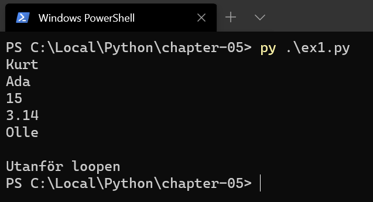

--

## Exempel 2

--

```python []
for a in [1, 2, 3]:
    product = a * a
    print(product)

print('\nUtanför loopen')
```

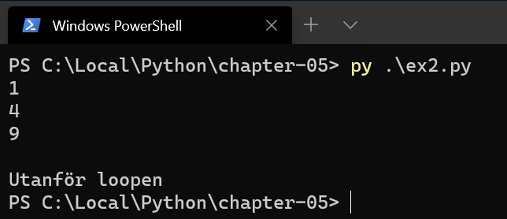

--

## Exempel 3

--

```python []
for a in range(1, 4):
    print(a + a)

print('\nUtanför loopen')
```

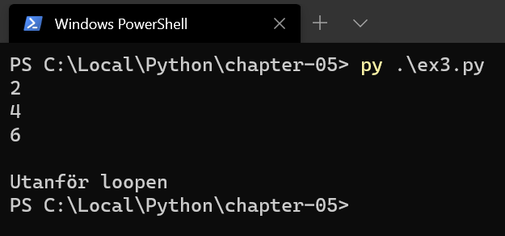

--

**range** är en s.k. itererbar datatyp, liksom listor och dictionaries (som vi ska gå igenom senare i kursen).

--

`range(1, 10)` är 1, 2, 3, 4, 5, 6, 7, 8, 9 (slutvärdet aldrig med)

--

`range(100)` är 0, 1, 2, 3, …, 98, 99 (startvärdet alltid 0 och stegvärdet alltid 1 om utelämnat)

--

`range(0, 100, 2)` är 0, 2, 4, 6, 8, …, 96, 98 (stegvärdet är 2)

--

`range(10, -1, -1)` är 10, 9, 8, 7, …, 2, 1, 0 (stegvärdet är -1)

--

```python []
start = 1
stop = 10
step = 2

for number in range(start, stop, step):
    print(number)

print('\nUtanför loopen')

```

Vad kommer resultatet att bli?

--

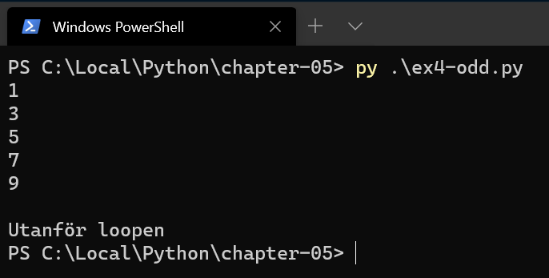

--

## Exempel 4

--

```python []
text = "Teknik"

for char in text:
    print(char)

print('\nUtanför loopen')
```

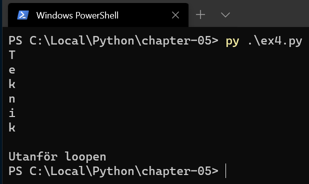

--

## Exempel 5

```python []
for i in range(3):
    print(i)
else:
    print("Klar!")

print('\nUtanför loopen')

```
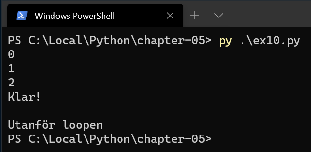

---

# While-loopar

--

Många `for`-loopar kan skrivas om som `while` och tvärtom.

`While` fortsätter så länge ett givet villkor är uppfyllt.

--

## Exempel 1

```python []
start = 1
stop = 10
step = 2

number = start

while number < stop:
    print(number)
    number += step

print('\nUtanför loopen')
```

--

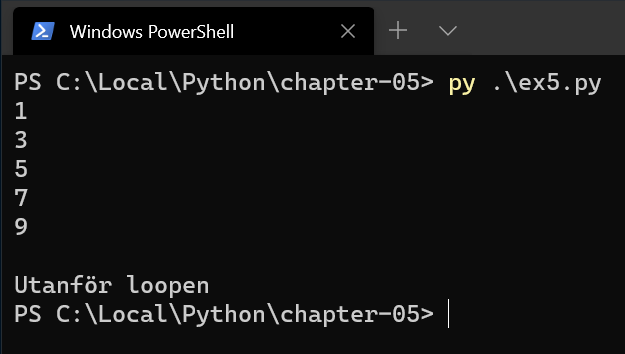

--

## Exempel 2

```python []
count = 0
the_sum = 0

number = int(input('Mata in ett positvt heltal: '))

while number != 0:
    count += 1
    the_sum += number
    number = int(input('Mata in ett positvt heltal: '))

if count != 0:
    print('Medelvärdet är', the_sum/count)
```

--

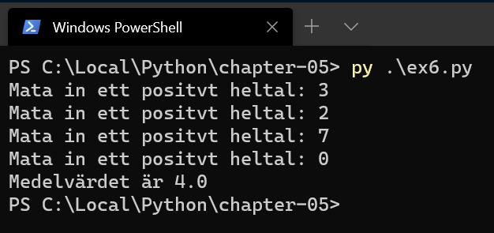

--


```python []
count = 0
the_sum = 0

number = int(input('Mata in ett positvt heltal: '))

while number != 0:
    if number < 0:
        print('Negativt heltal angivet... ABRYTER!')
        break

    count += 1
    the_sum += number
    number = int(input('Mata in ett positvt heltal: '))

if count != 0:
    print('Medelvärdet är', the_sum/count)
```

--

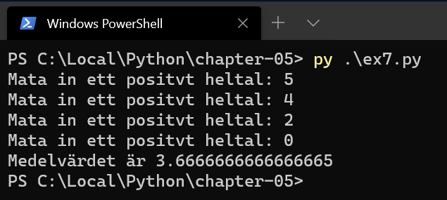
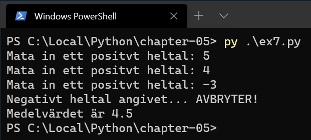

--

# Exempel 3

--

```python []
while True:
    n = input('Please enter "hello": ')
    if n.strip() == 'hello':
        break

print('\nUtanför loopen')
```

--

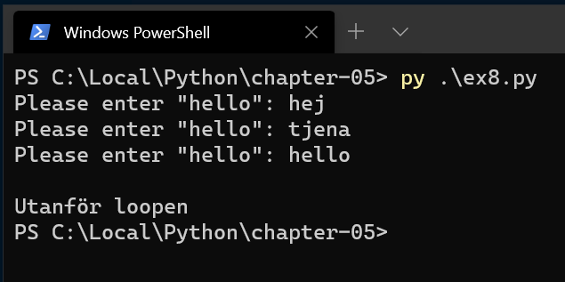

---

# Loop i en loop

--

```python []
for i in range(1, 4):
    print('i =', i)

    for j in range(1, 4):
        print('\t j =', j)

    print('--------------')

print('\n Utanför loopen')
```

--

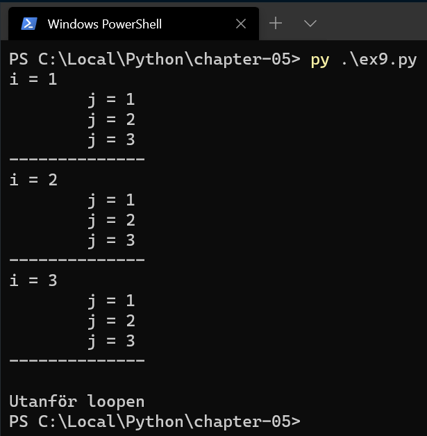

---

# SLUT