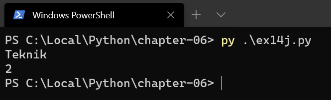

# Python - Kapitel 6

---

# Inledning

--

Vi har tidigare stött på teckensträngar i Python, dessa är sekvenser av tecken som är inneslutna i enkla, dubbla eller trippla citations-tecken

* `"Kurt"`
* `'Kurt'`
* `"""Kurt över flera rader... så att säga""" `

--

Strängarna ovan kallas för _strängkonstanter_ eller _literaler_.

Mestadels arbetar vi med strängar genom att tilldela dem till en variabel, `name = 'Kurt'`

---

# Strängar är itererbara

--

Då teckensträngar är lagrade i följd i minnet kan de indexeras på följande vis:


---

# Komma åt tecknen i en sträng – fyra varianter

--

```python
a = 'Kurt'

print(a[0])
print(a[1])
print(a[2])
print(a[3])
```


--

```python
a = 'Kurt'
i = 0

while i < len(a):
    print(a[i])
    i += 1
```


--

```python
a = 'Kurt'

for i in range(len(a)):
    print(a[i])
```


--

```python
a = 'Kurt'

for char in a:
    print(char)
```


---

# Plustecken

--

Plustecken (+) används för att slå ihop strängar

```python
firstname = 'Pelle'
lastname = 'Kanin'
fullname = firstname + ' ' + lastname

print(fullname)
```


---

# Multiplikationstecknet

--

Multiplikationstecknet (*) för att upprepa en sträng

```python
firstname = 'Pelle'
lotsofname = 5 * firstname
print(lotsofname)
```


--

```python
firstname = 'Pelle'
lotsofname = 5 * (firstname + ' ')
print(lotsofname) 
```


---

# Längd

--

`len(n)` ger längden på teckensträngen _n_

```python
name = input('Vad heter du i förnamn?\n')
length = len(name)

print('Du har', length, 'bosktäver i ditt förnamn')

```


---

# Förekomst

--

Med `in` kan man testa förekomsten av ett visst tecken i en sträng

--

```python
text = 'Lorem ipsum dolor sit amet, consectetur adipiscing elit'
search = 'tur'

if search in text:
    print('Finns i texten')
else:
    print('Finns ej i texten')
```


--

```python
txt = "För att komma åt tecken"
x = "ör" in txt
print(x)
```


--

```python
txt = "För att komma åt tecken"
x = "ör" not in txt
print(x)
```


---

# Typomvandling

--

`str(tal) `förvandlar en variabels innehåll till en sträng (åt andra hållet använder vi int och float på teckensträngarna)

--

```python
number = 42
print('Talet är ' + number)
```


--

```python
number = 42
text = str(number)
print('Talet är ' + text)
```


---

# Jämföra strängar

--

Vi kan jämföra strängar med `==` och _!=_

Så länge vi håller oss till engelska alfabetet kan vi kolla bokstavsordningen med `<`, `>`, `>=`, `<=`.

--

```python
password_1 = 'hemligt'
password_2 = 'Hemligt'

if password_1 == password_2:
    print('lika')
else:
    print('Olika')
```


--

```python
text1 = 'a'
text2 = 'a'

if text1 <= text2:
    print('if:en', text1, text2)
else:
    print('else:n', text2, text1)

```


--

```python
text1 = 'a'
text2 = 'b'
```


--

```python
text1 = 'b'
text2 = 'a'
```


---

# Negativ indexering

--

För att komma åt tecknen från slutet används även negativ indexering, med start från -1


--

```python
text = 'Teknikprogrammet'

print('Sista bokstaven är', text[-1])
```


---

# Delsträngar

--

Vi kan ta fram delsträngar genom att ange start- och slutindex med kolon emellan, s.k. slicar. Med en tredje parameter anges "steglängd".

--

```python
text = 'Teknikprogrammet'
sliced = text[0:6] # Slutindex ej med
print(sliced)
```


--

```python
text = 'Teknikprogrammet'
sliced = text[6:] # Alla tecken från 6:e och framåt
print(sliced)
```


--

```python
text = 'Teknikprogrammet'
sliced = text[:-6] # Alla tecken utom de sex sista
print(sliced)
```


--

```python
text = 'Teknikprogrammet'
sliced = text[::-1] # Alla tecken baklänges
print(sliced)
```


--

```python
text = 'Teknikprogrammet'
sliced = text[::2] # Vartannat tecken
print(sliced)
```


--

```python
text = 'Teknikprogrammet'
sliced = text[0:6:3]
print(sliced)
```


---

# Strängmetoder

--

Python har en klass för strängar, och till den hör ett antal metoder som man kan använda via punktnotation.

**Observera!** Alla strängmetoder returnerar ett nytt värde, de ändrar inte orginalet.

Se **String Methods** på [https://docs.python.org/3/library/stdtypes.html#string-methods](https://docs.python.org/3/library/stdtypes.html#string-methods)

--

## .center()

Centrerar en sträng i ett fält med visst antal tecken.

```python
text = 'Teknik'

print(text)
print(text.center(20))
print(text)
```


--

## .rjust()

```python
text = 'Teknik'

print(text)
print(text.rjust(20))
print(text)
```


--

## .ljust()

```python
text = 'Teknik'

print(text, 'så det så')
print(text.ljust(20), 'så det så')
```


--

## .upper()

```python
text = 'övning ger färdighet'

print(text)
print(text.upper())
```


--

## .lower()

```python
text = 'KANONERS'

print(text)
print(text.lower())
```


--

## .capitalize()

```python
text = 'teknik, vi är bäst'

print(text)
print(text.capitalize())
```


--

## .title()

```python
text = 'teknik, vi är bäst'

print(text)
print(text.title())
```


--

## .strip()

```python
text = '   teknik    '

print(text)
print(text.strip())
```


--

## .replace()

```python
text = 'Natur är det bästa programmet'

print(text)
print(text.replace('Natur', 'Teknik'))
```


--

## .count()

```python
text = 'Teknik'

print(text)
print(text.count('k'))
```



---

# Lite speciella saker om strängar

--

Man kan ha en tom sträng, som fortfarande är en sträng

--

Strängar är oföränderliga i Python, dvs man kan INTE byta ut enskilda bokstäver. Förändringar i strängar måste sparas i nya strängar (referensen till den nya strängen kan skriva över den gamla)

--

I Python är enskilda tecken strängar med längden 1. Dock kan enskilda teckens teckenkod (Unicode) kollas och evalueras med funktionerna `ord()` och `chr()`

--

```python
text = 'Örjan'
first = ord(text[0])
back = chr(first)

print(first)
print(back)
```


[https://www.utf8-chartable.de/](https://www.utf8-chartable.de/)

---

# SLUT