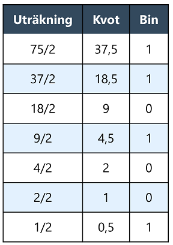

# Python - Kapitel 7

---

# DEC till BIN - Metod 1

--

## 75 till binärt

<b>75d = 1001011b</b>

--

## 148 till bin

<b>148d = 10010100b</b>

--

## 596 till bin

<b>596d = 1001010100b</b>

---

# DEC till BIN - Metod 2

--

## 75 till binärt

<b>75d = 1001011b</b>

Läs det binära talet nerifrån och uppåt

--

## 148 till bin

<b>148d = 10010100b</b>

--

## 596 till bin

<b>596d = 1001010100b</b>

---

# BIN till DEC - Metod 1

--

# 1010111 till decimalt

1 * 26 +
0 * 25 +
1 * 24 +
0 * 23 +
1 * 22 +
1 * 21 +
1 * 20

1 * 64 +
0 * 32 +
1 * 16 +
0 * 8 +
1 * 4 +
1 * 2 +
1 * 1

1 * 64 +
1 * 16 +
1 * 4 +
1 * 2 +
1 * 1

64 +
16 +
4 +
2 +
1 = 87

<b>1010111b = 87d</b>

---

# BIN till DEC - Metod 2

--

# 1010111 till decimalt

64 + 16 + 4 + 2 + 1 = 87

<b>1010111b = 87d</b>

--

# 11101101 till decimalt

128 + 64 + 32 + 8 + 4 + 1 = 237

<b>11101101b = 237d</b>

--

# 1110110101010111 till decimalt

32768 + 16384 + 8192 + 2048 +  1024 +   256 + 64 + 16 + 4 + 2 + 1 = 60759

<b>1110110101010111b = 60759d</b>

---

# BIN till DEC - Metod 3

--

# 1010111 till decimalt

--

# 11101101 till decimalt

--

# 1110110101010111 till decimalt

---

# DEC till HEX

--

## 47 till hexadecimalt

"2 15" &rarr; 2F

<b>47d = 2Fh</b>

--

## 232 till hexadecimalt

<b>323d = 143h</b>

--

## 3805 till hexadecimalt

"14 13 13" &rarr; EDD

<b>3805d= EDDh</b>

---

# HEX till DEC

--

## 2F till decimalt

2*161 + F*160

2*161 + 15*160

32 + 15 = 47

<b>2Fh = 47d</b>

--

## 143 till decimalt

1*162 + 4*161 + 3*160

256 + 64 + 3 = 323

<b>143h = 323d</b>

--

## EDD till decimalt

E*162 + D*161 + D*160

14*162 + 13*161 + 13*160

3584 + 208 + 13 = 3805

<b>EDDh = 3805d</b>

---

# BIN till HEX

--

Dela upp i grupper om fyra från minst värd siffra

Översätt från binärt till decimal form,  om 10-15 ange A-F.

--

--

**Kolumn ett** = Varannan nolla och etta osv

**Kolumn två** = Två nollor, två ettor osv.

**Kolumn tre** = Fyra nollor, fyra ettor osv.

**Kolumn fyra** = Åtta nollor, åtta ettor osv.

Första värdet kommer alltid vara enbart nollor i BIN.

Sista värdet kommer alltid vara enbart ettor i BIN.

--

## 101 till hexadecimalt

101

<b>0101b = 5h</b>

--

## 10101110110 till hexadecimalt

10101110110

0101 0111 0110 =
5 7 6

<b>10101110110b = 576h</b>

--

## 1011111111010 till hexadecimalt

1011111111010

0001 0111 1111 1010 =
1 7 15 10

1 7 15 10 =
1 7 F A

<b>1011111111010b = 17FAh</b>

---

# HEX till BIN

--

Översätt varje siffra för sig till 4-bitars binär form, använd tabellen.

--

--

## 5 till binärt

5 = 0101

<b>5h = 101b</b>

--

## 576 till binärt

5 = 0101, 7 = 0111, 6 = 0110

576h = 0101 0111 0110

<b>576h = 10101110110b</b>

--

## 17FA till binärt

1 = 0001, 7 = 0111, F = 1111, A = 1010

17FAh = 0001 0111 1111 1010b

<b>17FAh = 1011111111010b</b>

---

# SLUT!
