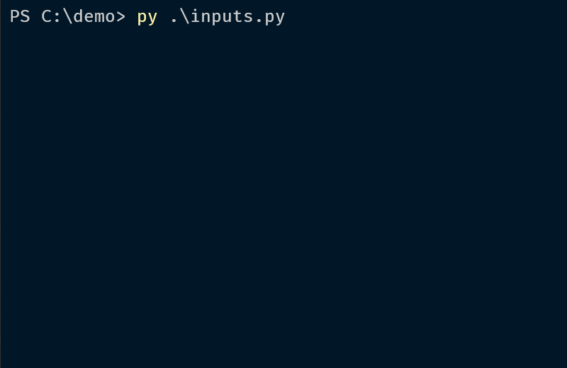
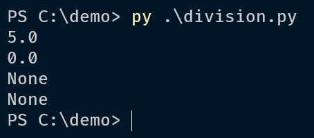
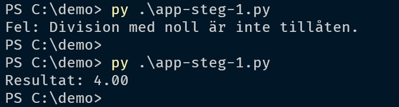
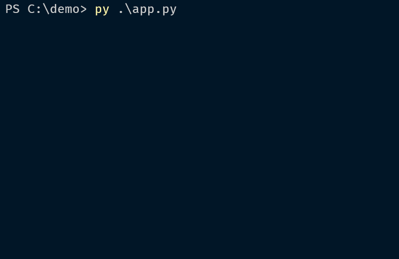

# Felhantering - Ett exempel

---

# Mål

--

- Skapa ett program som delar två heltal
- Använda funktioner för att separera kod
- Placera funktioner i separata filer (utom funktionen **main()**)
- Använd felhantering där det behövs.

---

# inputs.py

--

```python []
"""MODUL: inputs"""

def get_integer_input(prompt: str) -> int:
    """Prompts the user to enter an integer
    and validates the input.

    Args:
        prompt (str): The message displayed to the user.

    Returns:
        int: The valid integer entered by the user.
    """
    while True:
        try:
            return int(input(prompt))
        except ValueError:
            print("Fel: Ange ett giltigt heltal.")

if __name__ == "__main__":
    get_integer_input("Ange ett heltal: ")
```

--



---

# division.py

--

```python []
"""MODUL: division"""

def divide_numbers(numerator: int, denominator: int) -> float | None:
    """Divides two integers and returns the result.

    Args:
        numerator (int): The numerator (täljare).
        denominator (int): The denominator (nämnare).

    Returns:
        float | None: The division result, or
        None if division by zero occurs.
    """
    try:
        return numerator / denominator
    except ZeroDivisionError:
        return None

if __name__ == "__main__":
    print(divide_numbers(10, 2))  # 5.0
    print(divide_numbers(0, 10))  # 0.0
    print(divide_numbers(10, 0))  # None
    print(divide_numbers(0, 0))   # None
```

--



---

# app.py

--

## Steg 1

```python []
from inputs import get_integer_input
from division import divide_numbers

def main() -> None:
    """Main function to get input, perform
    division, and display the result.

    Numerator = Täljare
    Denominator = Nämnare
    Quotient = Kvot
    """

    numerator = 12
    denominator = 0
    quotient: float | None = divide_numbers(numerator, denominator)

    if quotient is None:
        print("Fel: Division med noll är inte tillåten.")

    if quotient is not None:
        print(f"Resultat: {quotient:.2f}")

if __name__ == "__main__":
    main()
```

--



--

## Steg 2

```python []
from inputs import get_integer_input
from division import divide_numbers

def main() -> None:
    """Main function to get input, perform division,
    and display the result."""

    numerator: int = get_integer_input("Ange täljaren: ")

    while True:
        denominator: int = get_integer_input("Ange nämnaren: ")

        if denominator == 0:
            print("Fel: Nämnaren får inte vara noll.")
        else:
            break

    quotient: float | None = divide_numbers(numerator, denominator)

    if quotient is None:
        print("Fel: Division med noll är inte tillåten.")

    if quotient is not None:
        print(f"Resultat: {quotient:.2f}")

if __name__ == "__main__":
    main()

```

--


--



---

# Slut!
