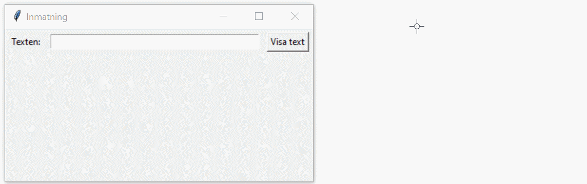

# Introduktion till Tkinter

---

# Vad är Tkinter?

--

Tkinter är ett bibliotek för att skapa grafiska användargränssnitt (GUI) i Python.

--

Ingår i standardbiblioteket och kräver ingen extra installation.

--

Används för att skapa fönster, knappar, textrutor och andra GUI-element.

---

# Första Tkinter-programmet

--

```python []
import tkinter as tk

# Skapa huvudfönstret
root = tk.Tk()
root.title("Min första GUI-app")

# Skapa en etikett
label = tk.Label(root, text="Hej världen!")
label.pack()

# Starta huvudloopen
root.mainloop()
```

--

## Förklaring

**tk.Tk()** skapar huvudfönstret.

**tk.Label()** skapar en textetikett.

**.pack()** placerar etiketten i fönstret.

**root.mainloop()** startar programmets GUI-loop.

--


--


---

# Ändra storlek på fönstret

--

## Sätta en storlek vid start

```python [6-7]
import tkinter as tk

root = tk.Tk()
root.title("Min första GUI-app")

# Sätter fönstrets storlek till 800x600 pixlar
root.geometry("800x600")

label = tk.Label(root, text="Hej världen!")
label.pack()

root.mainloop()
```

--


--

## Sätta min- och maxstorlekar

```python
import tkinter as tk

root = tk.Tk()
root.title("Min första GUI-app")

root.geometry("800x600")

# Minsta storlek 400x300
root.minsize(400, 300)

# Största storlek 1024x768
root.maxsize(1024, 768)

label = tk.Label(root, text="Hej världen!")
label.pack()

root.mainloop()
```

--

## Fullskärm

```python [6-7]
import tkinter as tk

root = tk.Tk()
root.title("Min första GUI-app")

# Fullskärm (endast Windows)
root.state("zoomed")

label = tk.Label(root, text="Hej världen!")
label.pack()

root.mainloop()
```

--

## Statisk storlek

```python [6-8 ]
import tkinter as tk

root = tk.Tk()
root.title("Min första GUI-app")

root.geometry("400x300")
# Förhindrar ändring av storlek
root.resizable(False, False)

label = tk.Label(root, text="Hej världen!")
label.pack()

root.mainloop()
```

---

# Lägga till knappar

--

```python [3-5, 11-12, 14-15]
import tkinter as tk

def klicka():
    """DOCSTRING"""
    label.config(text="Knappen klickades!")

root = tk.Tk()
root.title("Knapp")
root.geometry("400x100")

label = tk.Label(root, text="Tryck på knappen!")
label.pack()

button = tk.Button(root, text="Klicka mig!", command=klicka)
button.pack()

root.mainloop()
```

--

## Förklaring

**tk.Button()** skapar en knapp.

**command=klicka** kopplar knappen till funktionen **klicka()**.

**label.config(text=...)** ändrar texten på etiketten.

--


---

# Enkel inmatning från användaren

--

```python [3-5, 14-15, 17-18]
import tkinter as tk

def visa_text():
    """DOCSTRING"""
    label.config(text=f"Du skrev: {entry.get()}")

root = tk.Tk()
root.title("Inmatningsexempel")
root.geometry("400x100")

entry = tk.Entry(root)
entry.pack()

button = tk.Button(root, text="Visa text", command=visa_text)
button.pack()

label = tk.Label(root, text="")
label.pack()

root.mainloop()
```

--

## Förklaring

**tk.Entry()** skapar en inmatningsruta.

**.get()** hämtar texten från rutan.

**label.config(text=...)** uppdaterar etikettens text.

--



---

# Skapa menyer

--

```python [3-5, 11-19]
import tkinter as tk

def post():
    """DOCSTRING"""
    label.config(text="Du valde POST")

root = tk.Tk()
root.title("Meny")
root.geometry("400x100")

meny = tk.Menu(root)
root.config(menu=meny)

fil_meny = tk.Menu(meny, tearoff=0)
fil_meny.add_command(label="Post", command=post)
fil_meny.add_separator()
fil_meny.add_command(label="Avsluta", command=root.quit)

meny.add_cascade(label="Fil", menu=fil_meny)

label = tk.Label(root, text="Välj en meny!", font=("Arial", 14))
label.pack()

root.mainloop()
```

--

## Förklaring

**tk.Menu()** skapar en meny.

**add_command()** lägger till alternativ i menyn.

**add_separator()** lägger till ett streck

**add_cascade()** kopplar undermenyn till huvudmenyn.

**root.config(menu=meny)** aktiverar menyn i huvudfönstret.

--

## 

---

# Hantera textfiler

--

## Del 1

```python [7-8]
import tkinter as tk

root = tk.Tk()
root.title("Textfil")
root.geometry("400x100")

text_area = tk.Text(root, wrap="word")
text_area.pack(expand=True, fill="both")

meny = tk.Menu(root)
root.config(menu=meny)

fil_meny = tk.Menu(meny, tearoff=0)
fil_meny.add_command(label="Öppna", command="")
fil_meny.add_command(label="Spara", command="")
fil_meny.add_separator()
fil_meny.add_command(label="Avsluta", command=root.quit)
meny.add_cascade(label="Fil", menu=fil_meny)

root.mainloop()
```

--


--

## Förklaring

Doh!

--

## Del 2

```python [2, 4-16, 29]
import tkinter as tk
from tkinter import filedialog

def oppna_fil():
    """DOCSTRING"""
    filnamn = filedialog.askopenfilename(
        filetypes=[
            ("Textfiler", "*.txt"),
            ("Alla filer", "*.*")
        ]
    )

    if filnamn:
        with open(filnamn, "r") as fil:
            text_area.delete("1.0", tk.END)
            text_area.insert(tk.END, fil.read())

root = tk.Tk()
root.title("Textfil")
root.geometry("400x100")

text_area = tk.Text(root, wrap="word")
text_area.pack(expand=True, fill="both")

meny = tk.Menu(root)
root.config(menu=meny)

fil_meny = tk.Menu(meny, tearoff=0)
fil_meny.add_command(label="Öppna", command=oppna_fil)
fil_meny.add_command(label="Spara", command="")
fil_meny.add_separator()
fil_meny.add_command(label="Avsluta", command=root.quit)
meny.add_cascade(label="Fil", menu=fil_meny)

root.mainloop()
```

--

## Förklaring

**filedialog.askopenfilename()** används för att välja en fil att öppna.

**with open(filnamn, "r")** läser från filen.

**text_area.delete("1.0", tk.END)** tar bort all text från början till slut.

**text_area.insert(tk.END, fil.read())** läser hela innehållet i en öppen fil och placerar texten i textarean vid slutet.

--


--

## Del 3

```python [18-31, 45]
import tkinter as tk
from tkinter import filedialog

def oppna_fil():
    """DOCSTRING"""
    filnamn = filedialog.askopenfilename(
        filetypes=[
            ("Textfiler", "*.txt"),
            ("Alla filer", "*.*")
        ]
    )

    if filnamn:
        with open(filnamn, "r") as fil:
            text_area.delete("1.0", tk.END)
            text_area.insert(tk.END, fil.read())

def spara_fil():
    """DOCSTRING"""
    text = text_area.get("1.0", tk.END)
    filnamn = filedialog.asksaveasfilename(
        defaultextension=".txt",
        filetypes=[
            ("Textfiler", "*.txt"),
            ("Alla filer", "*.*")
        ]
    )

    if filnamn:
        with open(filnamn, "w") as fil:
            fil.write(text)

root = tk.Tk()
root.title("Textfil")
root.geometry("400x100")

text_area = tk.Text(root, wrap="word")
text_area.pack(expand=True, fill="both")

meny = tk.Menu(root)
root.config(menu=meny)

fil_meny = tk.Menu(meny, tearoff=0)
fil_meny.add_command(label="Öppna", command=oppna_fil)
fil_meny.add_command(label="Spara", command=spara_fil)
fil_meny.add_separator()
fil_meny.add_command(label="Avsluta", command=root.quit)
meny.add_cascade(label="Fil", menu=fil_meny)

root.mainloop()
```

--

## Förklaring

**text_area.get("1.0", tk.END)** hämtar text från text_area från startpositionen till slutpositionen. **1.0** betyder första raden, första tecknet och **tk.END** betyder slutet av texten.

**filedialog.asksaveasfilename()** används för att välja var filen ska sparas.

**with open(filnamn, "w")** skriver till filen.

---

# Vidare läsning

- [Tkinter-dokumentation](https://docs.python.org/3/library/tkinter.html)
- [Tkinter-tutorial](https://realpython.com/python-gui-tkinter/)
