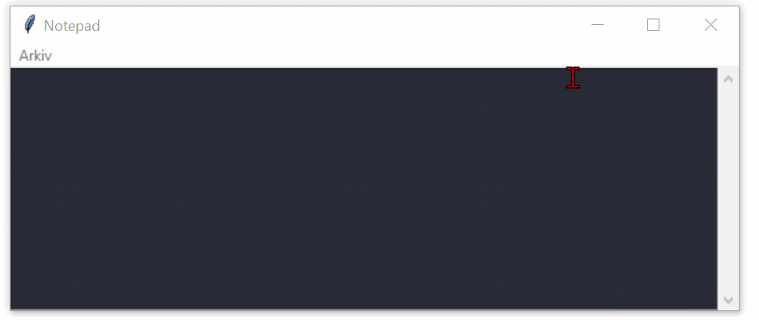
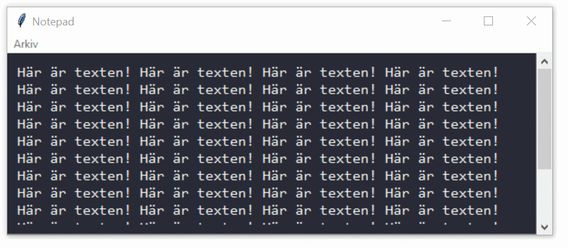

# Tkinter

---

# Vad är Tkinter?

--

Tkinter är ett bibliotek för att skapa grafiska användargränssnitt (GUI) i Python.

--

Ingår i standardbiblioteket och kräver ingen extra installation (nja).

--

Används för att skapa fönster, knappar, textrutor och andra GUI-element.

---

# Första Tkinter-programmet

--

```python []
import tkinter as tk

# Skapar huvudfönstret
root = tk.Tk()
root.title("Min första GUI-app")

# Skapar en etikett
label = tk.Label(root, text="Hej världen!")

# Placerar etiketten i fönstret
label.grid(row=0,column=0)

# Startar huvudloopen
root.mainloop()
```

--

## Förklaring

**tk.Tk()** skapar huvudfönstret.

**tk.Label()** skapar en textetikett.

**.pack()** placerar etiketten i fönstret.

**root.mainloop()** startar programmets GUI-loop.

--


--


---

# Ändra storlek på fönstret

--

## Sätta en storlek vid start

```python [6-7]
import tkinter as tk

root = tk.Tk()
root.title("Min första GUI-app")

# Sätter fönstrets storlek
root.geometry("500x400")

# Minsta storlek
root.minsize(400, 200)

# Största storlek
root.maxsize(800, 600)

label = tk.Label(
  root,
  text="Hej världen!"
)

label.grid(
  row=0,
  column=0,
  padx=10,
  pady=10
)

root.mainloop()
```

--

## Fullskärm

```python [6-7]
import tkinter as tk

root = tk.Tk()
root.title("Min första GUI-app")

# Fullskärm (endast Windows)
root.state("zoomed")

label = tk.Label(
  root,
  text="Hej världen!"
)

label.grid(
  row=0,
  column=0,
  padx=10,
  pady=10
)

root.mainloop()
```

--

```python [2, 7-9]
import tkinter as tk
import os

root = tk.Tk()
root.title("Min första GUI-app")

# Kontrollera om operativsystemet är Windows
if os.name == "nt":
    root.state("zoomed")

label = tk.Label(
    root,
    text="Hej världen!"
)

label.grid(
    row=0,
    column=0,
    padx=10,
    pady=10
)

root.mainloop()
```

--

## Statisk storlek

```python [6-8 ]
import tkinter as tk

root = tk.Tk()
root.title("Min första GUI-app")

root.geometry("400x300")
# Förhindrar ändring av storlek
root.resizable(False, False)

label = tk.Label(root, text="Hej världen!")
label.pack()

root.mainloop()
```

---

# Lägga till knappar

--

```python [3-5, 12-15, 17-37]
import tkinter as tk

def klicka() -> None:
    """DOCSTRING"""
    label.config(text="Knappen klickades!")

root = tk.Tk()
root.title("Knapp")
root.geometry("400x100")
root.resizable(False, False)

label = tk.Label(
    root,
    text="Tryck på knappen!"
)

label.grid(
    row=0,
    column=0,
    padx=10,
    pady=10
)

# Skapar en knapp som kör funktionen klicka
button = tk.Button(
    root,
    text="Klicka mig!",
    command=klicka
)

# Placerar knappen i fönstret
button.grid(
    row=0,
    column=1,
    padx=10,
    pady=10
)

root.mainloop()
```

--

## Förklaring

**tk.Button()** skapar en knapp.

**command=klicka** kopplar knappen till funktionen **klicka()**.

**label.config(text=...)** ändrar texten på etiketten.

--


---

# Enkel inmatning från användaren

--

```python ]
import tkinter as tk

def visa_text():
    label_output.config(text=f"Du skrev: {entry.get()}")

root = tk.Tk()
root.title("Inmatning")
root.geometry("400x200")

# Konfigurera kolumnerna
root.columnconfigure(0, weight=0)
root.columnconfigure(1, weight=1)
root.columnconfigure(2, weight=0)

# Skapa och placera widgets
label = tk.Label(root, text="Texten:")
label.grid(column=0, row=0, sticky=tk.W, padx=5, pady=5)

entry = tk.Entry(root)
entry.grid(column=1, row=0, sticky="ew", padx=5, pady=5)

button = tk.Button(root, text="Visa text", command=visa_text)
button.grid(column=2, row=0, sticky=tk.W, padx=5, pady=5)

label_output = tk.Label(root, text="")
label_output.grid(column=0, row=1, columnspan=2, sticky="w", padx=5, pady=5)

root.mainloop()
```

--

## Förklaring

Vi ställer in hur kolumnerna i fönstret ska bete sig när fönstret ändrar storlek. Kolumn 1 (mittkolumnen) ges en vikt på 1, vilket gör att den expanderar vid fönstrets storleksändring.

Vi skapar ett inmatningsfält, **Entry** där användaren kan skriva in text och placerar det i kolumn 1, rad 0

**sticky="ew"** för att expandera både åt vänster och höger.

**sticky=tk.W**, för att vänsterjustera

--


---

# Skapa menyer

--

```python [3-4, 11-34]
import tkinter as tk

def post():
    label.config(text="Du valde POST")

root = tk.Tk()
root.title("Meny")
root.geometry("400x100")
root.resizable(False, False)

meny = tk.Menu(root)
root.config(menu=meny)

fil_meny = tk.Menu(
    meny,
    tearoff=0
)

fil_meny.add_command(
    label="Post",
    command=post
)

fil_meny.add_separator()

fil_meny.add_command(
    label="Avsluta",
    command=root.quit
)

meny.add_cascade(
    label="Fil",
    menu=fil_meny
)

label = tk.Label(
    root, text="Välj en meny!",
    font=("Arial", 14)
)

label.grid(
    row=0,
    column=0,
    padx=10,
    pady=10
)

root.mainloop()

```

--

## Förklaring

**tk.Menu()** skapar en meny.

**add_command()** lägger till alternativ i menyn.

**add_separator()** lägger till ett streck

**add_cascade()** kopplar undermenyn till huvudmenyn.

**root.config(menu=meny)** aktiverar menyn i huvudfönstret.

--


---

# Textruta

--

```python [2, 4, 6-10, 20-33, 38]
import tkinter as tk
import tkinter.scrolledtext as tkst

current_file = None

def new_file():
    global current_file
    current_file = None
    text_area.delete(1.0, tk.END)
    root.title("Notepad")

root = tk.Tk()
root.title("Notepad")
root.geometry("600x400")
root.minsize(400, 200)

root.grid_rowconfigure(0, weight=1)
root.grid_columnconfigure(0, weight=1)

text_area = tkst.ScrolledText(
    master=root,
    wrap=tk.WORD,
    undo=True,
    padx=10,
    pady=10,
    font=("Consolas", 12),
    bg="#282A36",
    fg="#F8F8F2",
    insertbackground="white",
    selectbackground="#6272A4",
    selectforeground="#F8F8F2"
)
text_area.grid(row=0, column=0, sticky="nsew")

main_menu = tk.Menu(root)
file_menu = tk.Menu(main_menu, tearoff=0)
main_menu.add_cascade(label="Arkiv", menu=file_menu)
file_menu.add_command(label="Ny", command=new_file)
file_menu.add_separator()
file_menu.add_command(label="Avsluta", command=root.quit)
root.config(menu=main_menu)

root.mainloop()

```

--



--


