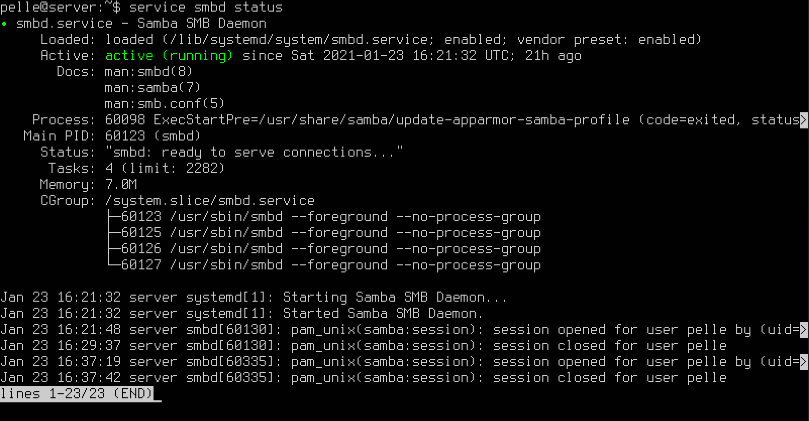
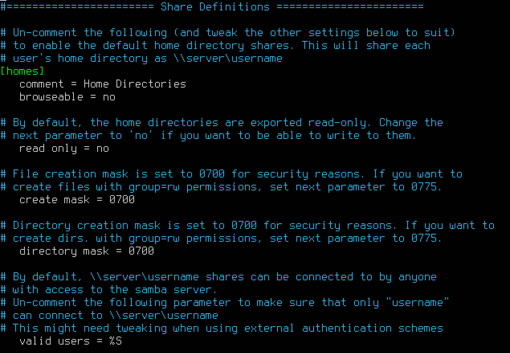
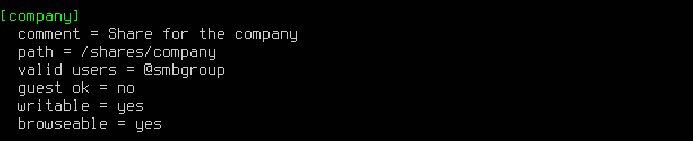
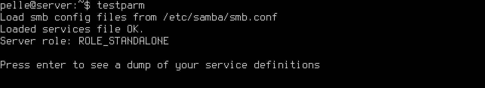
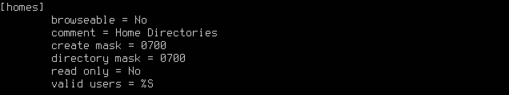

# Samba

---

# Vad är Samba?

--

Samba är fri programvara för Linux/Unix-system som använder SMB/CIFS-protokollet och används för att dela resurser som filer och skrivare i ett Windows-datornätverk (fil/printer-server).

---

# Installation

--


```html
sudo apt update
sudo apt upgrade
sudo apt install samba
whereis samba
sudo ufw allow samba
service smbd status
```

--



---

# Användare och rättigheter

--

Rättigheter till den utdelade mappen

Rättighter via Samba (Read/Write)

```html
sudo smbpassw -a username
```

---

# Konfiguration

--

```html
/etc/samba/smb.conf
```

Väldokumenterad!

--



--

## Sektioner

--

### [global]

Globala paramatrar som gäller för hela servern.

--

### [homes]

Inställningar för hemkataloger.

Om användaren och lösenord finns i Samba så klonas [home] och en delning skapas för användaren.

Om ingen unik _path_ har angivits länkas man till sin hemkatalog.

```html
path = /samba/home/%S
```

%S = Current share’s name

--

### [printers]

Används för att dela ut skrivare

---

# Hemkataloger

--


---

# Delade kataloger

--



--

```html
elev@server:~$ sudo addgroup smbgroup
Adding group 'smbgroup' (GID 1001) ...
Done.
```

--

```html
elev@server:~$ sudo usermod -aG smbgroup elev
```

--

```html
elev@server:~$ cat /etc/group | grep smbgroup
smbgroup:x:1001:elev

elev@server:~$ groups
elev adm cdrom sudo dip plugdev lxd smbgroup
```

--

```html
elev@server:~$ sudo mkdir -p shares/company
```

--

```html
elev@server:~$ sudo chown -R root:smbgroup /shares/company
elev@server:~$ sudo chmod -R 770 /shares/company
```

--

```html
elev@server:~$ ls -l /shares/
total 4
drwxrwx--- 2 root smbgroup 4096 Jan 23 13:37 company
```

---

# Använda sin modifierade konfig

--

## Kontroll

--





--

## Starta om tjänsten

```html
sudo service restart smbd
```
