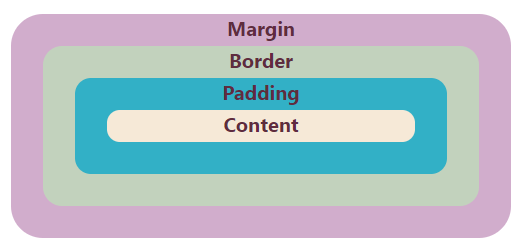
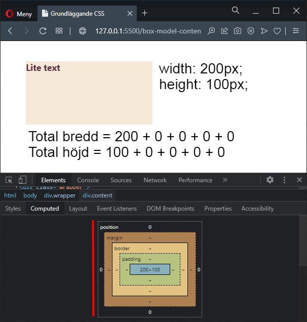
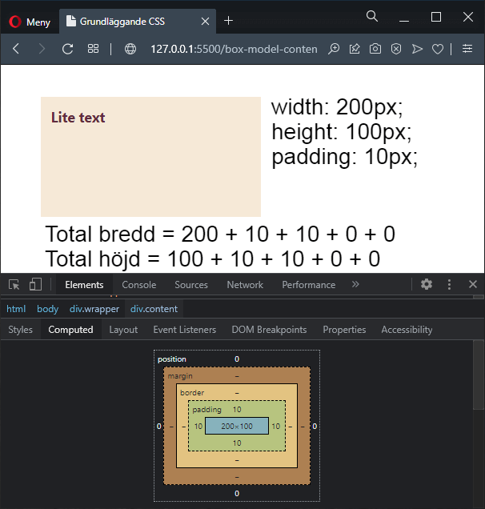
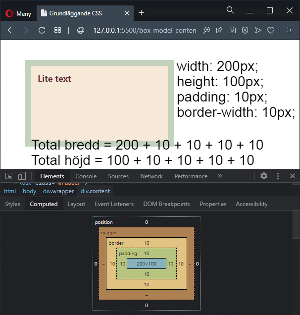

# Box-modellen

---



---

# box-sizing: content-box

--

Det här är standardvärdet.

Sätter man bredd och/eller höjd på ett element så kommer det ange bredden för innehållet (content).

**content + padding + border = total bredd/höjd**

--

```html []
<div class="content">Lite text</div>
```

```css []
.content {
  /* box-sizing: content-box;  Behöver ej anges, standard */ 
  background-color: #F6E9D7;

  height: 100px;
  width: 200px;    
}
```

--



--

## Vi lägger till padding

```css [7]
.content {
  background-color: #F6E9D7;

  height: 100px;
  width: 200px; 
  
  padding: 10px;
}
```

--



--

## Vi lägger till padding + border

```css [7-8]
.content {
  background-color: #F6E9D7;

  height: 100px;
  width: 200px; 
  
  padding: 10px;
  border: 10px solid #C2D2BD;
}
```

--



---

# box-sizing: border-box

--

I det här fallet kommer **border** och **padding** påverka bredden/höjden på **content**.

**width - border - padding = content**

**height - border - padding = content**

--

Doh!

---

# Jämförelse

--

Doh! Jämförande EXEMPEL

---

# Reset

--

```css []
html {
  box-sizing: border-box;
}

*, *:before, *:after {
  box-sizing: inherit;
}
```

[Läs mer om reseten på CSS-tricks](https://css-tricks.com/box-sizing/).

---

# Länkar

[https://developer.mozilla.org/en-US/docs/Web/CSS/box-sizing](https://developer.mozilla.org/en-US/docs/Web/CSS/box-sizing)

---

# SLUT
