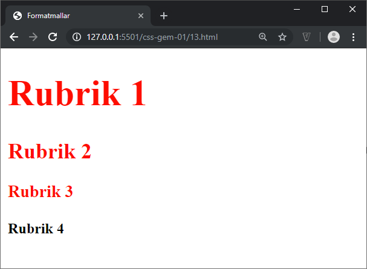
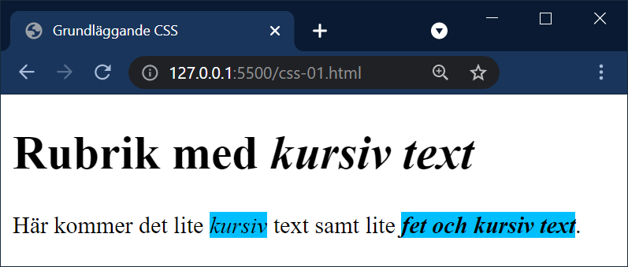

# CSS - 01 - Introduktion

## Webbutveckling 1

---

# CSS

--

Cascading Style Sheet

Formatmallar

Används för att skapa presentation av innehåll, t.ex färger, typsnitt och layout

---

# Hur är en CSS-regel uppbyggd?

--

```css  [ ]
selektor {
  egenskap: värde;
}
```

```css  [ ]
p {
  color: blue;
}
```

--


---

# Regler för deklarationers värden

--

Tre huvudgrupper av värden:

* **Ord**, t.ex `font-weight: bold;`
* **Numeriska värden**, t.ex `font-size: 12px;`
* **Färgvärden**, t.ex `color: #AABBCC;`

---

# Skriva CSS-regler

--

## Flera deklarationer  i samma regel


```css  [ ]
p {
  color: red;
  font-size: 20px;
}
```

--


--

## Flera selektorer kan grupperas


```css  [ ]
h1, h2, h3 {
  color: red;
}
```

--


--

## Flera regler kan appliceras på samma selektor


```css  [ ]
h1, h2, h3 {
  color: red;
}

h1 {
  font-size: 40px;
}
```

--



---

# Tre sätt att ange

--

## Lokala (inline)

Bifogas som ett attribut i en tagg.


```html
<p>Det här är stycke 1</p>

<p style="font-size:25pt; font-weight:bold; font-style:italic; color:red;">Det här stycket är moddat</p>

<p>Det här är stycke 3</p>
```

Den här tekniken bör (läs **skall**) undvikas.

--


--

## Inbäddade

Placeras mellan **&lt;head&gt;&lt;/head&gt;**


```html
<style>
h1 {   
  font-family: Arial, Helvetica, sans-serif;
  font-size: 48px;
  font-weight: bold;
  color: #0084A9;
}
p {
  font-size: 20px;
  color: #006600;
}
</style>
```

Den här tekniken kan användas för enskilda dokument. **Ni ska inte använda tekniken!**

--


--

# Länkade

Separat fil som länkas in mellan **&lt;head&gt;&lt;/head&gt;**


```html
<link rel="stylesheet" href="format.css">
```

```css  [ ]
body {
  background-color: #FFFF64;
}

h1 {
  font-family: Arial, Helvetica, sans-serif;
  font-size: 48px;
  color: #0084A9;
}
```

Tekniken ni ska använda!

--


---

# Vad innebär cascading?

--

1. Webbläsarens standardformatmall
1. Användarformatmallen
1. Författarstilmallen (länkade)
1. Inbäddade stilar (i head)
1. Lokala (inline)

Desto högre nummer desto senare läses de in och vinner över lägre nummer.

---

# CSS selektorer 

--

## Universiell


```css  [ ]
* {
    egenskap: värde;
}
```

Påverkar alla selektorer!


```css  [ ]
* {
  margin: 0;
  padding: 0;
}
```

--

## Element

```css  [ ]
selektor {
  egenskap: värde;
}
```

Påverkar alla taggar/element av angiven typ.

```css  [ ]
p {
  color: red;
}
```

--


--

## Ättlingar (descendant)

```css [ ]
selektorA selektorB {
  egenskap: värde;
}
```

Påverkar alla **selektorB** släktningar till **selektorA**.

```css [ ]
p i {
  background-color: deepskyblue;
}
```

Påverkar alla i-taggar som är släktningar till p-taggen.

--

```html
<h1>Rubrik med <i>kursiv text</i></h1>

<p>Här kommer det lite <i>kursiv</i> text samt lite <b><i>fet och kursiv text</i></b>.</p>
```

Här ser vi att vi har en i-tagg inuti vår h1:a och den kommer inte att påverkas av vår regel.

Dock kommer alla i-taggar inuti vår p-tagg att göra det, oavsett släktskap till p-taggen.

--


Här ser vi hur släktskapet är för taggarna. Som du ser så är den första i-taggen inuti p-taggen barn till denna. Den andra i-taggen är barnbarn till p-taggen då den återfinns inut b-taggen.

--



--

## Barn (child)

```css [ ]
selektorA > selektorB {
  egenskap: värde;
}
```

Påverkar alla **selektorB** som är barn till **selektorA**.

```css [ ]
p > i {
  background-color: deepskyblue;
}
```

Påverkar alla i-taggar som är barn till p-taggen.

--

```html
<h1>Rubrik med <i>kursiv text</i></h1>
<p>Här kommer det lite <i>kursiv</i> text samt lite <b><i>fet och kursiv text</i></b>.</p>
```

--


Här ser vi att enbart i-taggen som är direkt barn till p-taggen påverkas av vår regel

--

## Intilliggande (adjacent)

```css [ ]
selektor + selektor {
  egenskap: värde;
}
```

Påverkar vald selektor som ligger direkt efter.

```css [ ]
h1 + p {
  background-color: powderblue;
}
```

```html
<h1>Rubrik</h1>
<p>Lorem ipsum dolor sit amet.</p>
<p>Lorem ipsum dolor sit amet.</p>
```

--


--

## Klasser (class)

```css [ ]
.klassnamn {
  egenskap: värde;
}
```

En klass kan användas på noll eller flera ställen per html-dokument.

```css [ ]
.test {
  background-color: powderblue;
}
```

```html
<h1 class="test">Rubrik med klass</h1>
<h1>Rubrik utan klass</h1>
```

--


--

# Id

```css [ ]
#idnamn {
  egenskap: värde;
}
```

Får enbart kallas på en gång per html-dokument. Om inget annat sägs använder vi inte id:n!

```css [ ]
#test {
  background-color: powderblue;
}
```

```html
<h1 id="test">Rubrik med id</h1>
<h1>Rubrik utan id</h1>
```

--


---

# Slut!
