# CSS - 02 - Texthantering

## Webbutveckling 1

---

# Teckensnitt

--

## Familjer

* Serif
* Sans-serif
* Monospace
* Cursive
* Fantasy
* ~~System-UI~~ 
* ~~Emoji~~
* ~~Math~~
* ~~Fangsong~~

--

### Serif

Har serifer (tvärstreck).

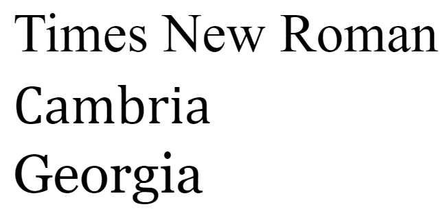

--

#### Times New Roman, Cambria, Georgia

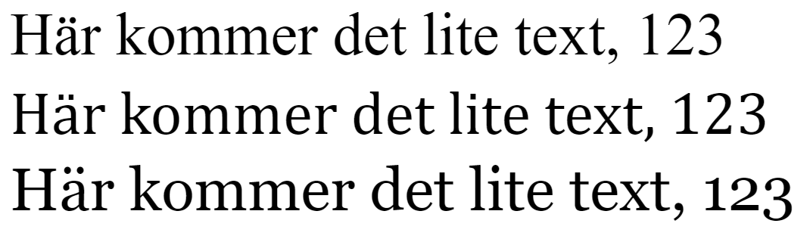

Samma storlek på texten.

--
### Sans-serif

Saknar tvärstreck och är (vanligen) jämntjocka.

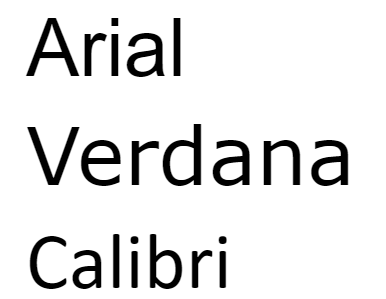

--

#### Arial, Verdana, Calibri

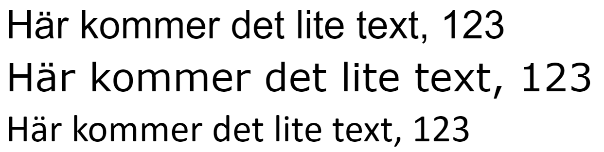

Samma storlek på texten.

--

### Monospace

Alla bokstäver är lika breda.

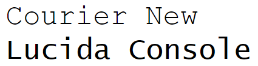

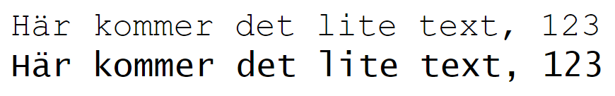

Samma storlek på texten.

--

### Cursive

Skrivstil eller mer "extrem" kursiv stil än vanlig kursiv stil.


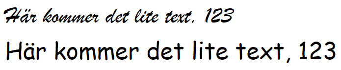

Samma storlek på texten.

--
### Fantasy

Dekorativa teckensnitt.

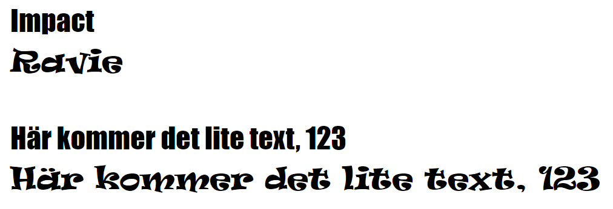

Samma storlek på texten.

---

# Teckensnittsfamiljer

Anges med egenskapen **font-family**

Ska alltid avslutas med ett generiskt namn (familjenam).

Anger man teckensnitt med mellanslag i namnet bör (läs ska) man ha " " runt hela namnet.

Tänk på att teckensnitten måste vara installerade på klienten (finns lösningar för det, mer om det senare i kursen).

--

## Exempel


```css
.ex1 {
  font-family: Arial, Helvetica, sans-serif;
}
.ex2 {
  font-family: 'Segoe UI', Tahoma, Geneva, Verdana, sans-serif;
}
.ex3 {
  font-family: Cambria, Cochin, Georgia, 'Times New Roman', serif;
}
.ex4 {
  font-family: "Times New Roman", Times, Baskerville, Georgia, serif;
}
```

--

## Mer information

* [https://developer.mozilla.org/en-US/docs/Web/CSS/font-family](https://developer.mozilla.org/en-US/docs/Web/CSS/font-family)
* [https://www.lifewire.com/web-safe-font-stacks-3467429](https://www.lifewire.com/web-safe-font-stacks-3467429)
* [https://css-tricks.com/typography-for-developers/](https://css-tricks.com/typography-for-developers/)

---

# Textstorlek

Ändras med egenskapen **font-size**

Vanliga enheter är *px*, *em*, *rem*.

Se [mdn-font-size för mer om tillåtna enheter](https://developer.mozilla.org/en-US/docs/Web/CSS/font-size).

--

```css
p {
  font-size: 40px;
}
```

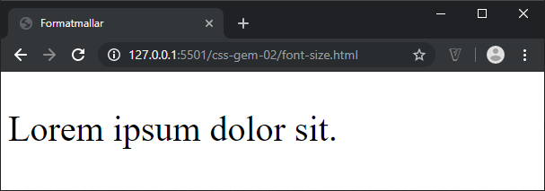

--

## Em vs. Rem

--

### Em

**Em** är en relativ storlek som baseras på förälderns storlek.

Som standard i webbläsarna har vi en textstorlek på 16px.

--

```css
h1 {
  font-size: 2em; /*16px * 2 = 32px*/
}
```

--

```css
html {
  font-size: 20px;
}

h1 {
  font-size: 4em; /*20px * 4 = 80px*/
}
```

--

### "Problem" med em


```css
html {font-size: 20px;}

i {font-size: 1.5em;}

b {font-size: 1.5em;}
```

```html
<p>Här <i>kommer <b>det lite</b></i> text</p>
```

--

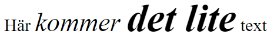

Här blir i:et **20\*1,5= 30px** och b:et blir **30px\*1,5=45px**

--

## Rem

**Rem** är en relativ storlek som baseras på html-taggens text-storlek.


```css
html {font-size: 20px;}

i {font-size: 1.5rem;}

b {font-size: 1.5rem;}
```

```html
<p>Här <i>kommer <b>det lite</b></i> text</p>
```

--

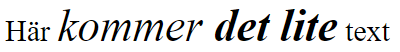

Här blir i:et **20\*1,5= 30px** och b:et blir **20px\*1,5=30px**

---

# Textfärg

Ändras med egenskaper **color**

Vanliga enheter är:
* **hexkod**, t.ex *#AABBCC*
* **hexkod**, t.ex *#ABC*
* **rgb**, t.ex *rgb(111, 222 , 255)*
* **Ord**, t.ex *blue*, *green*

Se [mdn-color för mer om tillåtna enheter](https://developer.mozilla.org/en-US/docs/Web/CSS/color).

Se även [mdn-color-value för mer om färger](https://developer.mozilla.org/en-US/docs/Web/CSS/color_value)

--

```css
p {
  color: red;
}
```

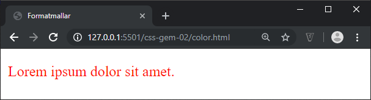

---

# Tjocklek

Ändras med egenskapen **font-weight**

Vanliga enheter är *normal* och *bold*.

Se [mdn-font-weight för mer om tillåtna enheter](https://developer.mozilla.org/en-US/docs/Web/CSS/font-weight)

--

```css
.ex1 {
  font-weight: bold;
}
```

```html
<p class="ex1">Lorem ipsum dolor sit amet.</p>
<p>Lorem ipsum dolor sit amet.</p>
```

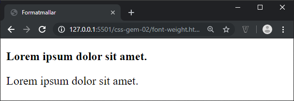

---

# Versaler och gemener mm

Ändras med **text-transform**

Vanliga enheter är *uppercase*, *lowercase*, *capitalize*, *none*

Se [mdn-text-transform för mer om tillåtna enheter](https://developer.mozilla.org/en-US/docs/Web/CSS/text-transform)

--

```css
.ex1 {
  text-transform: uppercase;
}

.ex2 {
  text-transform: capitalize;
}
```

```html
<h1 class="ex1">Omformad till versaler</h1>
<h1 class="ex2">Omformad till capitalize</h1>
```

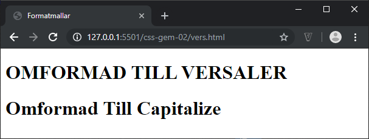

--

Ändras med egenskapen **font-variant**

Vanliga enheter är *normal*, *small-caps*.

Se [mdn-font-variant för mer om tillåtna enheter](https://developer.mozilla.org/en-US/docs/Web/CSS/font-variant)

```css
h1 {
  font-variant: small-caps;
}
```

```html
<h1>Stora små bokstäver</h1>
```

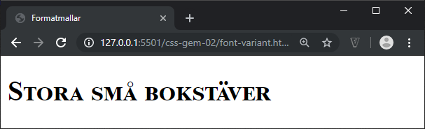

---

# Avstånd mellan bokstäver

Ändras med egenskapen **letter-spacing**

Vanliga enheter är *normal*, *längdenheter*

Se [mdn-letter-spacing för mer om tillåtna enheter](https://developer.mozilla.org/en-US/docs/Web/CSS/letter-spacing)

--

```css
.ex1 {
  letter-spacing: 0.1em;
}

.ex2{
  letter-spacing: -0.1em;
}
```

```html
<h1>Orginal texten</h1>
<h1 class="ex1">Posivt värde</h1>
<h1 class="ex2">Negativt värde</h1>
```

--

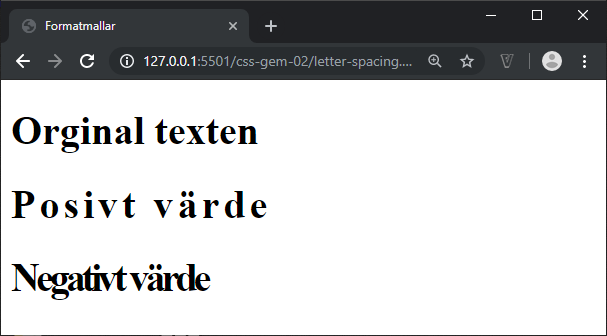

---

# Avstånd mellan ord

Ändras med egenskapen **word-spacing**

Vanliga enheter är *normal*, *längdenheter*

Se [mdn-word-spacing för mer om tillåtna enheter](https://developer.mozilla.org/en-US/docs/Web/CSS/word-spacing)

--

```css
.ex1 {
  word-spacing: 0.1em;
}

.ex2{
  word-spacing: 0.5em;
}
```

```html
<h1>Orginal texten</h1>
<h1 class="ex1">Posivt värde</h1>
<h1 class="ex2">Negativt värde</h1>
```

--

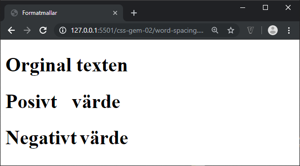

---

# Radavstånd

Ändras med egenskapen **line-height**

Vanliga enheter är *normal*, *nummer*, *längdenheter*, *procent*

Se [mdn-line-height för mer om tillåtna enheter](https://developer.mozilla.org/en-US/docs/Web/CSS/line-height)

--

```css
.lineheight {
  line-height: 150%;
}
```

```html
<p>Lorem...</p>
<p class="lineheight">Lorem...</p>
```

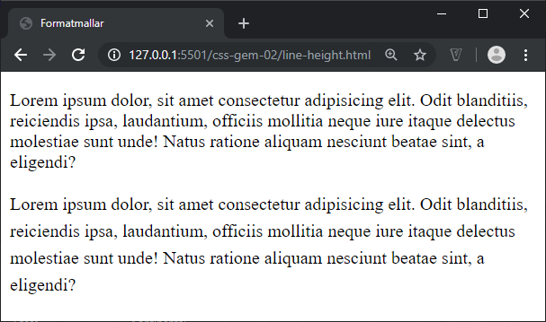

---

# Textjustering

Ändras med egenskapen **text-align**

Vanliga enheter är *left*, *right*, *center*

Se [mdn-text-align för mer om tillåtna enheter](https://developer.mozilla.org/en-US/docs/Web/CSS/text-align)

--

```css
.ex1 {
  text-align: center;
}

.ex2{
  text-align: right;
}
```

```html
<p>Lorem ipsum dolor sit.</p>
<p class="ex1">Lorem ipsum dolor sit.</p>
<p class="ex2">Lorem ipsum dolor sit.</p>
```

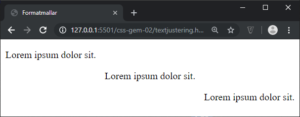

---

# Dekoration

Ändras med egenskapen **text-decoration**

Vanliga enheter är *underline*, *overline*, *line-through*, *blink*, *none* (blink = ingen funktion idag)

Se [mdn-text-decoration för mer om tillåtna enheter](https://developer.mozilla.org/en-US/docs/Web/CSS/text-decoration)

--

```css
p {
  text-decoration: line-through;
}
```

```html
<p>Lorem ipsum dolor sit.</p>
```

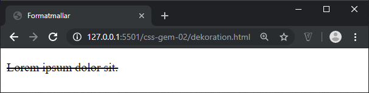

---

# Indentering

Ändras med egenskapen **text-indent**

Vanliga enheter är *längdenheter*, *procent*

Se [mdn-text-indent för mer om tillåtna enheter](https://developer.mozilla.org/en-US/docs/Web/CSS/text-indent)

--

```css
p {
  text-indent: 2em;
  margin: 0;
}
```

```html
<p>Lorem ipsum dolor sit...</p>
<p>Nisi alias repudiandae...</p>
```

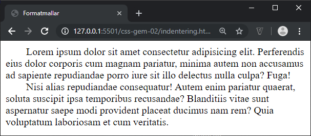

---

# Förkortad version för fonter (shorthand)

Ändras med egenskapen **font**

--

```css
selektor {
  font: font-style font-variant font-weight font-size/line-height font-family;
}
```

--

**Obligatoriska egenskaper:**
* font-size
* font-family

**Valbara egenskaper:**
* font-style
* font-variant
* font-weight
* line-height

Om inte **line-height** deklareras ska inte **/** vara med.

Observera ordningen!

--

## Utan shorthand

```css
h1 {
  font-style: italic;
  font-variant: small-caps;
  font-weight: normal;
  font-size: 1.5em;
  line-height: 1.5em;
  font-family: arial, helvetica, sans-serif;
}
```

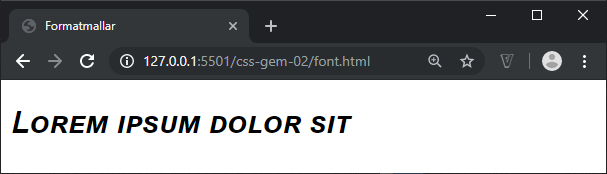

--

## Med shorthand

```css
h1 {
    font: italic small-caps bold 1.5em/1.5em arial, helvetica, sans-serif;
}
```


---

# Slut!

