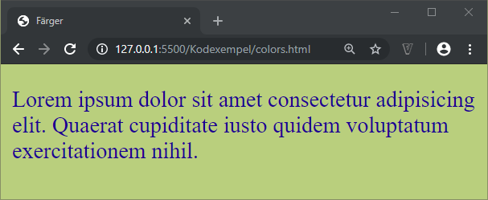

# CSS - Färger

## Webbutveckling 1

---

# Färger

Det finns ett flertal olika sätt att ange en färg. Vi kommer att titta på följande:
  * Namn
  * Hexadecimalt
  * RGB
  * HSL

---

# Namn

Här anger namnet på den färg man vill använda sig av.

```css [ ]
.ex1 {
  background: blue;
}

.ex2 {
  background: tomato;
}

.ex3 {
  background: steelblue;
}
```


--

Se [https://htmlcolorcodes.com/color-names/](https://htmlcolorcodes.com/color-names/)

---

# Hexadecimalt

--

## 6 siffror

\#<span class="redtext">RR</span><span class="greentext">GG</span><span class="bluetext">BB</span>

Består av tre färger: rött, grönt och blått.

Varje siffra kan ha ett värde mellan 0-f, dvs 0-9, a-f (där a = 10, f = 15)

Då varje färg består av två siffor ger det 16 * 16 = 256 nyanser.

Då vi har tre färger ger det 256 * 256 * 256 = 16.777.216 färger

--

### Några exempel

* \#ff0000 = Fullt rött
* \#00ff00 = Fullt grönt
* \#0000ff = Fullt blått
* \#2c3e50 = En mörk blågrå färg


--

## 3 siffror

Om vi har en hexfärg med sex siffror där vardera del består av likadant värde kan vi förkorta färgen till tre siffror.

 * #aabbcc = #abc
 * #33dd88 = #3d8
 * #44ff59 = <span class="redtext">Går ej då blått är 59!</span>

--

## Exempel

```css [ ]
body {
  background-color: #bc7;
}

p {
  color: #001694;
}
```

--



---

# RGB

--

## RGB med färgskala

Anges med ett värde mellan 0-255 för vardera R, G, B, t.ex *rgb(25, 168, 240)*

```css [ ]
body {
  background-color: rgb(188, 194, 198);
}

p {
  color: rgb(242, 156, 17);
}
```

--

## RGB med procent

Anges med ett procentvärde mellan 0-100% för vardera R, G, B, t.ex *rgb(55%, 16%, 24%)*

```css [ ]
body {
  background-color: rgb(74%, 75%, 77%)
}

p {
  color: rgb(94%, 160%, 7%);
}
```

--

## RGB med alpha-kanal

Med hjälp av alpha-kanalen kan vi skapa transparanta färger. Vi använder oss då av **rgba** istället för **rgb**.

```css [ ]
body {
  background-image:url(bg.jpg);
}

.ex1 {
  background-color: rgba(188, 194, 198, 0.5);
}

.ex2 {
  background-color: rgba(74%, 75%, 77%, 50%)
}
```

---

# HSL

HSL = hue, saturation, lightness

[https://codepen.io/HunorMarton/pen/dvXVvQ/](https://codepen.io/HunorMarton/pen/dvXVvQ/)

---

# Några bra tjänster

Sök på **Color Picker** på Google så kommer det upp en **Color Picker**.

* [https://flatuicolors.com/](https://flatuicolors.com/)
* [https://coolors.co/](https://coolors.co/)
* [https://htmlcolorcodes.com/color-picker/](https://htmlcolorcodes.com/color-picker/)
* [https://codepen.io/HunorMarton/pen/dvXVvQ/](https://codepen.io/HunorMarton/pen/dvXVvQ/)
