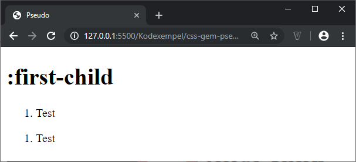

# CSS - 04 - Pseudoklasser & pseudoelement

## Webbutveckling 1

---

# Pseudoklasser

Pseudoklasser används i CSS-selektorer för att välja ut element baserat på deras egenskaper eller tillstånd.

Ett exempel på detta kan vara att man vill att en CSS-regel ska triggas om man besökt en länk, medan obesökta länkar ska trigga hela andra regler.

Se [https://developer.mozilla.org/en-US/docs/Web/CSS/Pseudo-classes](https://developer.mozilla.org/en-US/docs/Web/CSS/Pseudo-classes) för alla pseudoklasser.

--

```css
selektor:pseudoklass {
    egenskap: värde;
}
```
Anges **alltid** med ett : följt av klassnamnet.

---

# :first-child

Matchar ett specifikt element som är det första barnet till sin förälder.

```css
li {
    color: red;
}

li:first-child {
    color: cornflowerblue;
    font-weight: bold;
}
```

--

```html
<h1>:first-child</h1>
<ol>
  <li>Test</li>
  <li>Test</li>
  <li>Test</li>
</ol>
```

--


--

## Problem med :first-child

```html
<h1>:first-child</h1>
<ol>
    <li>Test</li>
</ol>
<ol>
    <li>Test</li>
</ol>
```

--

```css
ol:first-child {
  color: cornflowerblue;
  font-weight: bold;
}
```

Vi vill att den första listan ska ha blå fet text.

--



Hmmm... Vår CSS-regel fungerar inte!

--

```html
<!--<h1>:first-child</h1>-->
<ol>
    <li>Test</li>
</ol>
<ol>
    <li>Test</li>
</ol>
```

Vad händer om vi kommenterar bort h1:an?

--


Aha.. Vår CSS-regel fungerar!

Det här beror på hur **:first-child** fungerar. Den fungerar enbart om det regelns selektor är första barnet och i vårt fall har vi en h1:a före, som är det första barnet.

---

# :first-of-type

```html
<h1>:first-child</h1>
<ol>
    <li>Test</li>
</ol>
<ol>
    <li>Test</li>
</ol>
```

Vi utgår från samma html-kod som tidigare

--

```css
ol:first-of-type {
  color: cornflowerblue;
  font-weight: bold;
}
```

Den här regeln kommer att påverka den första ordnade listan.

--

 TODO: Fixa bilden

---

# :nth-child

```css
tr:nth-child(odd) {
  background-color: #55efc4;
}

tr:nth-child(even) {
  background-color: #fab1a0;
}
```

Det enklaste sättet att använda **:nth-child** är med värdena **odd** och **even**.

--


--

Se [https://css-tricks.com/useful-nth-child-recipies/](https://css-tricks.com/useful-nth-child-recipies/) för mer avancerade sätt att använda sig av **:nth-child**.

---

# Länkar

Här kan vi använda oss av:

  * *:link*
  * *:visited*
  * *:hover*
  * *:active*

**LVHA-ordningen:** :link — :visited — :hover — :active.

--

```css
a:link {
    color: blue;
}
a:visited {
    color: purple;
}
a:hover {
    background: yellow;
}
a:active {
    background: green;
    color: yellow;
}
```

--


---

# Observera

Det kommer att komma uppgifter där du måste (försöka) att lista ut vilken pseudoklass du ska använda dig av för att lösa uppgiften.

---

# Pseudoelement

Är inte element som vi skapar, utan istället är det saker som har egenskaper som gör att de kan ses som element.

Se [https://developer.mozilla.org/en-US/docs/Web/CSS/pseudo-elements](https://developer.mozilla.org/en-US/docs/Web/CSS/pseudo-elements) för fullständig lista över de pseudoelement som finns.

--

```css
selektor::pseudoelement {
    egenskap: värde;
}
```

Anges **alltid** med :: följt av elementnamnet.

**Observera!** Ska man stödja äldre webbläsare ska man använda ett : istället för två.

---

# ::first-letter

Precis som det låter så gäller selektorn enbart för den första bokstaven.

```css
p::first-letter {
  background-color: cornflowerblue;
  font-weight: bold;
}
```

```html
<h1>::first-letter</h1>
<p>Lorem ipsum dolor sit amet.</p>
<p>Odit qui tempora labore maxime.</p>
```

--


--

## Vad händer i det här fallet?

```html
<h1>::first-letter</h1>
<ol>
  <li>Lista #1</li>
</ol>
<ol>
  <li>Lista #2</li>
</ol>
```

```css
ol:first-of-type li::first-letter {
  background-color: cornflowerblue;
  font-weight: bold;
}
```

--


---

# ::first-line

Precis som det låter så gäller selektorn enbart för den första raden.

```css
p::first-line {
  font-variant: small-caps;
  font-size: 1.2em;
}
```

--


---

# ::selection

Det här pseudoelementet kan vi använda för att ange hur det ska se ut när vi markerar en text.

```css
p::selection {
  background-color: pink;
}
```

```html
<h1>En rubrik</h1>
<p>Lorem...</p>
```

--


--

## Vad händer här?

```css
*::selection {
  background-color: pink;
}
```

\* = Universiell selektor.

--


---

# ::before och ::after

Används för att lägga till något till ett element med hjälp av egenskapen *content*.

--

```css
.celsius {
  color: red;
}
.celsius::before {
  content: "temperatur: ";
  color: blue;
}
.celsius::after {
  content: "\00b0";
}
```

```html
<p>Lorem ipsum och <span class="celsius">+30</span></p>
```

--


--

Här finner du en bra lista över specialtecken som kan användas i *content*: [https://www.webdesignerexpress.com/blog/css-glyphs-and-html-special-characters.html](https://www.webdesignerexpress.com/blog/css-glyphs-and-html-special-characters.html)

---

# Slut!
