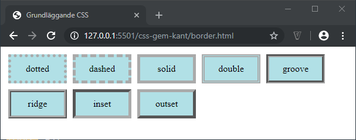

# CSS - 05 - Kantlinjer, marginaler, padding, höjd och bredd

## Webbutveckling 1

---

# Bredd och höjd

**Bredd** styrs med egenskapen `width`

**Höjd** styrs med egenskapen `height`

**Värden:** *Längdvärden* och *procent*

--

```css [ ]
div {
  background-color: powderblue;
  height: 100px;
  width: 300px;
}
```

```html
<div>Här är en div-box</div>
```

--


---

# Min- och max

Man kan använda `min-width`, `max-width`, `min-height` och `max-height `för att få ett mer dynamiskt element.

--


```css [ ]
div {
  background-color: powderblue;
  height: 100px;
  min-width: 600px;
  max-width: 80%;
}
```

Här har vi angivit attt div:en ska vara minst 600px bred och maximalt 80% av bredden på fönstret.

```html
<div>Här är en div-box</div>
```

--


---

# Kantlinjer

--

## Bredd

Med egenskapen `border-width` anger vi bredden på kantlinjen.

--

```css [ ]
p {
  border-width: thin medium thick 10px;
}
```

* Toppens kantlinje är tunn
* Höger kantlinje är medium
* Bottens kantlinje är tjock
* Vänsters kantlinje är 10px

--

```css [ ]
p {
  border-width: thin medium thick;
}
```

* Toppens kantlinje är tunn
* Höger och vänster kantlinjer är medium
* Bottens kantlinje är tjock

--

```css [ ]
p {
  border-width: thin medium;
}
```

* Toppen och bottens kantlinjer är tunna
* Höger och vänster kantlinjer är medium

--

```css [ ]
p {
  border-width: thin;
}
```

* Alla fyra kantlinjerna är tunna

--

Vi kan även styra bredden individuellt för varje kantlinje…

* `border-top-width`
* `border-right-width`
* `border-bottom-width`
* `border-left-width`

--

## Utseende

Med egenskapen `border-style` styr vi utseendet på kantlinjen. Här följer ett par exempel på värden:

*none*, *hidden*, *dotted*, *dashed*, *solid*, *double*, *groove*, *ridge*, *inset*, *outset*

--



--

```css [ ]
p {
  border-style: dotted solid double dashed;
}
```

* Toppen = dotted
* Höger = solid
* Botten = double
* Vänster = dashed

--

```css [ ]
p {
  border-style:  dotted solid double;
}
```
* Toppen = dotted
* Höger och vänster = solid
* Botten = double

--

```css [ ]
p {
  border-style: dotted solid;
}
```

* Toppen och botten = dotted
* Höger och vänster = solid

--

```css [ ]
p {
  border-style: dotted;
}
```

* Alla fyra = dotted

--

Vi kan även styra utseendet individuellt för varje kantlinje…

* `border-top-style`
* `border-right-style`
* `border-bottom-style`
* `border-left-style`

--

## Färg

Med egenskapen `border-color` anger vi färgen på kantlinjen.

--

```css [ ]
p {
  border-color: red green blue  yellow;
}
```
* Toppen = röd
* Höger = grön
* Botten = blå
* Vänster = gul

--

```css [ ]
p {
  border-color:  red green blue;
}
```

* Toppen = röd
* Höger och vänster = grön
* Botten = gul

--

```css [ ]
p {
  border-color: red green;
}
```

* Toppen och botten = röd
* Höger och vänster = grön


--

```css [ ]
p {
  border-color: red;
}
```

* Alla fyra = röda

--

Vi kan även styra färgen individuellt för varje kantlinje…

* `border-top-color`
* `border-right-color`
* `border-bottom-color`
* `border-left-color`

Anger färger med valfritt sätt, t.ex *hex* eller *RGB*.

Ange alltid `border-style` innan `border-color` då det måste finnas en border att ändra färgen på!

--

## Shorthand border

Istället för att ange en egenskap i taget så kan vi använda oss egenskapen `border` och man skriver då värdena i ordningen *border-width border-style border-color*.

```css [ ]
p {
  /*border: tjocklek utseende färg*/
  border: 1px solid #000;
}
```

---

# Marginal och padding

--

## Marginal

Med marginal menas avståndet från ett element till ett annat.

Anges med egenskapen `margin`

Som vanligt kan vi styra alla sidor individuellt antingen via `margin` eller mha `margin-top`, `margin-right`, `margin-bottom` och `margin-left`.

--

```css [ ]
div {
  background-color: powderblue;
  height: 100px;
  width: 100px;
}
.ex1 {
  /*margin: top right bottom left;*/
  margin: 5px 10px 15px 20px;
}
.ex2 {
  /*margin: top right|left bottom;*/
  margin: 5px 10px 15px;
}
.ex3 {
  /*margin: top|bottom right|left;*/
  margin: 5px 10px;
}
```

```html
<div class="ex1"></div>
<div class="ex2"></div>
<div class="ex3"></div>
```

--


--

### Ett till exempel

```css [ ]
div {
  background-color: powderblue;
  height: 50px;
  width: 50px;
  margin: 20px;
}
```

Vi har nu angivit att vi har en marginal på 10px åt alla håll.

```html
<div></div>
<div></div>
```

--


--

Via *Inspekteraren* ser vi marginalen för den första boxen.

Som du ser så får vi inte 20px mellan boxarna då vi får något som kallas [margin collapse](https://developer.mozilla.org/en-US/docs/Web/CSS/CSS_Box_Model/Mastering_margin_collapsing).

--

## Padding

Med *padding* menas avståndet från kanten på en tagg till själva innehållet.

Styrs med egenskapen `padding`

Som vanligt kan vi styra alla sidor individuellt antingen via `padding` eller mha `padding-top`, `padding-right`, `padding-bottom` och `padding-left`.

--

```css [ ]
div {
  background-color: powderblue;
  margin: 5px;
  width: 100px;
}
.ex1 {
  /*padding: top right bottom left;*/
  padding: 5px 10px 15px 20px;
}
.ex2 {
  /*padding: top right|left bottom;*/
  padding: 5px 10px 15px;
}
.ex3 {
  /*padding: top|bottom right|left;*/
  padding: 5px 10px;
}
```

```html
<div>Utan padding</div>
<div class="ex1">Med padding #1</div>
<div class="ex2">Med padding #2</div>
<div class="ex3">Med padding #3</div>
```

--


--

## Räkna ut den totala bredden

Total bredd = width + left padding + right padding + left border + right border
