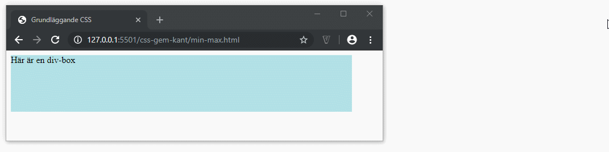

# CSS - Bredd och höjd

## Webbutveckling 1

---

# Bredd och höjd

**Bredd** styrs med egenskapen `width`

**Höjd** styrs med egenskapen `height`

**Värden:** *Längdvärden* och *procent*

--

```css [ ]
div {
  background-color: powderblue;
  height: 100px;
  width: 300px;
}
```

```html
<div>Här är en div-box</div>
```

--


---

# Min- och max

Man kan använda `min-width`, `max-width`, `min-height` och `max-height `för att få ett mer dynamiskt element.

--


```css [ ]
div {
  background-color: powderblue;
  height: 100px;
  min-width: 600px;
  max-width: 80%;
}
```

Här har vi angivit attt div:en ska vara minst 600px bred och maximalt 80% av bredden på fönstret.

```html
<div>Här är en div-box</div>
```

--



---

# Slut
