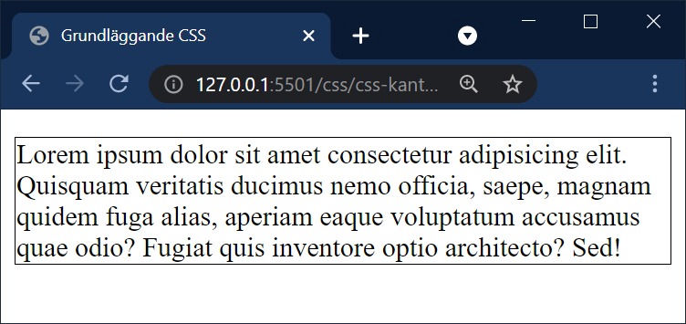
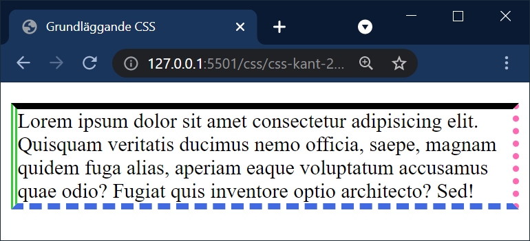
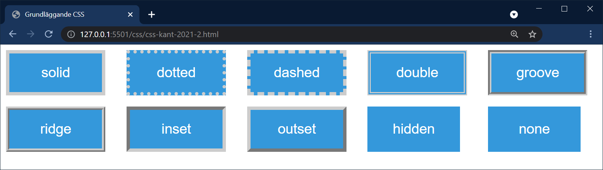
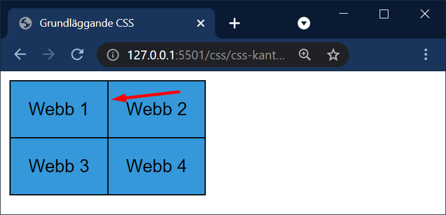
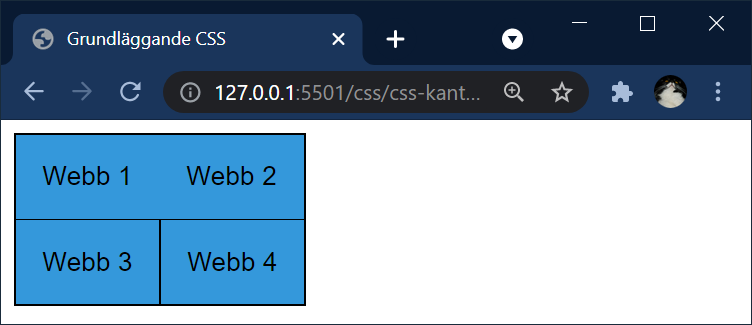

# CSS - Kantlinjer

## Webbutveckling 1

---

# Shorthand border

--

Oftast när vi vill ange en kantlinje så använder vi egenskapen `border` och man skriver då värdena i ordningen *border-width border-style border-color*.

--

```css [ ]
p {
  /*border: tjocklek utseende färg*/
  border: 1px solid #000;
}
```

Här ser vi att vi har angiv **border-width** till **1px**, **border-style** till **solid** och **border-color** till **#000**

--



--

* `border-top:`
* `border-right:`
* `border-bottom:`
* `border-left:`

Vi har även tillgång till följande egenskaper för att ange för en viss kant.

--

```css
p {
  border-top: 5px solid black;
  border-right: 5px dotted hotpink;
  border-bottom: 5px dashed royalblue;
  border-left: 5px double limegreen;
}
```

--

  

---

# Longhand, en egenskap i taget

--

Vi kan även ange kantlinjer med en egna egenskaper för **bredd**, **utseende** och **färg**.

Vi kommer nu på resten av presentationen gå igenom dessa.

---

# Bredd

Med egenskapen `border-width` anger vi bredden på kantlinjen.

--

```css [ ]
p {
  border-width: thin medium thick 10px;
}
```

* Toppens kantlinje är tunn
* Höger kantlinje är medium
* Bottens kantlinje är tjock
* Vänsters kantlinje är 10px

--

```css [ ]
p {
  border-width: thin medium thick;
}
```

* Toppens kantlinje är tunn
* Höger och vänster kantlinjer är medium
* Bottens kantlinje är tjock

--

```css [ ]
p {
  border-width: thin medium;
}
```

* Toppen och bottens kantlinjer är tunna
* Höger och vänster kantlinjer är medium

--

```css [ ]
p {
  border-width: thin;
}
```

* Alla fyra kantlinjerna är tunna

--

Vi kan även styra bredden individuellt för varje kantlinje…

* `border-top-width`
* `border-right-width`
* `border-bottom-width`
* `border-left-width`

---

# Utseende

Med egenskapen `border-style` styr vi utseendet på kantlinjen. Här följer ett par exempel på värden:

*solid*, *dotted*, *dashed*,  *double*, *groove*, *ridge*, *inset*, *outset*, *none*, *hidden*

--



Skillanden på **none** och **hidden**? Ingen alls, om vi bortser från tabeller med **border-collapse**.

--

```html [4]
<table>
  <tr>
    <td>Webb 1</td>
    <td class="exempel">Webb 2</td>
  </tr>
  <tr>
    <td>Webb 3</td>
    <td>Webb 4</td>
  </tr>
</table>
```

--

```css [2, 12-14]
table {
    border-collapse: collapse;
    font-family: Arial, sans-serif;
}

td {
    border: 1px solid #000;
    background: #3498db;
    padding: 1rem;
}

.exempel {
    border-left: 0.25rem none #000;
}
```

--



--

```css [13]
table {
    border-collapse: collapse;
    font-family: Arial, sans-serif;
}

td {
    border: 1px solid #000;
    background: #3498db;
    padding: 1rem;
}

.exempel {
    border-left: 0.25rem hidden #000;
}
```

--



--

När det kommer till tabeller med `border-collapse: collapse` så har **none** lägst prioritet så finns det en kantlinje i cellen brevid vinner denna.

**Hidden** däremot har högst prioritet och vinner över en kantlinje som finns i cellen brevid.

--

## Ange flera kanters utseende

```css [ ]
p {
  border-style: dotted solid double dashed;
}
```

* Toppen = dotted
* Höger = solid
* Botten = double
* Vänster = dashed

--

```css [ ]
p {
  border-style:  dotted solid double;
}
```
* Toppen = dotted
* Höger och vänster = solid
* Botten = double

--

```css [ ]
p {
  border-style: dotted solid;
}
```

* Toppen och botten = dotted
* Höger och vänster = solid

--

```css [ ]
p {
  border-style: dotted;
}
```

* Alla fyra = dotted

--

Vi kan även styra utseendet individuellt för varje kantlinje…

* `border-top-style`
* `border-right-style`
* `border-bottom-style`
* `border-left-style`

---

# Färg

Med egenskapen `border-color` anger vi färgen på kantlinjen.

--

```css [ ]
p {
  border-color: red green blue  yellow;
}
```
* Toppen = röd
* Höger = grön
* Botten = blå
* Vänster = gul

--

```css [ ]
p {
  border-color:  red green blue;
}
```

* Toppen = röd
* Höger och vänster = grön
* Botten = gul

--

```css [ ]
p {
  border-color: red green;
}
```

* Toppen och botten = röd
* Höger och vänster = grön


--

```css [ ]
p {
  border-color: red;
}
```

* Alla fyra = röda

--

Vi kan även styra färgen individuellt för varje kantlinje…

* `border-top-color`
* `border-right-color`
* `border-bottom-color`
* `border-left-color`

Anger färger med valfritt sätt, t.ex *hex* eller *RGB*.

--

Ange alltid `border-style` innan `border-color` då det måste finnas en border att ändra färgen på!

---

# Slut
