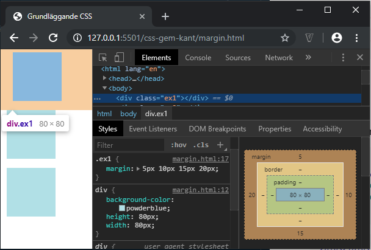
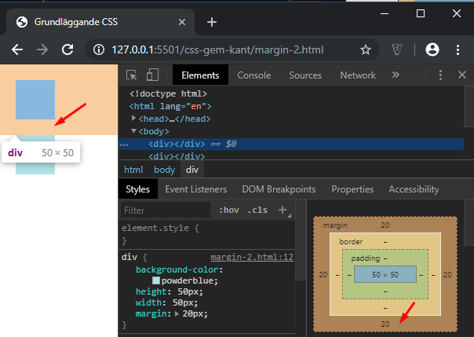
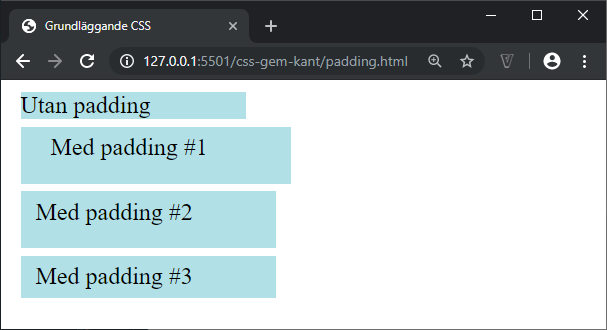

# CSS - Marginaler och padding

## Webbutveckling 1

---

# Marginal

--

Med marginal menas avståndet från ett element till ett annat.

Anges med egenskaperna **margin**, **margin-top**, **margin-right**, **margin-bottom** och **margin-left**.

--

```css [ ]
div {
  background-color: powderblue;
  height: 100px;
  width: 100px;
}
.ex1 {
  /*margin: top right bottom left;*/
  margin: 5px 10px 15px 20px;
}
.ex2 {
  /*margin: top right|left bottom;*/
  margin: 5px 10px 15px;
}
.ex3 {
  /*margin: top|bottom right|left;*/
  margin: 5px 10px;
}
```

```html
<div class="ex1"></div>
<div class="ex2"></div>
<div class="ex3"></div>
```

--



--

### Ett till exempel

```css [ ]
div {
  background-color: powderblue;
  height: 50px;
  width: 50px;
  margin: 20px;
}
```

Vi har nu angivit att vi har en marginal på 10px åt alla håll.

```html
<div></div>
<div></div>
```

--



--

Via *Inspekteraren* ser vi marginalen för den första boxen.

Som du ser så får vi inte 20px mellan boxarna då vi får något som kallas [margin collapse](https://developer.mozilla.org/en-US/docs/Web/CSS/CSS_Box_Model/Mastering_margin_collapsing).

---

# Padding

--

Med *padding* menas avståndet från kanten på en tagg till själva innehållet.

Anges med egenskaperna **padding**, **padding-top**, **padding-right**, **padding-bottom** och **padding-left**.

--

```css [ ]
div {
  background-color: powderblue;
  margin: 5px;
  width: 100px;
}
.ex1 {
  /*padding: top right bottom left;*/
  padding: 5px 10px 15px 20px;
}
.ex2 {
  /*padding: top right|left bottom;*/
  padding: 5px 10px 15px;
}
.ex3 {
  /*padding: top|bottom right|left;*/
  padding: 5px 10px;
}
```

```html
<div>Utan padding</div>
<div class="ex1">Med padding #1</div>
<div class="ex2">Med padding #2</div>
<div class="ex3">Med padding #3</div>
```

--



---

## Räkna ut den totala bredden

Total bredd = width + left padding + right padding + left border + right border
