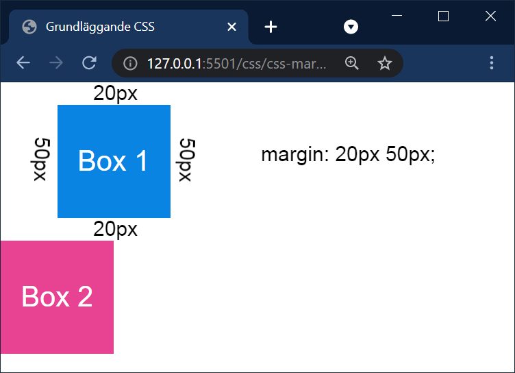

# CSS - Marginaler och padding

## Webbutveckling 1

---

# Marginal

--

Med marginal menas avståndet från ett element till ett annat.

Anges med egenskaperna **margin**, **margin-top**, **margin-right**, **margin-bottom** och **margin-left**.

--

## Lite förberande kod

Här kommer den kod vi kommer att utgå för att förklara margin. Kolla igenom den om du vill, inget krav!

--

```html []
<div class="box box__1">Box 1</div>
<div class="box box__2">Box 2</div>
```

--

```css []
body {
  margin: 0;
  padding: 0;
}

.box {
  width: 100px;
  height: 100px;

  display: grid;
  justify-content: center;
  align-items: center;

  font-family: Arial, sans-serif;
  font-size: 25px;
  color: #FFF;
}

.box__1 {
    background:#0984E3;
}

.box__2 {
    background-color: #E84393;
}
```

--


--

## Marginal med ett värde

```css [3]
.box__1 {
  background:#0984E3;
  margin: 20px;
}

.box__2 {
    background-color: #E84393;
}
```

Anger vi ett värde så kommer vi få samma marginal på alla fyra sidor.

--


--

## Marginal med två värden

```css [3]
.box__1 {
  background:#0984E3;
  margin: 20px 50px;
}

.box__2 {
  background-color: #E84393;
}
```

Anger vi två värden så kommer det första värdet ange **top/bottom** och det andra **left/right**.

--



--

## Marginal med fyra värden

```css [3]
.box__1 {
  background:#0984E3;
  margin: 20px 30px 40px 50px;
}

.box__2 {
  background-color: #E84393;
}
```

Anger vi två värden så kommer vi ange **top**, **right**, **bottom**, **left**

--


--

## Margin Collapse


```css [3, 8]
.box__1 {
  background:#0984E3;
  margin: 20px;
}

.box__2 {
  background-color: #E84393;
  margin: 20px;
}
```

Om vi anger en marginal även för **box__2** så skulle man kunna tro att den totala marginalen mellan de två boxarna skulle bli 40px, men så blir det inte utan de går över varandra och den marginal med störst värde vinner.

--


---

# Padding

--

Med *padding* menas avståndet från kanten på en tagg till själva innehållet.

Anges med egenskaperna **padding**, **padding-top**, **padding-right**, **padding-bottom** och **padding-left**.

--

Doh!

---

## Räkna ut den totala bredden

Total bredd = width + left padding + right padding + left border + right border
