# CSS - Bakgrund

## Webbutveckling 1

---

# Ändra färg på bakgrunden

Med egenskapen `background-color` kan man ange bakgrundsfärgen i en selektor (CSS-regel).

```css [ ]
body {
  background-color: #222f3e;
}

h1 {
  background-color: #feca57;
}
```

```html
<body>
  <h1>En rubrik... helt enkelt</h1>
</body>
```

--

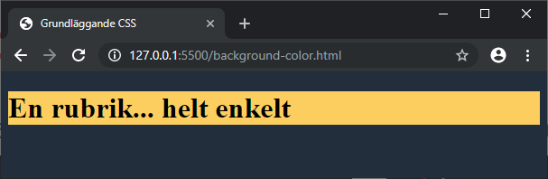

---

# Bilder som bakgrund

För att använda en bild som bakgrund använder man egenskapen `background-image`.

```css [ ]
body {
  background-image: url('bild.jpg');
}
```

--

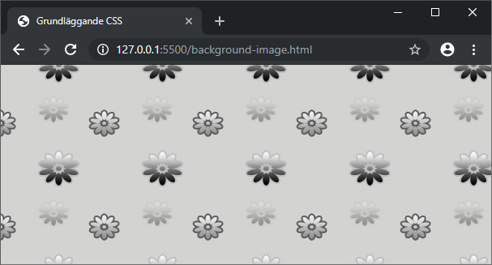

---

# Repetition av bildbakgrund

Med egenskapen `background-repeat` kan vi ange hur vi vill att bakgrunden ska repeteras.

Vi har följande värden att använda oss av:
  * *repeat* (standard om inget annat anges)
  * *no-repeat*
  * *repeat-x*
  * *repeat-y*
  * *round*
  * *space*

--

```css [ ]
body {
  background-image: url('bild.jpg');
  background-repeat: no-repeat;
}
```

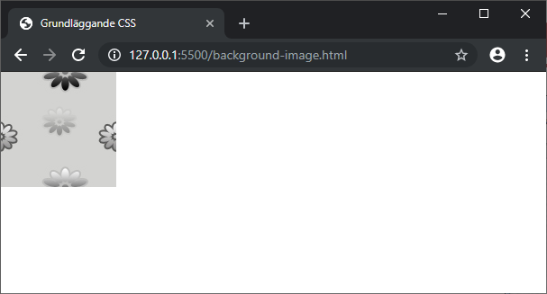

--

```css [ ]
body {
  background-image: url('bild.jpg');
  background-repeat: repeat-x;
}
```

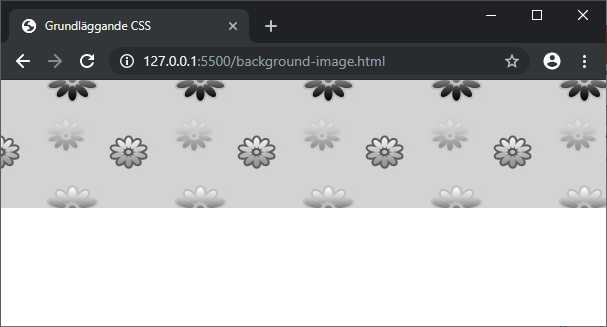

--

```css [ ]
body {
  background-image: url('bild.jpg');
  background-repeat: repeat-y;
}
```

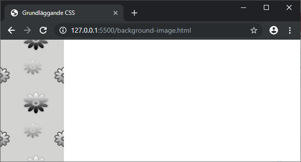

--

Värdet *space* innebär att bilden blir repterad så många gånger som möjligt utan att bli klippt. Den första och sista bilden i "kedjan" sätts och därefter räknas det fram antalet hela bilder som får plats mellan dessa.

Värdet *round* innebär att bilderna i "kedjan" kommer att sträckas ut för att fylla utrymmet på bästa möjliga sätt.

--

```css [ ]
.space {
  background-image: url('donut.png');
  background-repeat: round;

  width: 423px;
  height: 50px;

  border: 1px solid #000;
}

.round {
  background-image: url('donut.png');
  background-repeat: space;

  width: 423px;
  height: 50px;

  border: 1px solid #000;
}
```

```html
<h1>Space</h1>
<div class="space"></div>
<h1>Round</h1>
<div class="round"></div>
```

--

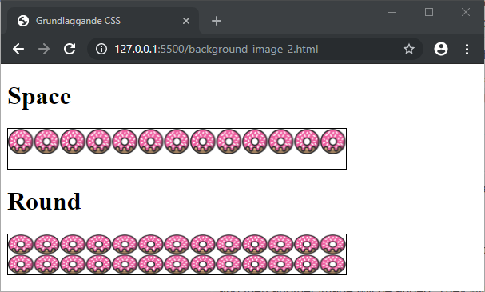

---

# Fixering av bildbakgrund

Med egenskapen `background-attachment` kan vi ange hur vi vill att bakgrunden ska skrolla med eller vara fixerad.

Vi har följande värden att använda oss av:
  * *scroll* (standard om inget annat anges)
  * *fixed*
  * *local*

--

```css [ ]
body {
  background-image: url('bild.jpg');
  background-attachment: scroll; /* Standardvärdet */

  color: red;
}
```

Den här deklarationen behövs ej då *scroll* är standardvärdet om inget annat anges.

--


--

```css [ ]
body {
  background-image: url('bild.jpg');
  background-attachment: fixed;

  color: red;
}
```

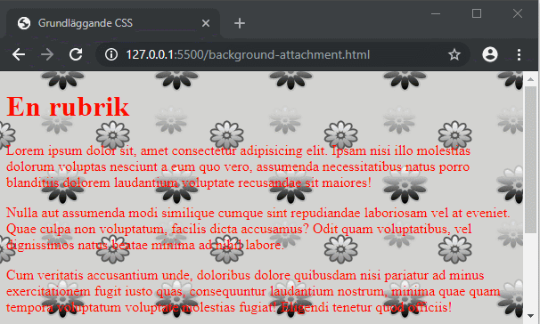

--

```css [ ]
.box {
  background-image: url('bild.jpg');

  height: 200px;
  width: 300px;

  overflow: auto;

  color: red;
}
```

I det här exemplet har vi satt en bakgrund på klassen `.box `och vi har gett den en  bredd och höjd. Vi har även angett att om innehållet är större än tillgänglig yta så ska vi få en skrollista (`overflow: auto;`).

--

```html
 <div class="box">
   <p>Lorem...</p>
   ...
 </div>
```


Som du ser så kommer bakgrunden att vara fixerad som standard.

--

```css [ ]
.box {
  background-image: url('bild.jpg');
  background-attachment: local;

  height: 200px;
  width: 300px;

  overflow: auto;

  color: red;
}
```

Anger vi nu att `background-attachment` ska ha värdet *local* så kommer bakgrunden att skrolla med.

--

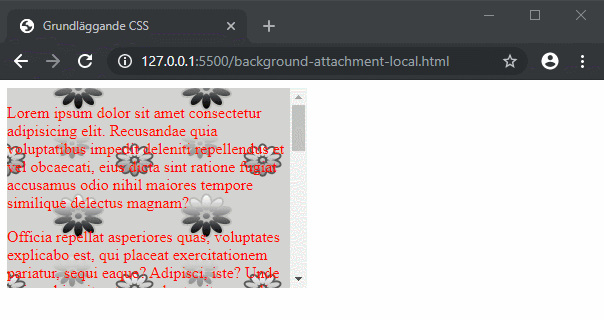

---

# Positionera bilder i bakgrunden

Med egenskapen `background-position` kan vi ange hur vi vill att bakgrunden ska placeras.

```css [ ]
div {
  border: 1px solid #000;
  height: 100px;
  width: 100px;
  margin: 20px;
  float: left;
}
```

Här har vi anget hur vi vill att alla div:ar ska se ut.

--

```html
<div class="topleft"></div>
<div class="top"></div>
<div class="topright"></div>

<div class="centerleft"></div>
<div class="center"></div>
<div class="centerright"></div>

<div class="bottomleft"></div>
<div class="bottom"></div>
<div class="bottomright"></div>
```

--

```css [ ]
.topleft {
  background-image: url('donut.png');
  background-position: top left;
  background-repeat: no-repeat;
}
.top {
  background-image: url('donut.png');
  background-position: top;
  background-repeat: no-repeat;
}
.topright {
  background-image: url('donut.png');
  background-position: top right;
  background-repeat: no-repeat;
}
```

--

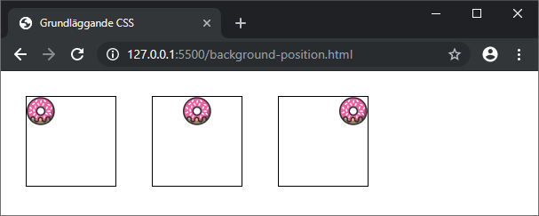

--

```css [ ]
.centerleft {
  background-image: url('donut.png');
  background-position: center left;
  background-repeat: no-repeat;
}
.center {
  background-image: url('donut.png');
  background-position: center;
  background-repeat: no-repeat;
}
.centerright {
  background-image: url('donut.png');
  background-position: center right;
  background-repeat: no-repeat;
}
```

--

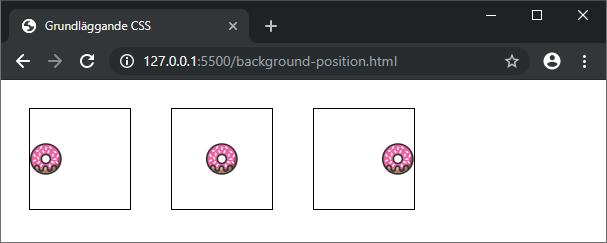

--

```css [ ]
.bottomleft {
  background-image: url('donut.png');
  background-position: bottom left;
  background-repeat: no-repeat;
}
.bottom {
  background-image: url('donut.png');
  background-position: bottom;
  background-repeat: no-repeat;
}
.bottomright {
  background-image: url('donut.png');
  background-position: bottom right;
  background-repeat: no-repeat;
}
```

--

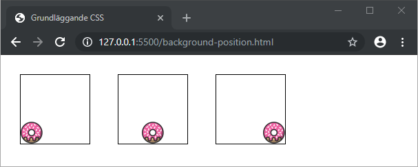

--

```html
<div class="relativ"></div>
<div class="statisk"></div>
<div class="blandad"></div>
```

```css [ ]
.relativ {
  background-image: url('donut.png');
  background-position: 15% 70%;
  background-repeat: no-repeat;
}
.statisk {
  background-image: url('donut.png');
  background-position: 50px 10px;
  background-repeat: no-repeat;
}
.blandad {
  background-image: url('donut.png');
  background-position: 20px top;
  background-repeat: no-repeat;
}
```

--

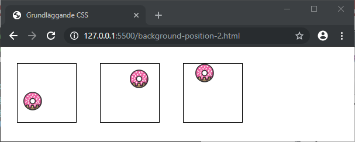

--

```css [ ]
body {
  background-color: #ff9ff3;
  background-image: url('donut.png');
  background-position: top;
  background-repeat: repeat-x;
}
```

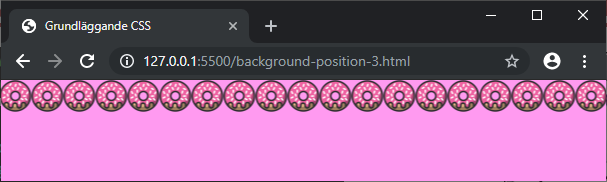

---

# Shorthand för bakgrund

Med egenskapen `background` kan vi ange följande:

  1. `background-clip`
  1. `background-color`
  1. `background-image`
  1. `background-origin`
  1. `background-position`
  1. `background-repeat`
  1. `background-size`
  1. `background-attachment`

--

De egenskaper som man inte anger kommer att få sina standardvärden. Läs mer på [https://developer.mozilla.org/en-US/docs/Web/CSS/background](https://developer.mozilla.org/en-US/docs/Web/CSS/background).

```css [ ]
p {
  background: red url('bg.png');
}
```

---

# Slut!
