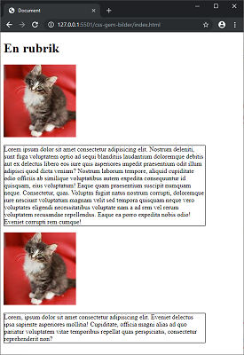
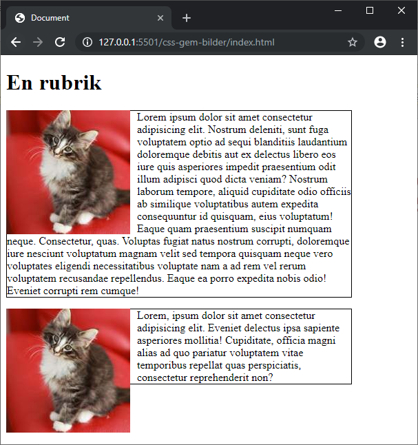
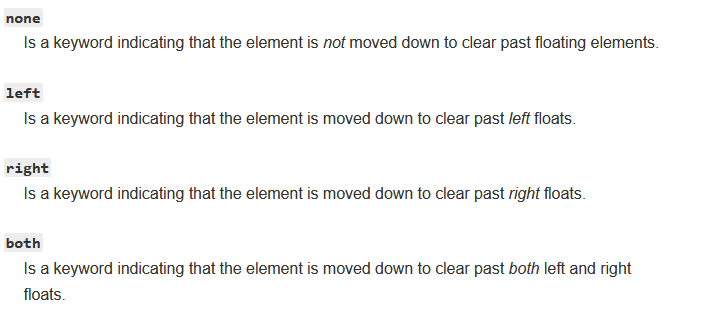

# CSS - Bilder

## Webbutveckling 1

---

# Positionera bilder

--

## Utgångspunkt

```html
<h1>En rubrik</h1>


<p>Lorem...</p>


<p>Lorem...</p>
```

```css [ ]
p {
  border: 1px solid #000;
  width: 500px;
}
```

--



--

```css [ ]
img {
  float: left;
  clear: both;
  margin: 0 10px 0 0;
}
```

För egenskapen `float` har vi värdena *left*, *right*, *none*.

För egenskapen `clear` har vi värdena *left*, *right*, *both* och *none*.

--



--

Saxat från MDN (https://developer.mozilla.org/en-US/docs/Web/CSS/clear) om `clear`



---

# Slut!
