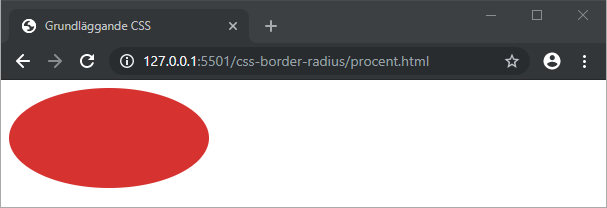

# CSS - 08 - Runda hörn

## Webbutveckling 1

---

# Border-radius

Med egenskapen `border-radius` kan vi skapa runda hörn.

Vi behöver *inte* ha en kantlinje för att kunna använda oss av `border-radius`.

**Värden:** Längdvärden (t.ex px, rem, em) och %

---

# Alla hörn

```css
div {
  background-color: #d63031;
  border-radius: 20px;
  height: 100px;
  width: 100px;
}
```


---

# Top-left och bottom-right | top-right och bottom-left 

```css
div {
  background-color: #d63031;
  border-radius: 20px 40px;
  height: 100px;
  width: 100px;
}
```


---

# Top-left | top-right | bottom-right | bottom-left

```css
div {
  background-color: #d63031;
  border-radius: 20px 40px 70px 100px;
  height: 100px;
  width: 100px;
}
```


---

# Procent

```css
div {
  background-color: #d63031;
  border-radius: 50%;
  height: 100px;
  width: 100px;
}
```


--

```css
div {
  background-color: #d63031;
  border-radius: 50%;
  height: 100px;
  width: 200px;
}
```



--

```css
div {
  background-color: #d63031;
  border-radius: 50% 0;
  height: 100px;
  width: 200px;
}
```


---

# x- och y-värde


```css
div {
  background-color: #d63031;
  border-radius: 20px/40px;
  height: 100px;
  width: 200px;
}
```


---

# Runt hörn i enbart ett hörn

Använd:
  * `border-top-left-radius`
  * `border-top-right-radius`
  * `border-bottom-right-radius`
  * `border-bottom-left-radius`

---

# Slut!
