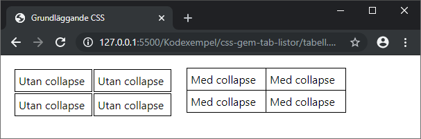
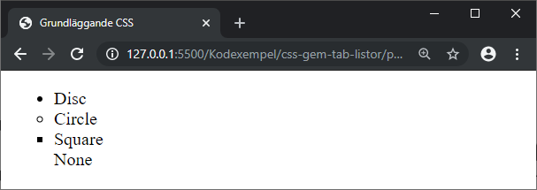
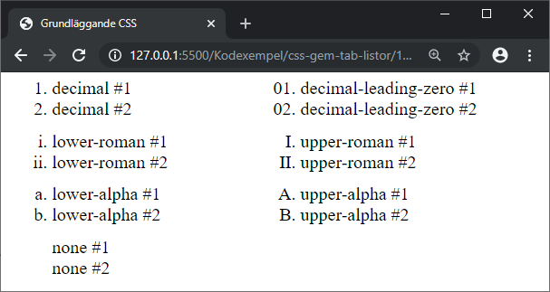
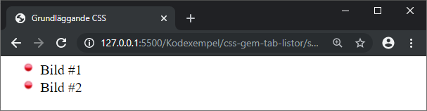
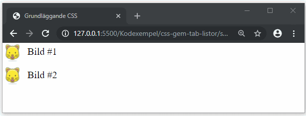
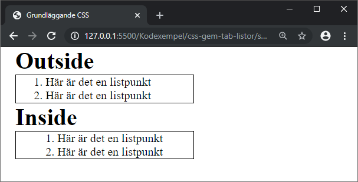

# CSS - 09 - Tabeller och Listor

## Webbutveckling 1

---

# Tabeller

```css
table {
  border-collapse: collapse;
}
```



---

# Listor

--

## Ändra listpunkter/listenheter

Med egenskapen `list-style-type` kan vi ändra hur vår listpunkter/listenheter ska se ut.

--

### Punktlista

| Värde         | Beskrivning                   |
| ------------- |:----------------------------:|
| disc          | Ifylld cirkel, standardvärde |
| circle        | Ring                         |
| square        | Fylld kvadrat                |
| none          | Ingen listpunkt visas        |

För en punktlista använder vi vanligen ett av ovanstående värden.

--



Formaterar man `<ul>` (eller `<ol>`) med egenskapen `list-style-type` påverkar man hela listan.

Man kan även, som i det här fallet, formatera med `list-style-type` på `<li>`.

--

### 1-2-3-lista

| Värde                | Beskrivning                   |
| -------------------- |:----------------------------:|
| decimal              | Heltal, standardvärde        |
| decimal-leading-zero | Heltal med nollor framför    |
| lower-roman          | Små romerska siffror         |
| upper-roman          | Stora romerska siffror       |
| lower-alpha          | Små bokstäver                |
| upper-alpha          | Stora bokstäver              |
| none                 | Ingen listenhet visas        |

--

För en 1-2-3-lista använder vi vanligen ett av ovanstående värden. 

Det finns en hel del till olika värden, se [https://developer.mozilla.org/en-US/docs/Web/CSS/list-style-type](https://developer.mozilla.org/en-US/docs/Web/CSS/list-style-type) samt [https://caniuse.com/#search=list-style-type](https://caniuse.com/#search=list-style-type)

--



--

## Bild som listpunkt


```css
.ex1 {
  list-style-image: url("bullet-red.png");
}
```

För att använda en bild som listpunkt använder vi egenskapen `list-style-image`.



--



Det finns andra sätt att sätta en bild som listenhet.

--

```css
.ex2 {
  list-style-type: none;
  margin: 0;
  padding: 0;
}
.ex2 > li {
  background: url('cat-a.png') no-repeat left top;
  padding-left: 40px;
  height: 32px;
  padding-top: 5px;
}
.ex2 li:hover {
  background: url('cat-b.png') no-repeat left top;
}
```

--

## list-style-position

Den här egenskapen använder vi för att placera själva listpunkten/listenheten.

```css
ol {
  border: 1px solid #000;
}
.ex1 {
  list-style-position: outside; /* standardvärde */
}
.ex2 {
  list-style-position: inside;
}
```

--



--

## Attribut

https://developer.mozilla.org/en-US/docs/Web/HTML/Element/ol

https://html.spec.whatwg.org/multipage/grouping-content.html#the-ol-element
