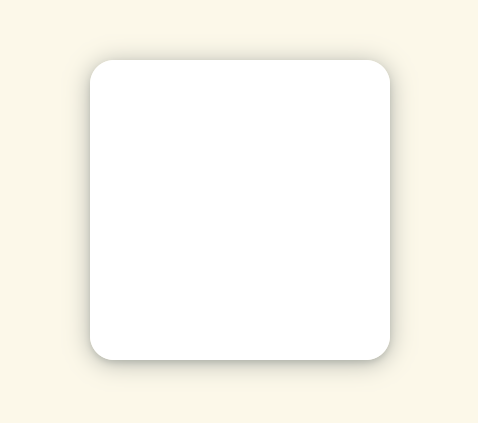
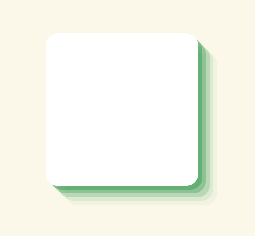

# CSS - 10 - Skugga

## Webbutveckling 1

---

# Box-shadow

Med egenskapen `box-shadow` kan vi lägga till skuggor.


```css [ ]
.selektor {
  box-shadow: inset offset-x offset-y blur-radius spread-radius color
}
```

---

```html
<div class="ex"></div>
```

```css [ ]
div {
  background-color: powderblue;
  height: 100px;
  width: 400px;
}
```

---

## Ex 1

```css [ ]
.ex {
  /* offset-x offset-y color */
  box-shadow: 20px 40px black;
}
```

--


---

## Ex 2

```css [ ]
.ex {
  /* offset-x offset-y color */
  box-shadow: 20px -40px black;
}
```

--


---

## Ex 3

```css [ ]
.ex {
  /* offset-x offset-y blur-radius color */
  box-shadow: 20px 40px 20px black;
}
```

--


---

## Ex 4

```css [ ]
.ex {
  /* offset-x offset-y blur-radius spread-radius color */
  box-shadow: 20px 40px 20px 20px black;
}
```

--


---

## Ex 5

```css [ ]
.ex {
  /* offset-x offset-y blur-radius spread-radius color */
  box-shadow: 20px 40px 20px -20px black;
}
```

--


---

## Ex 6

```css [ ]
.ex {
  /* inset offset-x offset-y color */
  box-shadow: inset 10px 10px black;
}
```

--


---

## Ex 7

```css [ ]
.ex {
  /* offset-x offset-y blur-radius color */
  box-shadow: 0 12px 12px -12px black;
}
```

--


---

## Ex 8

```css [ ]
.ex {
  box-shadow:
    0 16px 12px -12px black,
    16px 0 12px -12px red;
}
```


---

## Ex 9

```css [ ]
.ex {
  box-shadow:
    rgba(14, 30, 37, 0.12) 0px 2px 4px 0px,
    rgba(14, 30, 37, 0.32) 0px 2px 16px 0px;
}
```



---

## Ex 10

```css [ ]
.ex {
  box-shadow:
    rgb(232, 204, 204) 3px 3px 6px 0px inset,
    rgba(255, 255, 255, 0.5) -3px -3px 6px 1px inset;
}
```


---

## Ex 11

```css [ ]
.ex {
  box-shadow:
    rgba(40, 146, 70, 0.4) 5px 5px,
    rgba(40, 146, 70, 0.3) 10px 10px,
    rgba(40, 146, 70, 0.2) 15px 15px,
    rgba(40, 146, 70, 0.1) 20px 20px,
    rgba(40, 146, 70, 0.05) 25px 25px;
}
```



---

# Bra källor

* [https://developer.mozilla.org/en-US/docs/Web/CSS/box-shadow](https://developer.mozilla.org/en-US/docs/Web/CSS/box-shadow)
* [https://css-tricks.com/almanac/properties/b/box-shadow/](https://css-tricks.com/almanac/properties/b/box-shadow/)
* [https://www.webfx.com/blog/web-design/css-box-shadow/](https://www.webfx.com/blog/web-design/css-box-shadow/)
* [https://www.webfx.com/blog/images/assets/cdn.sixrevisions.com/0457-01-css-box-shadow-demo/demo.html](https://www.webfx.com/blog/images/assets/cdn.sixrevisions.com/0457-01-css-box-shadow-demo/demo.html)
* [https://codepen.io/sdthornton/pen/wBZdXq](https://codepen.io/sdthornton/pen/wBZdXq)

---

# Slut!