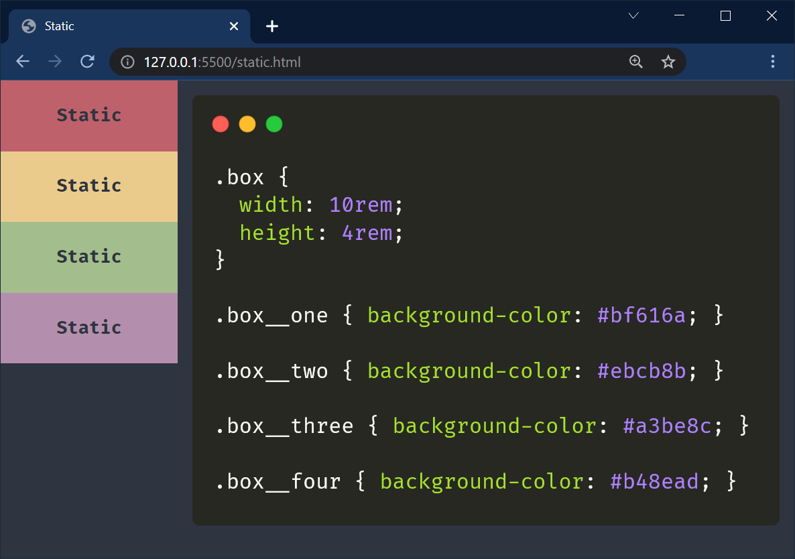
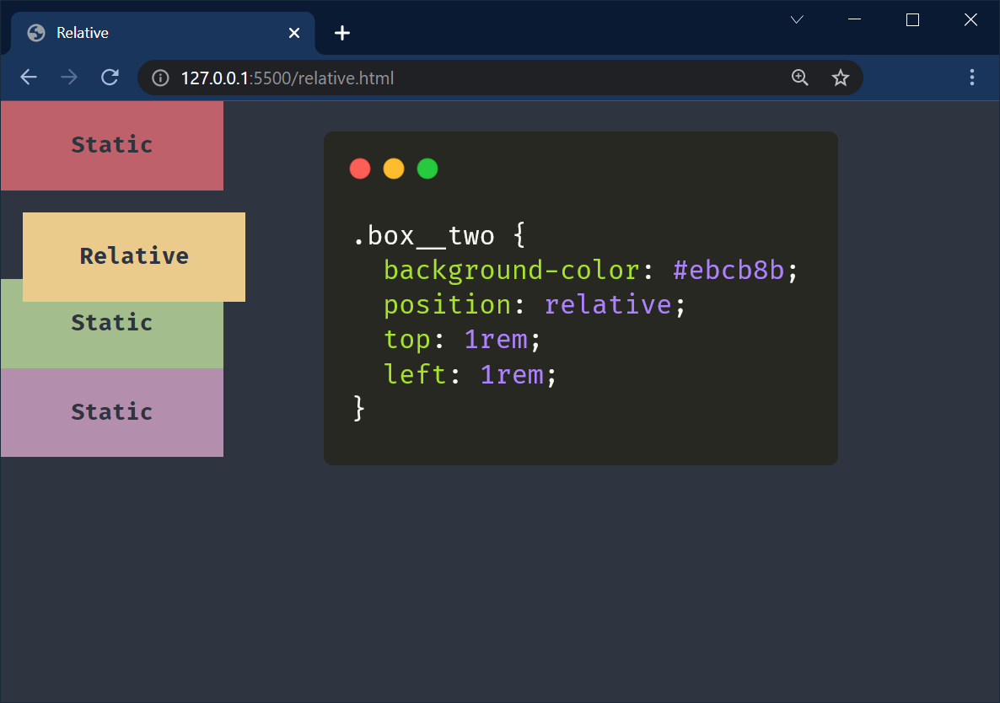
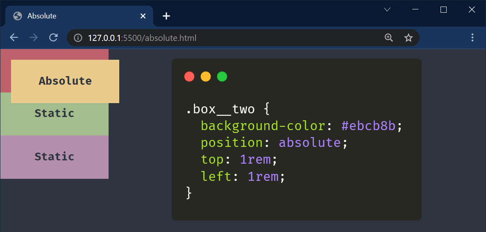
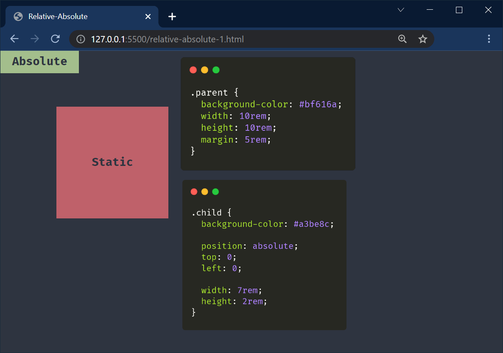
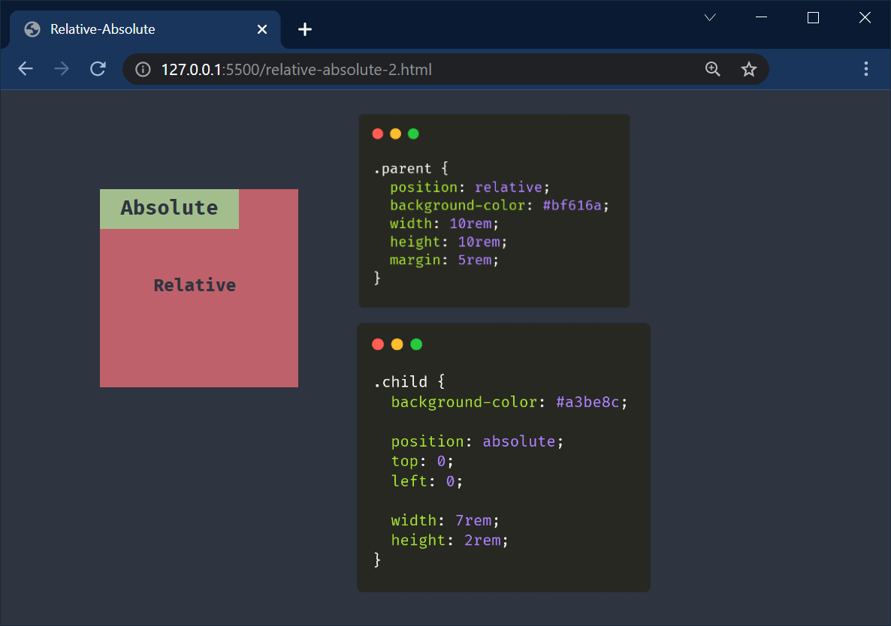
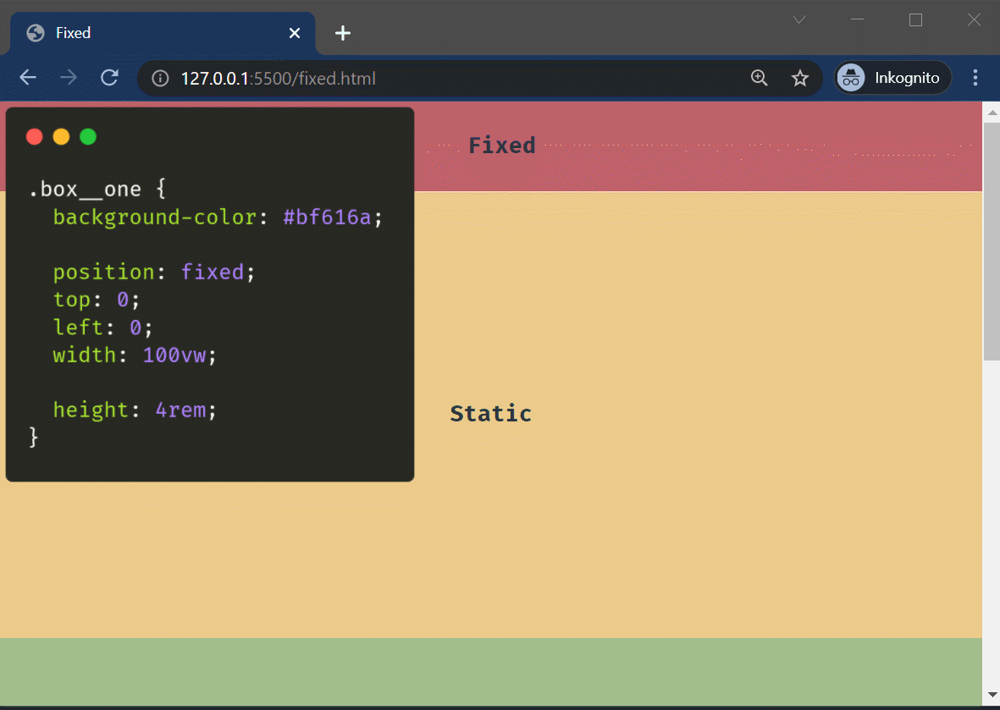
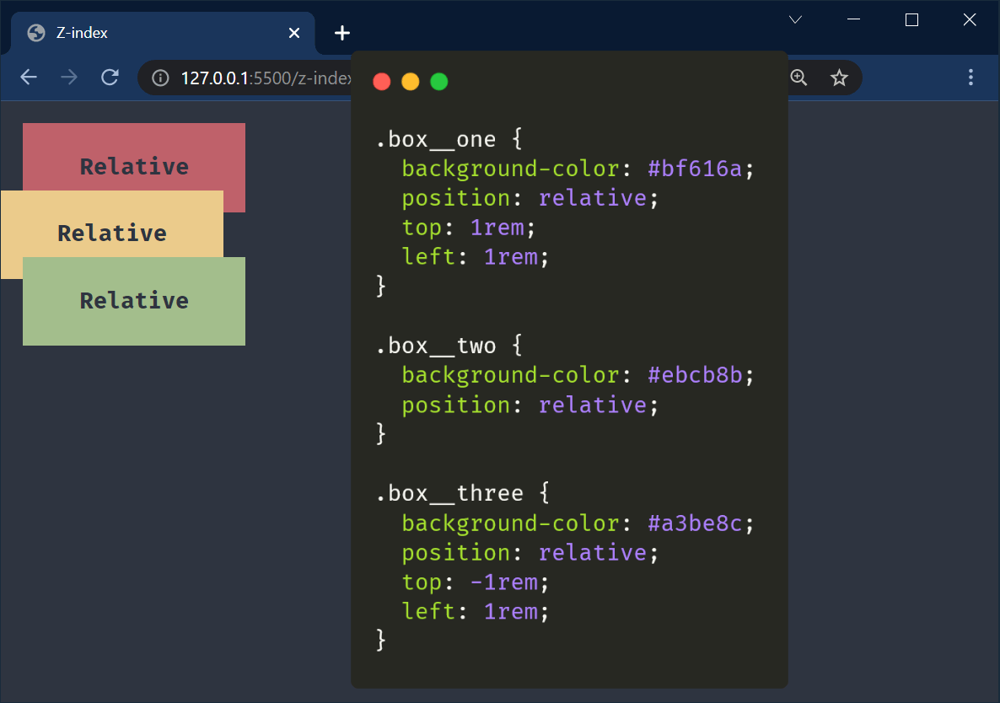
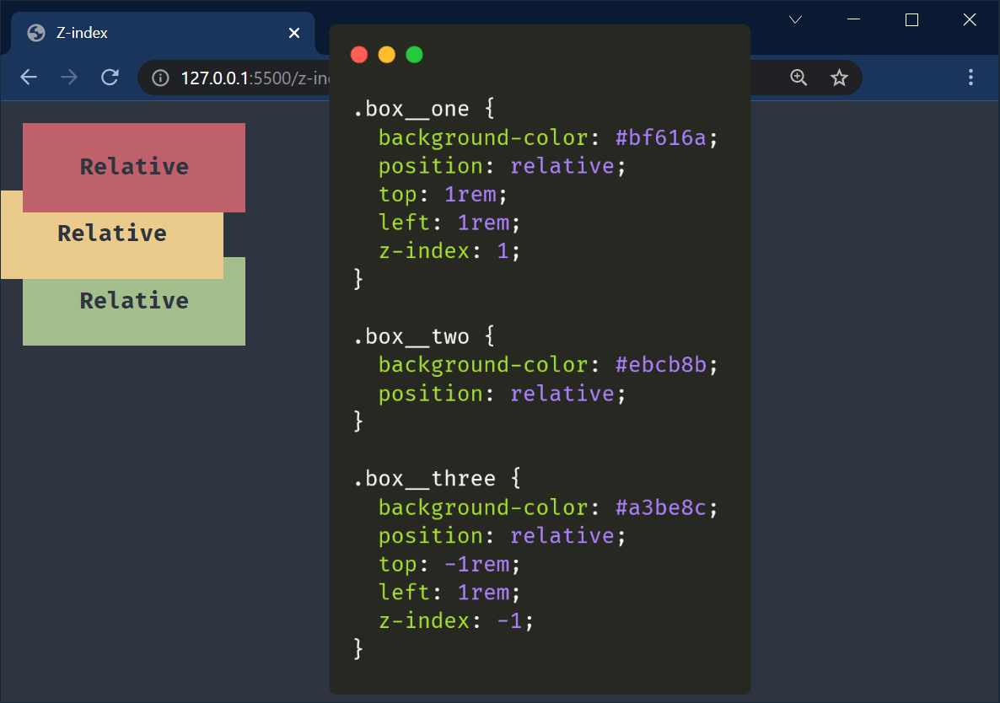

# Positionering

---

## Statisk positionering

--

Standard för positionering, dvs vi behöver inte ange denna

Påverkas inte av de olika egenskaperna vi har för att positionera element

--

---

## Relativ positionering

--

Utifrån sin statiska position så förflyttas elementet relativt

--

---

## Absolut positionering

--

Elementet lämnar sin statiska position och övriga element "ignorerar" elementet vid positionering

--

---

## Relativ och absolut i samspel

--

Anger vi relativ position på föräldern och absolut på ett barn-element så kommer barnets 0:0-punkt inte vara webbläsarens 0:0-punkt utan utgår då från förälderns 0:0-punkt

--

### Absolut inuti utan relativ förälder

I det här fallet kommer barnet som har positionen absolut att ignorera sin förälder

--

--

### Absolut inuti med relativ förälder

I det här fallet kommer barnet som har positionen absolut att följa med sin förälder

--

---

## Fixerad positionering

--

Elementet lämnar även här sin statiska position och kommer att bli fixerat i fönstret

--

---

## Z-index

--

Med `z-index` kan vi flytta positionerade element (ej **static**) i z-led (tänk lager).

--

--

---

# SLUT!

