# CSS - Olika sätt att <br>lösa uppgift 1

## Webbutveckling 1

---

# Målet

--

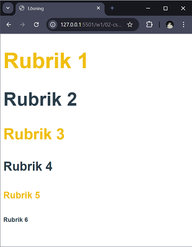

--

## Analys av uppgiften

- Alla rubriker har samma typsnitt
- Udda rubriker har samma färg
- Jämna rubriker har samma färg
- Rubriker minskar med 0.5em per steg

--

## Mapp och filer

- Vi skapar en mapp som heter **gcss**, det är här alla uppgifter i momentet kommer att finnas.
- I mappen **gcss** skapar vi en till mapp som heter **01**.
- I mappen **01** skapar vi filerna **index.html** och **style.css**

--

## HTML

```html [ 7, 11-16]
<!DOCTYPE html>
<html lang="sv">
  <head>
    <meta charset="UTF-8" />
    <meta name="viewport" content="width=device-width, initial-scale=1.0" />
    <title>Grundläggande CSS - Uppgift 01</title>
    <link rel="stylesheet" href="style.css" />
  </head>

  <body>
    <h1>Rubrik 1</h1>
    <h2>Rubrik 2</h2>
    <h3>Rubrik 3</h3>
    <h4>Rubrik 4</h4>
    <h5>Rubrik 5</h5>
    <h6>Rubrik 6</h6>
  </body>
</html>
```

Här ser vi att vi har länkat in formatmallen.

---

# Lösning 1

--

**Idé:** Skapar en CSS-regel för varje rubrik som innehåller alla deklarationer
som behövs för den aktuella regeln för att få till rätt utseende.

--

```css []
h1 {
  font-family: Arial, Helvetica, sans-serif;
  font-size: 3.5em;
  color: #f0bf11;
}
```

--

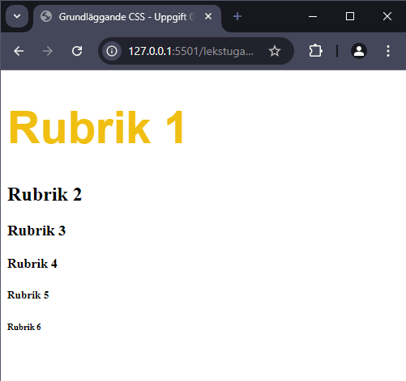

--

```css [7-11]
h1 {
  font-family: Arial, Helvetica, sans-serif;
  font-size: 3.5em;
  color: #f0bf11;
}

h2 {
  font-family: Arial, Helvetica, sans-serif;
  font-size: 3em;
  color: #2a3d4a;
}
```

--

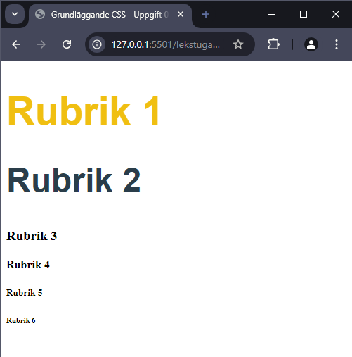

--

```css [13-17]
h1 {
  font-family: Arial, Helvetica, sans-serif;
  font-size: 3.5em;
  color: #f0bf11;
}

h2 {
  font-family: Arial, Helvetica, sans-serif;
  font-size: 3em;
  color: #2a3d4a;
}

h3 {
  font-family: Arial, Helvetica, sans-serif;
  font-size: 2.5em;
  color: #f0bf11;
}
```

--

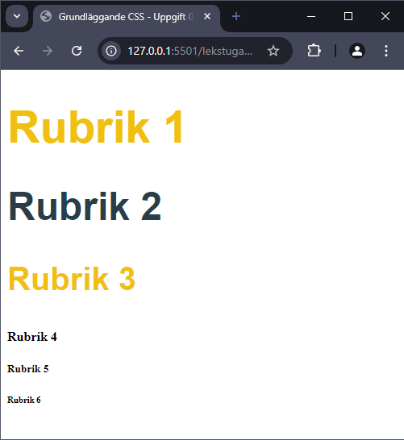

--

```css [19-23]
h1 {
  font-family: Arial, Helvetica, sans-serif;
  font-size: 3.5em;
  color: #f0bf11;
}

h2 {
  font-family: Arial, Helvetica, sans-serif;
  font-size: 3em;
  color: #2a3d4a;
}

h3 {
  font-family: Arial, Helvetica, sans-serif;
  font-size: 2.5em;
  color: #f0bf11;
}

h4 {
  font-family: Arial, Helvetica, sans-serif;
  font-size: 2em;
  color: #2a3d4a;
}
```

--

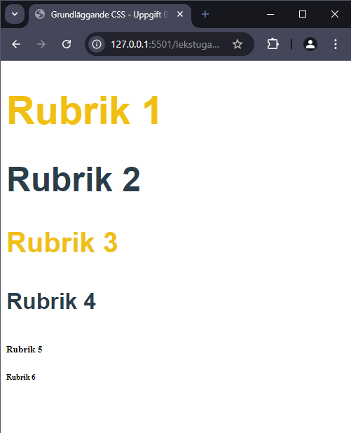

--

```css [25-29]
h1 {
  font-family: Arial, Helvetica, sans-serif;
  font-size: 3.5em;
  color: #f0bf11;
}

h2 {
  font-family: Arial, Helvetica, sans-serif;
  font-size: 3em;
  color: #2a3d4a;
}

h3 {
  font-family: Arial, Helvetica, sans-serif;
  font-size: 2.5em;
  color: #f0bf11;
}

h4 {
  font-family: Arial, Helvetica, sans-serif;
  font-size: 2em;
  color: #2a3d4a;
}

h5 {
  font-family: Arial, Helvetica, sans-serif;
  font-size: 1.5em;
  color: #f0bf11;
}
```

--

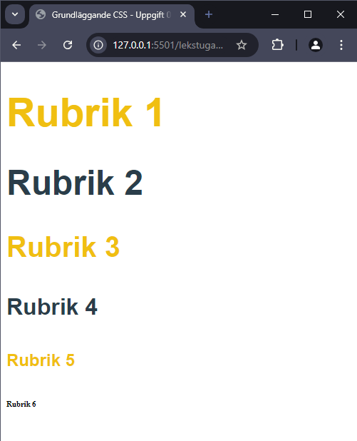

--

```css [31-35]
h1 {
  font-family: Arial, Helvetica, sans-serif;
  font-size: 3.5em;
  color: #f0bf11;
}

h2 {
  font-family: Arial, Helvetica, sans-serif;
  font-size: 3em;
  color: #2a3d4a;
}

h3 {
  font-family: Arial, Helvetica, sans-serif;
  font-size: 2.5em;
  color: #f0bf11;
}

h4 {
  font-family: Arial, Helvetica, sans-serif;
  font-size: 2em;
  color: #2a3d4a;
}

h5 {
  font-family: Arial, Helvetica, sans-serif;
  font-size: 1.5em;
  color: #f0bf11;
}

h6 {
  font-family: Arial, Helvetica, sans-serif;
  font-size: 1em;
  color: #2a3d4a;
}
```

--

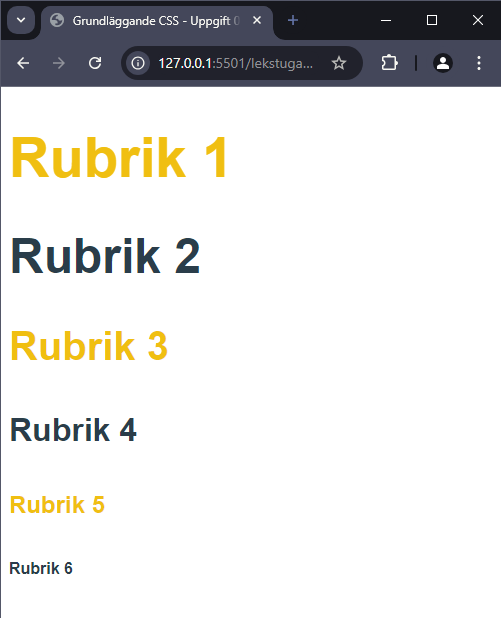

---

# Lösning 2

--

**Idé:** Skapa CSS-regler för det som är gemensamt för att sedan enbart
hantera det som är unikt för att få till rätt utseende.

--

```css []
h1,
h2,
h3,
h4,
h5,
h6 {
  font-family: Arial, Helvetica, sans-serif;
}
```

--

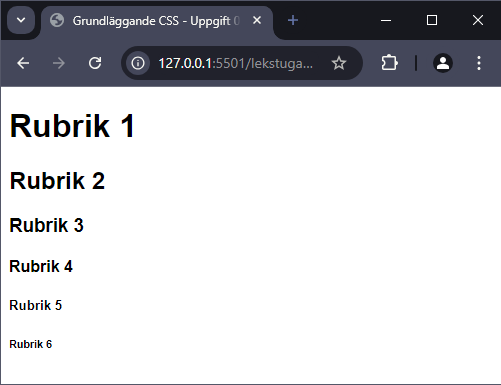

--

```css [10-14]
h1,
h2,
h3,
h4,
h5,
h6 {
  font-family: Arial, Helvetica, sans-serif;
}

h1,
h3,
h5 {
  color: #f0bf11;
}
```

--

## 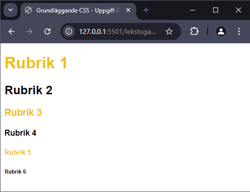

--

```css [16-20]
h1,
h2,
h3,
h4,
h5,
h6 {
  font-family: Arial, Helvetica, sans-serif;
}

h1,
h3,
h5 {
  color: #f0bf11;
}

h2,
h4,
h6 {
  color: #2a3d4a;
}
```

--

## 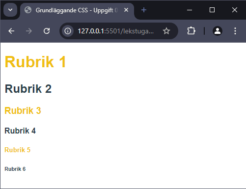

--

```css [22-24]
h1,
h2,
h3,
h4,
h5,
h6 {
  font-family: Arial, Helvetica, sans-serif;
}

h1,
h3,
h5 {
  color: #f0bf11;
}

h2,
h4,
h6 {
  color: #2a3d4a;
}

h1 {
  font-size: 3.5em;
}
```

--

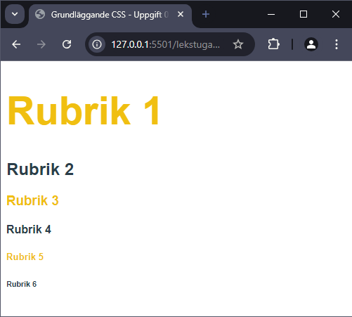

--

```css [26-28]
h1,
h2,
h3,
h4,
h5,
h6 {
  font-family: Arial, Helvetica, sans-serif;
}

h1,
h3,
h5 {
  color: #f0bf11;
}

h2,
h4,
h6 {
  color: #2a3d4a;
}

h1 {
  font-size: 3.5em;
}

h2 {
  font-size: 3em;
}
```

--

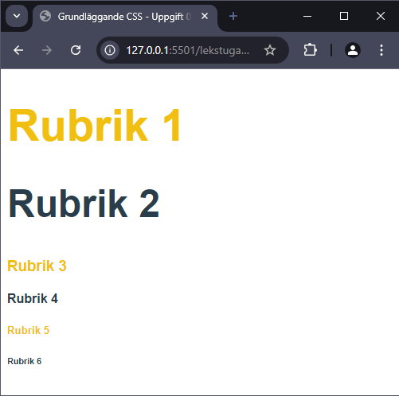

--

```css [30-32]
h1,
h2,
h3,
h4,
h5,
h6 {
  font-family: Arial, Helvetica, sans-serif;
}

h1,
h3,
h5 {
  color: #f0bf11;
}

h2,
h4,
h6 {
  color: #2a3d4a;
}

h1 {
  font-size: 3.5em;
}

h2 {
  font-size: 3em;
}

h3 {
  font-size: 2.5em;
}
```

--

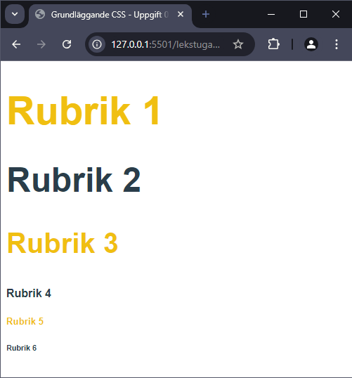

--

```css [34-36]
h1,
h2,
h3,
h4,
h5,
h6 {
  font-family: Arial, Helvetica, sans-serif;
}

h1,
h3,
h5 {
  color: #f0bf11;
}

h2,
h4,
h6 {
  color: #2a3d4a;
}

h1 {
  font-size: 3.5em;
}

h2 {
  font-size: 3em;
}

h3 {
  font-size: 2.5em;
}

h4 {
  font-size: 2em;
}
```

--

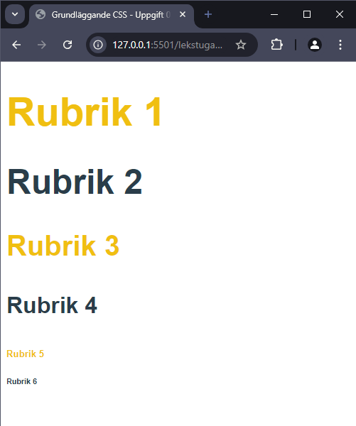

--

```css [38-40]
h1,
h2,
h3,
h4,
h5,
h6 {
  font-family: Arial, Helvetica, sans-serif;
}

h1,
h3,
h5 {
  color: #f0bf11;
}

h2,
h4,
h6 {
  color: #2a3d4a;
}

h1 {
  font-size: 3.5em;
}

h2 {
  font-size: 3em;
}

h3 {
  font-size: 2.5em;
}

h4 {
  font-size: 2em;
}

h5 {
  font-size: 1.5em;
}
```

--

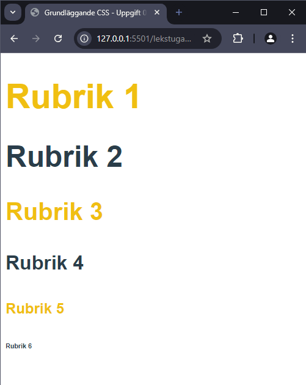

--

```css [42-44]
h1,
h2,
h3,
h4,
h5,
h6 {
  font-family: Arial, Helvetica, sans-serif;
}

h1,
h3,
h5 {
  color: #f0bf11;
}

h2,
h4,
h6 {
  color: #2a3d4a;
}

h1 {
  font-size: 3.5em;
}

h2 {
  font-size: 3em;
}

h3 {
  font-size: 2.5em;
}

h4 {
  font-size: 2em;
}

h5 {
  font-size: 1.5em;
}

h6 {
  font-size: 1em;
}
```

--

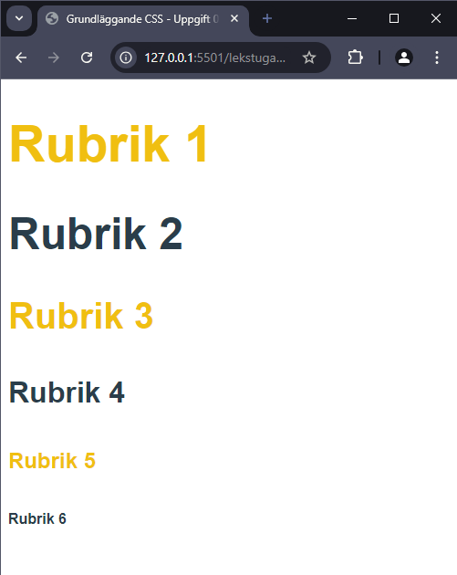

---

# Lösning 3

--

**Idé:** Skapa _CSS-variabler_ och sedan använda deras värden i CSS-reglerna.

--

```css []
:root {
  --clr-primary: #f0bf11;
  --clr-secondary: #2a3d4a;
  --ff: Arial, Helvetica, sans-serif;
}
```

--

```css [7-10]
:root {
  --clr-primary: #f0bf11;
  --clr-secondary: #2a3d4a;
  --ff: Arial, Helvetica, sans-serif;
}

h1 {
  font-family: var(--ff);
  color: var(--clr-primary);
  font-size: 3.5em;
}
```

--

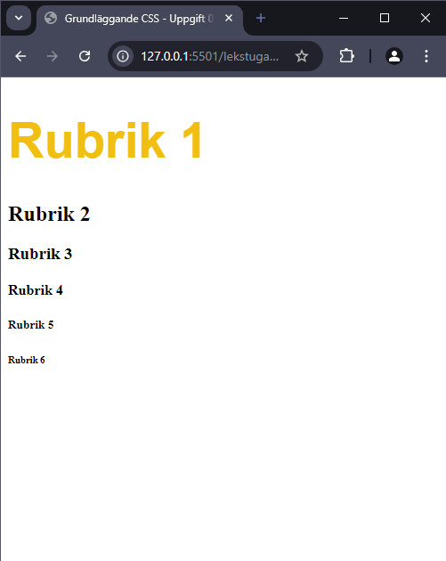

--

```css [13-17]
:root {
  --clr-primary: #f0bf11;
  --clr-secondary: #2a3d4a;
  --ff: Arial, Helvetica, sans-serif;
}

h1 {
  font-family: var(--ff);
  color: var(--clr-primary);
  font-size: 3.5em;
}

h2 {
  font-family: var(--ff);
  color: var(--clr-secondary);
  font-size: 3em;
}
```

--

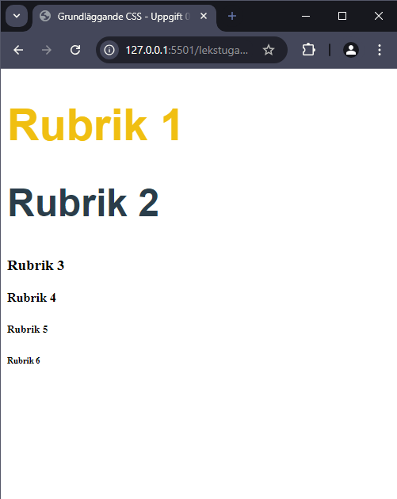

--

```css [19-23]
:root {
  --clr-primary: #f0bf11;
  --clr-secondary: #2a3d4a;
  --ff: Arial, Helvetica, sans-serif;
}

h1 {
  font-family: var(--ff);
  color: var(--clr-primary);
  font-size: 3.5em;
}

h2 {
  font-family: var(--ff);
  color: var(--clr-secondary);
  font-size: 3em;
}

h3 {
  font-family: var(--ff);
  color: var(--clr-primary);
  font-size: 2.5em;
}
```

--

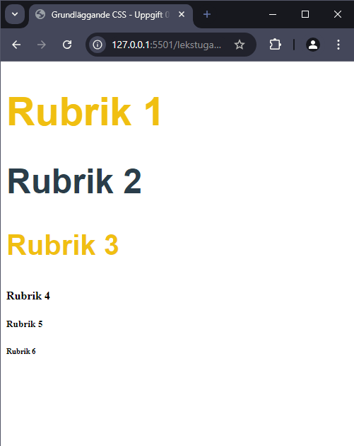

--

```css [25-29]
:root {
  --clr-primary: #f0bf11;
  --clr-secondary: #2a3d4a;
  --ff: Arial, Helvetica, sans-serif;
}

h1 {
  font-family: var(--ff);
  color: var(--clr-primary);
  font-size: 3.5em;
}

h2 {
  font-family: var(--ff);
  color: var(--clr-secondary);
  font-size: 3em;
}

h3 {
  font-family: var(--ff);
  color: var(--clr-primary);
  font-size: 2.5em;
}

h4 {
  font-family: var(--ff);
  color: var(--clr-secondary);
  font-size: 2em;
}
```

--

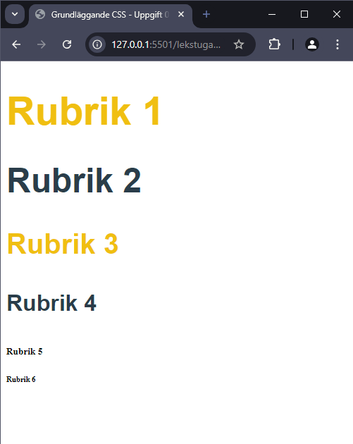

--

```css [31-35]
:root {
  --clr-primary: #f0bf11;
  --clr-secondary: #2a3d4a;
  --ff: Arial, Helvetica, sans-serif;
}

h1 {
  font-family: var(--ff);
  color: var(--clr-primary);
  font-size: 3.5em;
}

h2 {
  font-family: var(--ff);
  color: var(--clr-secondary);
  font-size: 3em;
}

h3 {
  font-family: var(--ff);
  color: var(--clr-primary);
  font-size: 2.5em;
}

h4 {
  font-family: var(--ff);
  color: var(--clr-secondary);
  font-size: 2em;
}

h5 {
  font-family: var(--ff);
  color: var(--clr-primary);
  font-size: 1.5em;
}
```

--

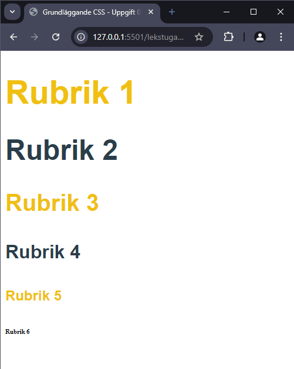

--

```css [37-41]
:root {
  --clr-primary: #f0bf11;
  --clr-secondary: #2a3d4a;
  --ff: Arial, Helvetica, sans-serif;
}

h1 {
  font-family: var(--ff);
  color: var(--clr-primary);
  font-size: 3.5em;
}

h2 {
  font-family: var(--ff);
  color: var(--clr-secondary);
  font-size: 3em;
}

h3 {
  font-family: var(--ff);
  color: var(--clr-primary);
  font-size: 2.5em;
}

h4 {
  font-family: var(--ff);
  color: var(--clr-secondary);
  font-size: 2em;
}

h5 {
  font-family: var(--ff);
  color: var(--clr-primary);
  font-size: 1.5em;
}

h6 {
  font-family: var(--ff);
  color: var(--clr-secondary);
  font-size: 1em;
}
```

--


---

# Lösning 4

--

**Idé:** Skapa _CSS-variabler_ samt räkna ut storleken på resten av rubriknivåerna utifrån h1:ans storlek

--

```css [5-10]
:root {
  --clr-primary: #f0bf11;
  --clr-secondary: #2a3d4a;
  --ff: Arial, Helvetica, sans-serif;
  --headingSize1: 3.5rem;
  --headingSize2: calc(var(--headingSize1) * 0.86);
  --headingSize3: calc(var(--headingSize1) * 0.714);
  --headingSize4: calc(var(--headingSize1) * 0.571);
  --headingSize5: calc(var(--headingSize1) * 0.428);
  --headingSize6: calc(var(--headingSize1) * 0.286);
}
```

--

```css []
:root {
  --clr-primary: #f0bf11;
  --clr-secondary: #2a3d4a;
  --ff: Arial, Helvetica, sans-serif;
  --headingSize1: 3.5rem;
  --headingSize2: calc(var(--headingSize1) * 0.86);
  --headingSize3: calc(var(--headingSize1) * 0.714);
  --headingSize4: calc(var(--headingSize1) * 0.571);
  --headingSize5: calc(var(--headingSize1) * 0.428);
  --headingSize6: calc(var(--headingSize1) * 0.286);
}

h1 {
  font-family: var(--ff);
  color: var(--clr-primary);
  font-size: var(--headingSize1);
}

h2 {
  font-family: var(--ff);
  color: var(--clr-secondary);
  font-size: var(--headingSize2);
}

h3 {
  font-family: var(--ff);
  color: var(--clr-primary);
  font-size: var(--headingSize3);
}

h4 {
  font-family: var(--ff);
  color: var(--clr-secondary);
  font-size: var(--headingSize4);
}

h5 {
  font-family: var(--ff);
  color: var(--clr-primary);
  font-size: var(--headingSize5);
}

h6 {
  font-family: var(--ff);
  color: var(--clr-secondary);
  font-size: var(--headingSize6);
}
```

---

# SLUT!
