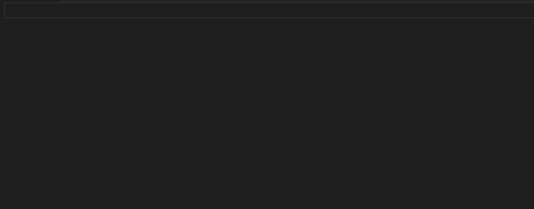

# Emmet i Visual Studio Code

--


**Emmet** är inbyggt från början i _Visual Studio Code_ och vi använder **ENTER** för att köra vår emmetsträng

--


Du kan även trycka på **skiftnyckeln** som dyker upp för att köra emmetsträngen.

---

# Skapa dokumentmallen

--



För att skapa dokumentmallen (html) använder vi **utropstecknet**.

---

# Använda plustecknet

--


Använder man plustecknet så skapar man två element efter varandra. Skriver vi **h1+p** kommer vi således få först en **h1:a** och därefter ett **p**.

När vi har kört vår emmetsträng så får vi insättnigspunkter för innehållet i taggarna och vi kan nu använda **TAB** för att hoppa mellan dem.

---

# Använda gångertecknet

--


Vill vi skapa flera element av samma typ så kan vi använda oss av gångertecknet, t.ex **p*3**.

---

# Använda pil

--


Med pilen kan vi lägga till barntaggar.

--


Vi kan även använda pilen tillsammans med **lorem** för att fylla en tagg med innehåll.

---

# Använda parenteser

--

## Exempel 1

--

```html
<h1></h1>
<p></p>
<p></p>
<ol>
  <li></li>
  <li></li>
</ol>
<p></p>
```

Låt säga att vi vill skapa koden ovan med hjälp av emmet

--


För att göra det skriver vi **h1+p\*2+(ol>li*2)+p**

--

## Exempel 2

--

```html
<div class="card">
  <h1></h1>
  
  <p></p>
</div>
<div class="card">
  <h1></h1>
  
  <p></p>
</div>
```

Låt säga att vi vill skapa koden ovan med hjälp av emmet. För att göra det skriver vi **(.card>h1+img+p)\*2**

---

# Sätta attribut

--


Med hjälp av **fyrkantsparenteser** kan vi sätta värdet på ett attribut.

Vill vi sätta flera attribut samtidigt använder vi ett mellanslag mellan attributen, t.ex <br> **input[name=test value=test]**.

---

# Lägga till innehåll

--


Med hjälp av **klammerparenteser** ("måsvingar") kan vi lägga till innehåll i en tagg direkt i emmetsträngen.

--


Här visar jag hur vi kan sätta både attribut och innehåll på en gång.

---

# Lägga till en kommentar vid slutet på klasser/id:n

--


Vill man lägga till en automatisk kommentar som visar var en klass/id slutar använder vi **pipetecknet + c**, t.ex **.card>(h1+p)|c**

---

# Lägga till flera <br> klasser på en gång

--


Om man vill lägga till flera klasser på en gång så skriver man ihop klasserna, t.ex **.klass1.klass2**

---

# Lägga till nummer

--


Man kan med **$-tecknet** lägga till nummer.

I exemplet här skriver vi **ul>li.item${listpunkt $}\*3** och som du ser kan vi numrera t.ex både klassnamn och i innehållet.

---

# SLUT!