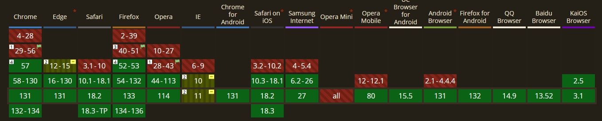

# CSS Grid - En Grundläggande Introduktion

---

# Vad är CSS Grid?

--

2D-layoutsystem

Designat för att skapa flexibla och responsiva grid-baserade layouter.

Perfekt för att arrangera innehåll i rader och kolumner.

---

# Fördelar med CSS Grid

--

**Flexibilitet**: Lätt att anpassa layout

**Responsiv design**: Fungerar bra på olika skärmstorlekar.

**Enkelhet**: Mindre kod jämfört med äldre layouttekniker.

---

# Grundläggande begrepp

--

**Grid Container**: Ett element som definierar ett grid (t.ex. `
` med `display: grid;`).

**Grid Items**: Barn till grid-containern som placeras i rutnätet.

**Grid Lines**: Linjer som separerar rader och kolumner.

**Grid Cells**: Individuella rutor i rutnätet.

---

# Webbläsare

--

---

# SLUT!
