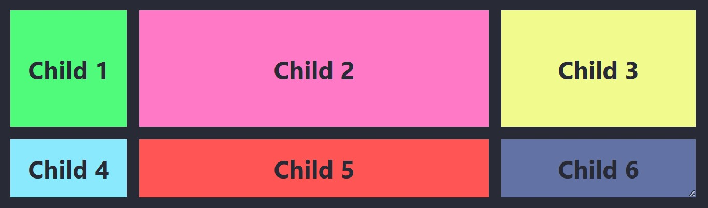
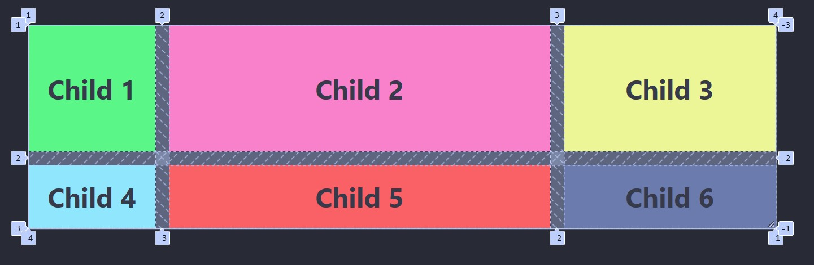
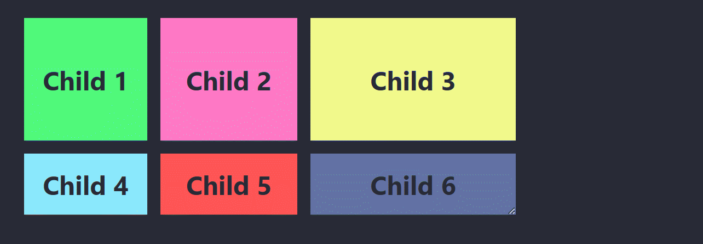
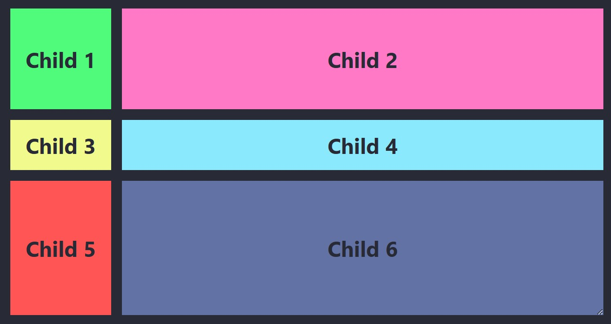
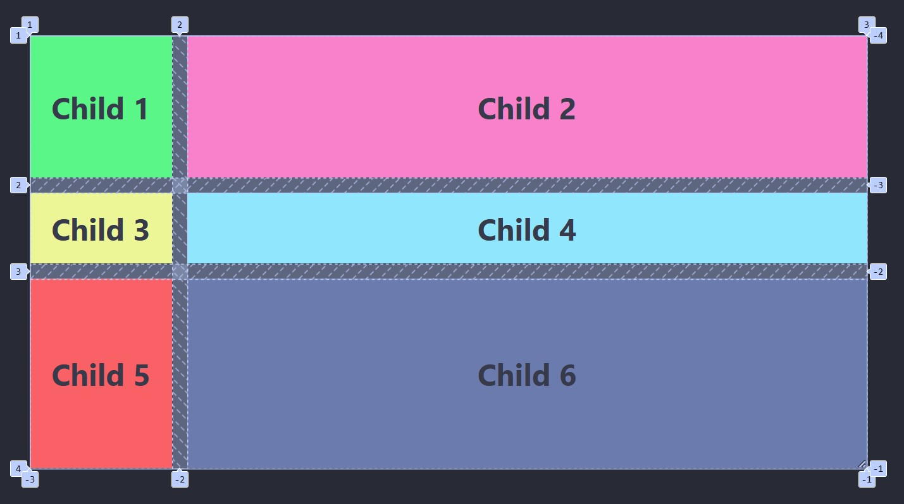

# Exempel på en grid-layout

---

# HTML

```html []
<div class="parent">
  <div class="child child-1">Child 1</div>
  <div class="child child-2">Child 2</div>
  <div class="child child-3">Child 3</div>
  <div class="child child-4">Child 4</div>
  <div class="child child-5">Child 5</div>
  <div class="child child-6">Child 6</div>
</div>
```

---

# CSS - Exempel 1

```css []
.parent {
  width: 60%;
  display: grid;
  grid-template-columns: 150px auto 250px;
  grid-template-rows: 150px auto;
  gap: 1rem;
}
```

--



--



--



--

## Vad gör varje egenskap?

--

### display: grid;

Aktiverar CSS Grid på **.parent**

--

### grid-template-columns: 150px auto 250px;

Skapar tre kolumner:

- **Första kolumnen**: 150px bred
- **Andra kolumnen**: Automatiskt bred
- **Tredje kolumnen**: 250px bred.

--

### grid-template-rows: 150px auto;

Skapar två rader:

- **Första raden**: 150px hög
- **Andra raden**: Automatiskt hög (fyller resterande höjd).

--

### gap: 1rem;

Skapar ett mellanrum på **1rem** mellan rader och kolumner.

---

# CSS - Exempel 2

--

```css [5-6]
.parent {
  width: 60%;
  display: grid;

  grid-template-columns: 150px auto;
  grid-template-rows: 150px auto 200px;

  gap: 1rem;
}
```

--



--



---

# SLUT!
