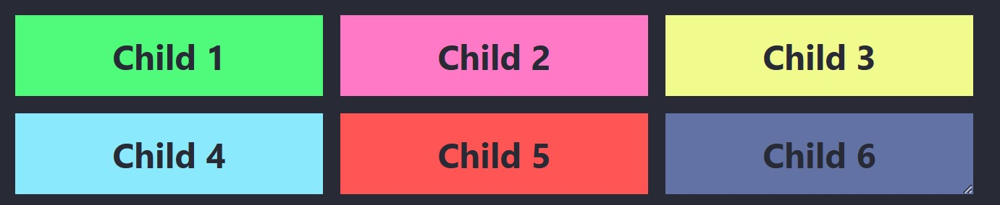
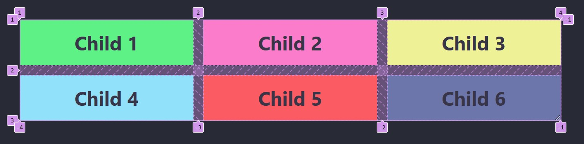
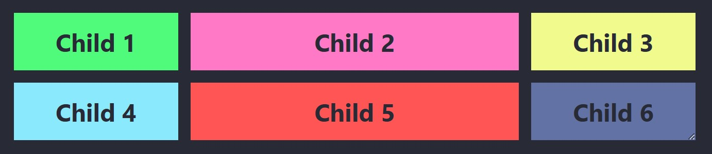
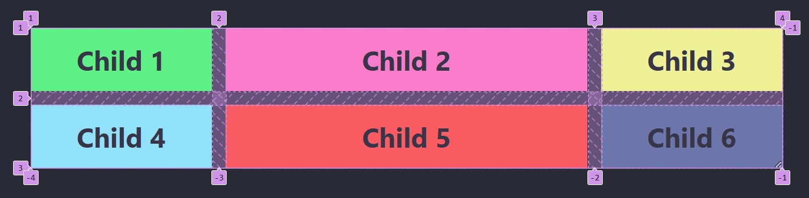
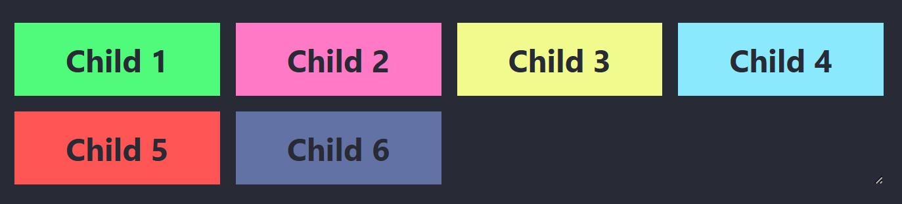
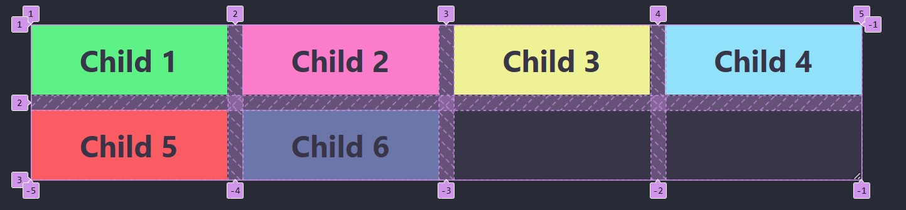
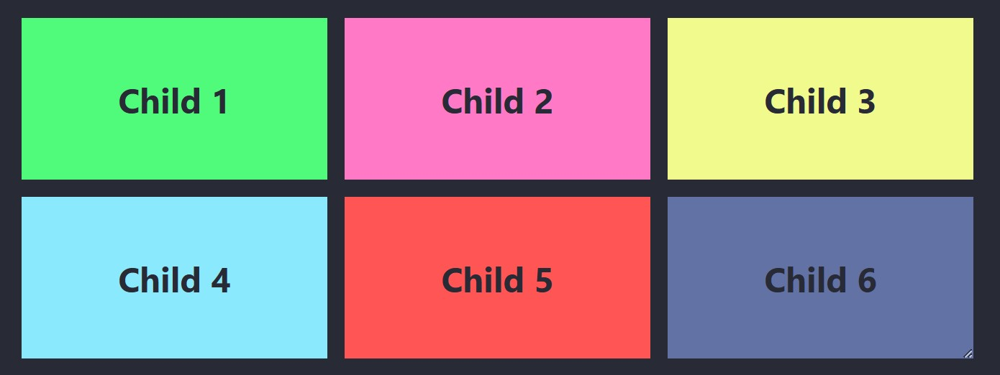
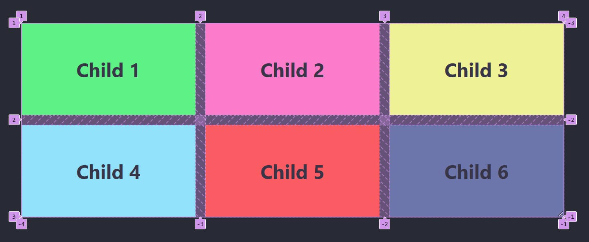

# Fraktioner och repeat

---

# HTML

```html []
<div class="parent">
  <div class="child child-1">Child 1</div>
  <div class="child child-2">Child 2</div>
  <div class="child child-3">Child 3</div>
  <div class="child child-4">Child 4</div>
  <div class="child child-5">Child 5</div>
  <div class="child child-6">Child 6</div>
</div>
```

---

# Exempel 1: <br>Lika stora kolumner

--

## CSS-kod

```css [5]
.parent {
  width: 60%;

  display: grid;
  grid-template-columns: 1fr 1fr 1fr;
  gap: 1rem;
}
```

--



--



--

## 

--

## Beskrivning

Skapar tre kolumner med lika stor bredd.

**1fr** betyder att varje kolumn får en lika stor del av det tillgängliga utrymmet.

**gap: 1rem** lägger till mellanrum mellan kolumner och rader.

---

# Exempel 2: <br>Olika bredder på kolumner

--

## CSS-kod

```css [5]
.parent {
  width: 60%;

  display: grid;
  grid-template-columns: 1fr 2fr 1fr;
  gap: 1rem;
}
```

--



--



--

## Beskrivning

Skapar tre kolumner

Första och sista kolumnen är lika stora, **1fr**.

Mittenkolumnen är dubbelt så bred, **2fr**, som de andra.

---

# Exempel 3: <br>Upprepning med `repeat`

--

## CSS-kod

```css
.parent {
  width: 60%;

  display: grid;
  grid-template-columns: repeat(3, 1fr);
  gap: 1rem;
}
```

--


--


--

## Beskrivning

Använder **repeat** för att skapa tre kolumner med lika stor bredd, **1fr**.

Samma resultat som **Exempel 1**, men med kortare kod.

---

# Exempel 4: <br>Fyra kolumner med `repeat`

--

## CSS-kod

```css [5]
.parent {
  width: 60%;

  display: grid;
  grid-template-columns: repeat(4, 1fr);
  gap: 1rem;
}
```

--



--



--

## Beskrivning

Skapar fyra kolumner med lika stor bredd, **1fr**.

---

# Exempel 5: <br>Rader och kolumner med `repeat`

--

## CSS-kod

```css [5-6]
.parent {
  width: 60%;

  display: grid;
  grid-template-columns: repeat(3, 1fr);
  grid-template-rows: repeat(2, 150px);
  gap: 1rem;
}
```

--



--



--

## Beskrivning

Tre kolumner av lika stor bredd, **1fr**.

Två rader med en höjd av **150px** vardera.

---

# Exempel 6: <br>`grid-template` för kortare kod

--

## CSS-kod

```css [5]
.parent {
  width: 60%;

  display: grid;
  grid-template: repeat(2, 150px) / repeat(3, 1fr);
  gap: 1rem;
}
```

--


--


--

## Beskrivning

Kombinerar definitionen av rader och kolumner i en enda egenskap.

Samma layout som **Exempel 5**, men mer kompakt kod.

---

# SLUT!
