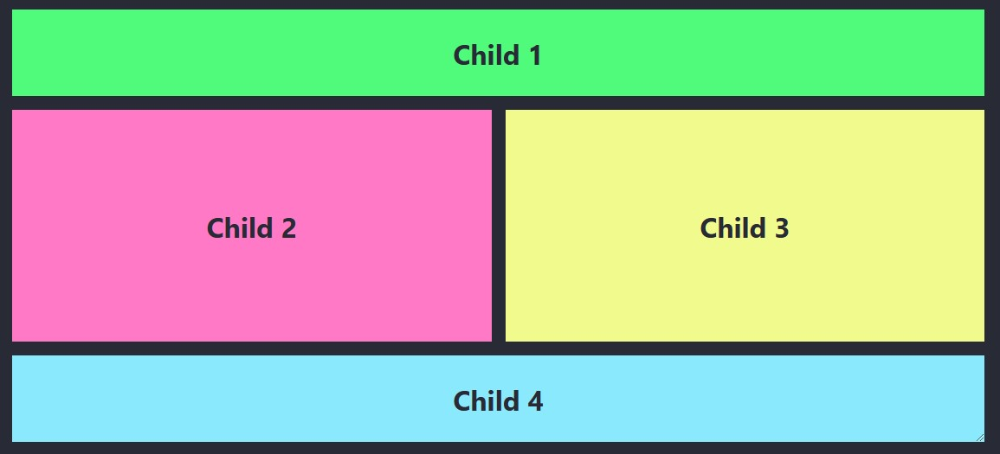
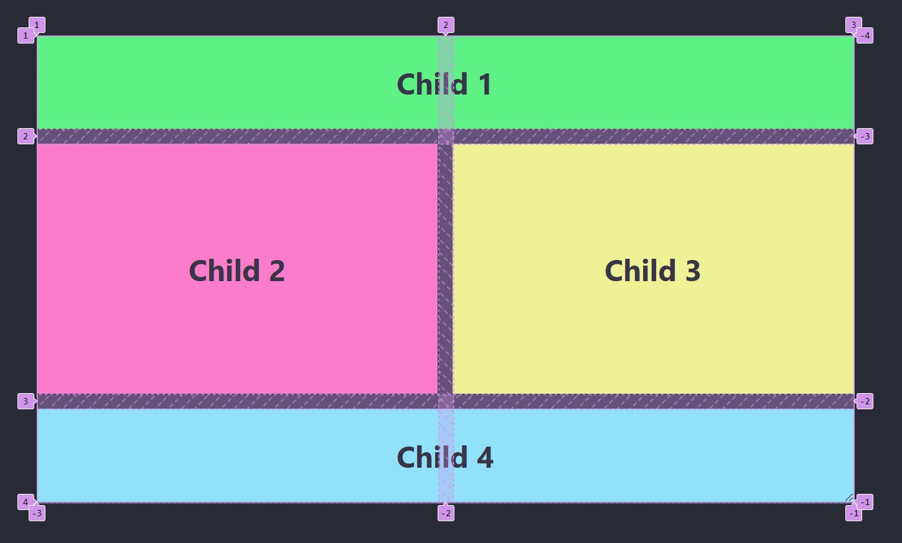
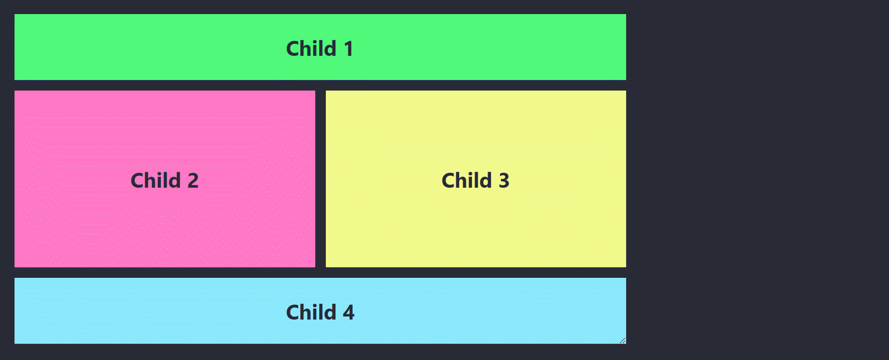
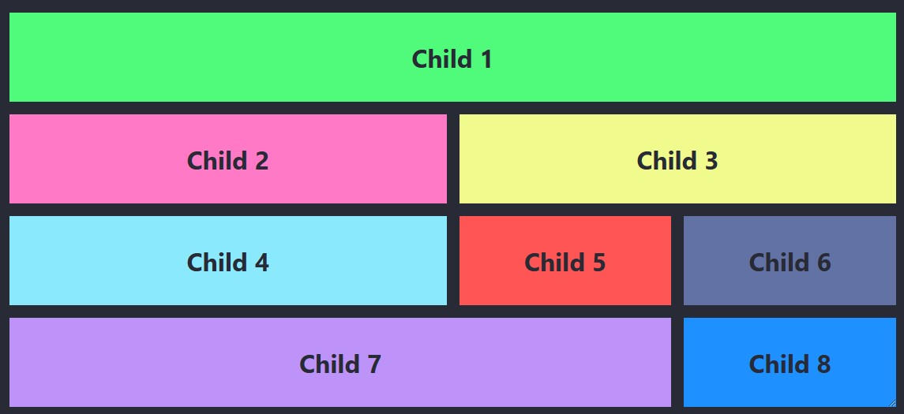
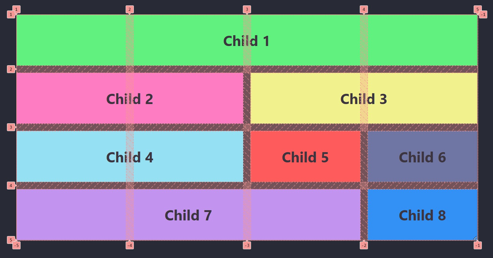
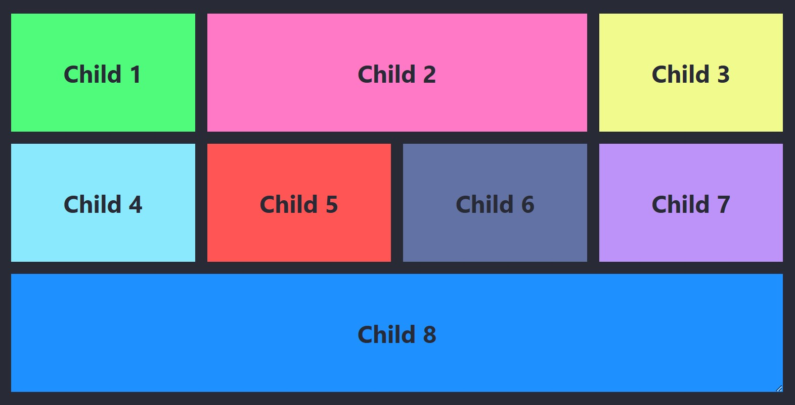
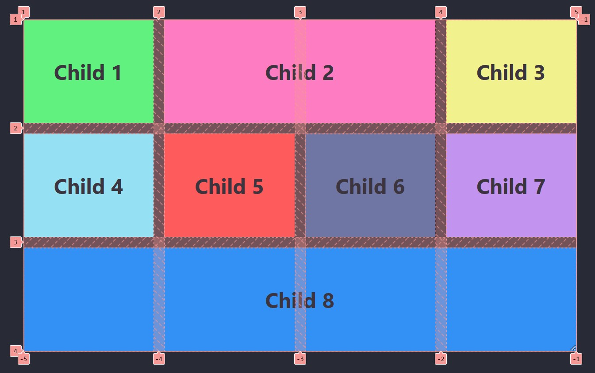

# Placering av <br>grid-items - Del 1

---

# HTML

--

```html
<div class="parent">
  <div class="child child-1">Child 1</div>
  <div class="child child-2">Child 2</div>
  <div class="child child-3">Child 3</div>
  <div class="child child-4">Child 4</div>
</div>
```

---

# Exempel 1: Egenskaperna `grid-column-start` och `grid-column-end`

--

## CSS-kod

```css
.parent {
  width: 60%;

  display: grid;
  grid-template-columns: repeat(2, 1fr);
  grid-template-rows: 100px 1fr 100px;
  gap: 1rem;
}

.child-1 {
  grid-column-start: 1;
  grid-column-end: 3;
}

.child-4 {
  grid-column-start: 1;
  grid-column-end: 3;
}
```

--

### Beskrivning

Använder **grid-column-start** och **grid-column-end** för att ange vilken kolumn ett element börjar och slutar på.

--



--



--



---

# Exempel 2: Egenskapen <br>`grid-column`

--

## CSS-kod

```css [10, 14]
.parent {
  width: 60%;
  display: grid;
  grid-template-columns: repeat(2, 1fr);
  grid-template-rows: 100px 1fr 100px;
  gap: 1rem;
}

.child-1 {
  grid-column: 1 / 3;
}

.child-4 {
  grid-column: 1 / 3;
}
```

--

## Beskrivning

Använder **grid-column** som är en kortare syntax för att ange start- och slutkolumn.

Får samma resultat som **Exempel 1**, men med kortare kod.

---

# Exempel 3: Ett lite <br>större exempel

--

## HTML

--

```html []
<div class="parent">
  <div class="child child-1">Child 1</div>
  <div class="child child-2">Child 2</div>
  <div class="child child-3">Child 3</div>
  <div class="child child-4">Child 4</div>
  <div class="child child-5">Child 5</div>
  <div class="child child-6">Child 6</div>
  <div class="child child-7">Child 7</div>
  <div class="child child-8">Child 8</div>
</div>
```

--

## CSS

```css []
.parent {
  width: 60%;

  display: grid;
  grid-template-columns: repeat(4, 1fr);
  gap: 1rem;
}

.child-1 {
  grid-column: 1 / 5;
}

.child-2 {
  grid-column: 1 / 3;
}

.child-3 {
  grid-column: 3 / 5;
}

.child-4 {
  grid-column: 1 / 3;
}

.child-7 {
  grid-column: 1 / 4;
}
```

--



--



---

# Exempel 4: Egenskapen `span` samt negativa linjer

--

## HTML

--

```html []
<div class="parent">
  <div class="child child-1">Child 1</div>
  <div class="child child-2">Child 2</div>
  <div class="child child-3">Child 3</div>
  <div class="child child-4">Child 4</div>
  <div class="child child-5">Child 5</div>
  <div class="child child-6">Child 6</div>
  <div class="child child-7">Child 7</div>
  <div class="child child-8">Child 8</div>
</div>
```

--

## CSS

```css [14, 18]
.parent {
  width: 60%;

  display: grid;
  grid-template-columns: repeat(4, 1fr);
  gap: 1rem;
}

.child-1 {
  grid-column: 1 / 2;
}

.child-2 {
  grid-column: 2 / span 2;
}

.child-8 {
  grid-column: 1 / -1;
}
```

--



--

## 

--

## Beskrivning

**grid-column: 2 / span 2;**

Elementet börjar i kolumn 2 och sträcker sig över 2 kolumner (dvs. kolumn 2 och kolumn 3).

**grid-column: 1 / -1;**

Elementet börjar vid den första kolumnen (1) och sträcker sig ända till den sista kolumnen (-1 är ett shorthand för den sista kolumnen). Detta gör att elementet täcker hela radens bredd.

---

# SLUT!
