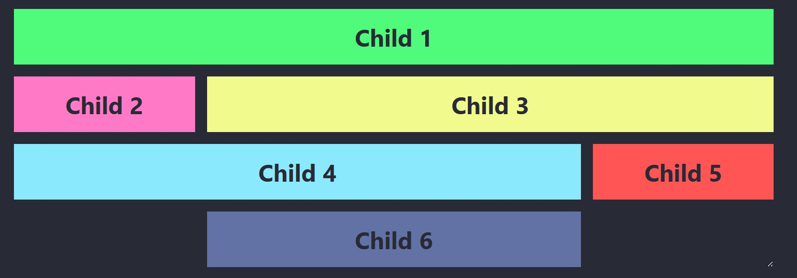

# Placering av <br>grid-items - Del 2

---

# HTML

--

```html []
<div class="parent">
  <div class="child child-1">Child 1</div>
  <div class="child child-2">Child 2</div>
  <div class="child child-3">Child 3</div>
  <div class="child child-4">Child 4</div>
  <div class="child child-5">Child 5</div>
  <div class="child child-6">Child 6</div>
</div>
```

---

# Exempel 1

--

## CSS

```css
.parent {
  width: 60%;

  display: grid;
  grid-template-columns: repeat(4, 1fr);
  gap: 1rem;

  grid-template-areas:
    "c1 c1 c1 c1"
    "c2 c3 c3 c3"
    "c4 c4 c4 c5"
    ".  c6 c6  .";
}

.child-1 {
  grid-area: c1;
}

.child-2 {
  grid-area: c2;
}

.child-3 {
  grid-area: c3;
}

.child-4 {
  grid-area: c4;
}

.child-5 {
  grid-area: c5;
}

.child-6 {
  grid-area: c6;
}
```

--



--


--

## Beskrivning

**grid-template-areas** används för att skapa en visuellt läsbar layout.

Varje område (t.ex. **c1**, **c2**) namnges och kan användas för att placera specifika element.

Elementens placering styrs av egenskapen **grid-area**.

--

_Rad 1_: **child-1** sträcker sig över alla kolumner

_Rad 2_: **child-2** täcker första kolumnen, medan **child-3** täcker tre kolumner

_Rad 3_: **child-4** täcker tre kolumner, och **child-5** täcker sista kolumnen

_Rad 4_: **child-6** centreras över två kolumner då vi anger att första och sista kolumnerna ska vara tomma (med **punkten**).

---

# Exempel 2

--

```css [8-12]
.parent {
  width: 60%;

  display: grid;
  grid-template-columns: repeat(4, 1fr);
  gap: 1rem;

  grid-template-areas:
    "c2 c1 c1 c1"
    "c2 c3 c3 c4"
    "c2 c3 c3 c5"
    "c2 c6 c6 c6";
}
```

Här har vi nu ändrat hur vi vill att områdena ska placeras.

--


--


---

## Fördelar med `grid-template-areas`

**Läslig layout**: Det blir enkelt att förstå hur elementen är placerade.

**Flexibel hantering**: Du kan snabbt ändra layouten genom att uppdatera **grid-template-areas**.

**Separation av innehåll och layout**: Placeringen definieras utan att påverka elementens innehåll.

---

# SLUT!
