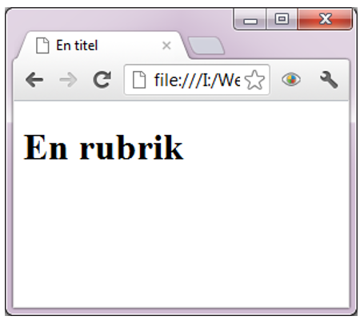
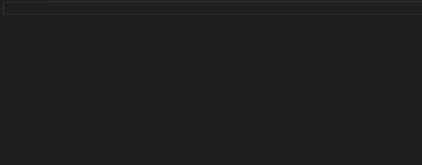
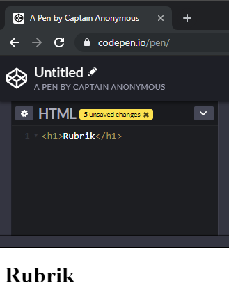

# HTML - 01 - Introduktion
## Webbutveckling 1

---

# HTML

**H**yper**T**ext **M**arkup **L**anguage

Språket som vi kodar webbsidor i.

Språket används för att t ex visa att **"Här kommer det en rubrik"**. Det säger inget om hur rubriken ska se ut.

Tolkas av webbläsaren.

---

# Kort historisk tillbakablick

* HTML 1 = 1993
* HTML 2 = 1995
* HTML 3 = 1997 (januari)
* HTML 4 = 1997 (december)
* XHTML 1 = 2000
* XHTML 1.1 = 2001
* HTML 5 = 2014 (W3C, WHATWG separat)
* HTML (LS) = 2019 (WHATWG) [Aktuell version](https://html.spec.whatwg.org/multipage/)

---

# Taggar

Taggar/märken börjar med **&lt;** och slutar med **&gt;**.

Mellan **&lt; &gt;** finns ett nyckelord som berättar vilken typ av tagg det är.

I HTML kan man använde både stora (versaler) och små (gemener) bokstäver för att skriva taggarna.

**Men enligt god programmeringspraxis kodar man med små bokstäver.**

--

```html [ ]
<title>Datorteknik</title>
```

De flesta taggar består av en **starttagg** och en **sluttagg**.

Sluttagen har ett snedstreck **/** före nyckelordet.

Innehållet mellan taggarna kallas just **innehåll**.

**Tagg + innehåll = element**.

--

Tomma taggar är taggar som inte har en sluttagg.

```
<br> (HTML)
<br /> (XHTML)
```

För manuell radbrytning använder vi br-taggen.

I den äldre xhtml-standarden måste även tomma taggar avslutas.

---

# En enkel webbsida

```html [ ]
<!DOCTYPE html>
<html lang="sv">
  <head>
    <meta charset="UTF-8">
    <title>En titel</title>
  </head>
  <body>
    <h1>En rubrik</h1>
  </body>
</html>
```

--



---

# Dokumenttyp

```html [ ]
<!DOCTYPE html>
```
Anger typ av dokument och hur det ska tolkas.

Placeras **alltid** längst upp i dokumentet

Anges inte dokumenttyp används **Quirk mode**, dvs det är upp till webbläsaren att tolka koden.

--

## Exempel på äldre versioner

```html [ ]
<!DOCTYPE html PUBLIC "-//W3C//DTD XHTML 1.0 Strict//EN"
"http://www.w3.org/TR/xhtml1/DTD/xhtml1-strict.dtd">

<!DOCTYPE html PUBLIC "-//W3C//DTD XHTML 1.0 Transitional//EN"
 "http://www.w3.org/TR/xhtml1/DTD/xhtml1-transitional.dtd">

<!DOCTYPE HTML PUBLIC "-//W3C//DTD HTML 4.01 Frameset//EN"
"http://www.w3.org/TR/html4/frameset.dtd">
```

---

# HTML-taggen

```html [ ]
<html>…</html>
```

Dokumentets rotelement.

Det är mellan dessa två allt ska finnas (utom DOCTYPE).


--

```html [ ]
<html lang="sv"> Svenska
<html lang="en-US"> Amerikansk engelska
<html lang="en"> Engelska
<html lang="ar" dir="rtl"> Arabiska
```

Ange språk med attributet **lang**

Med attributet **dir** kan man ange textorientering.

---

# Head-taggen

```html [ ]
<head>
  <title>Teknikprogrammet</title>
</head>
```

Innehåller beskrivande taggar om själva dokumentet, till exempel teckentabell, titel m.m (metadata).

När det gäller innehållet i **title** så ska vi följa riktlinjen [Skriv beskrivande sidtitlar](https://webbriktlinjer.se/riktlinjer/135-skriv-beskrivande-sidtitlar/)

--

### Metadata

```html [ ]
<head>
  <meta charset="UTF-8">
  <meta name="description" content="Spikarnas paradis">
  <meta name="keywords" content="Spik, Skruv">
  <meta name="author" content="Bo Spik">
  <title>Teknikprogrammet</title>
</head>
```

Metadata är data (information) om data

---

# Body-taggen

```html [ ]
<body> … </body>
```

Det här vi kodar och skriver allt innehåll som ska synas på webbplatsen.

```html [ ]
<body>
  <h1>En rubrik</h1>
</body>
```

---

# Filnamn

Det är viktigt att döpa filerna på ett korrekt sätt.

Här ska vi följa riktlinjen [Ge dokument filnamn som beskriver innehållet](https://webbriktlinjer.se/riktlinjer/9-ge-dokument-tydliga-filnamn/)

<span class="greentext">uppgift01.html = OK!</span>

<span class="redtext">Övning 01.html = NEJ!</span>

---

# Specialtecken

Används för att koda ett unikt tecken.

Fast mellanslag fås via &ampnbsp;

&amplt; ger <

&ampgt; ger >

Se [Charref](https://dev.w3.org/html5/html-author/charref)

--

```html [ ]
<p>A $lt; B</p>
```

Resultatet som visas i wewbbläsaren blir A < B

---

# Kommentarer

Kommentarer syns inte i webbläsaren.

Via **Visa källa/Inspektera element** kommer du åt att se HTML-koden, här syns kommentarerna.

--

```html [ ]
<!-- Text in här -->
```

Kommentera upp koden vad den gör.

Observera det är två bindestreck i vardera ände.

--

```html [ ]
<!-- <p>Ett stycke text</p> -->
```

Kommentera bort kod som inte behövs (enkel felsökning).

Vill du kommentera ut ett block gör du det genom att markera blocket för att sedan trycka **ALT + SHIFT + A**

Togglefunktion

---

# Följ standard!

Nät vi kodar ser vi till att följa vald standard samt riktlinjen [Följ standarder](https://webbriktlinjer.se/riktlinjer/80-folj-standarder/).

---

# Validering

Med validering kan vi kontrollera vår HTML-kod att den följer standarden.

Läs mer på om validering under riktlinjen [Se till att koden validerar](https://webbriktlinjer.se/riktlinjer/84-se-till-att-koden-validerar/)

<span class="purpletext">DEMO!</span>

---

# Skapa mallen i VSC



Skapa en ny fil och se till att den har filändelsen **.html**

**! + ENTER**

**html:5 + ENTER**

---

# Skapa mallen i Codepen



--

Här behöver du inte skapa mallen.

Det du skriver i rutan HTML är det som placeras i bodyn.

---

# Slut!
