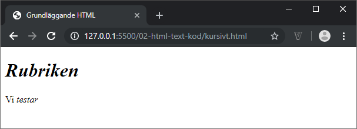
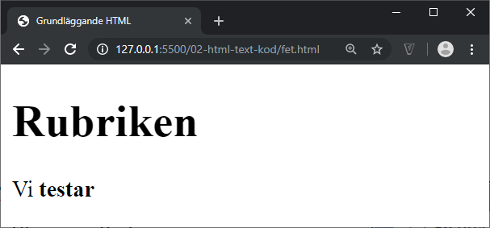
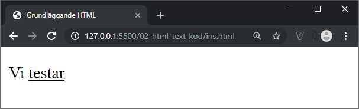

# HTML - 02 - Text
## Webbutveckling 1

---

# Rubriker

```html
<h1>...</h1>
<h2>...</h2>
<h3>...</h3>
<h4>...</h4>
<h5>...</h5>
<h6>...</h6>
```

**h1** är störst

**h6** är minst

--

```html
<body>
  <h1>En rubrik</h1>
  <p>Massa text</p>

  <h2>Underrubrik</h2>
  <p>Massa text</p>

  <h2>Underrubrik igen</h2>
  <p>Massa text</p>
</body>
```

Förenklad kod, ej allt med pga utrymmesbrist!

Man hoppar ***aldrig*** över en nivå!

--


--

## Riktlinjer

* [Skapa rubriker med h-element](https://webbriktlinjer.se/riktlinjer/105-skapa-rubriker-med-h-element/)
* [Skriv beskrivande rubriker och etiketter](https://webbriktlinjer.se/riktlinjer/61-skriv-tydliga-och-berattande-rubriker/)

---

# Stycken

```html
<p>...</p>
```

Radbrytning i ett stycke sker automatiskt.

Mellanrum mellan stycken som standard (Browser CSS)

Obs! Radbrytningar (**&lt;br&gt;**) ska **inte** användas för styckesindelning.

--

```html
<p>...</p>
```

&nbsp;

```html
<p>Lorem, ipsum dolor sit amet consectetur adipisicing elit. Ipsam dolor dolorem obcaecati autem omnis ab velit dolores ducimus nostrum debitis magni sint optio aliquam soluta, sit aut necessitatibus dolore fuga.</p>
<p>Ea a porro maiores sequi saepe sit veniam expedita nostrum reiciendis. Reprehenderit autem ut id sunt voluptatum debitis impedit deserunt voluptates consectetur sed! Illum quia veritatis quod. Reprehenderit, minima! Rem.</p>
```

--


---

# Kursiv text

```html
<i>...</i>
```
&nbsp;

```html
<h1><i>Rubriken</i></h1>
<p>Vi <i>testar</i></p>
```

--



---

# Fet text

```html
<b>...</b>
```
&nbsp;

```html
<h1><b>Rubriken</b></h1>
<p>Vi <b>testar</b></p>
```

--



**Observera!** Rubriker har fet stil som standard... dvs det är onödigt att lägga till b-taggen som i exemplet.

---

# Betoningar

```html
<em>...</em>
```

Används för att påvisa något (betona) viktigt i en text.

Visas vanligen som kursiv text.

--

```html
<p>Vi <em>testar</em></p>
```


--

```html
<strong>...</strong>
```

Används för att påvisa något som är extremt viktigt i en text.

Visas vanligen som fet text.

--

```html
<p>Vi <strong>testar</strong></p>
```


---

# Upphöjd text

```html
<sup>...</sup>
```
&nbsp;

```html
<p>Vi <sup>testar</sup></p>
```

--


---

# Nedsänkt text

```html
<sub>...</sub>
```
&nbsp;

```html
<p>Vi <sub>testar</sub></p>
```

--


---

# Inaktuell text

```html
<del>...</del>
```
&nbsp;

```html
<p>Vi <del>testar</del></p>
```

--


---

# Ny text

```html
<ins>...</ins>
```
&nbsp;

```html
<p>Vi <ins>testar</ins></p>
```

--



--

## Problem!

Då &lt;ins&gt;-taggen vanligen visas som understruken text, kan användaren lätt misstolka och tro att det är en länk.

Går att lösa med CSS (nästa moment i kursen).

Här kan du läsa mer om riktlinjen [Stryk aldrig under text som inte är länkad](https://webbriktlinjer.se/riktlinjer/106-stryk-aldrig-under-text-som-inte-ar-lankad/)

---

# Förkortningar

```html
<abbr>...</abbr>
```

&nbsp;

```html
<p>You can use <abbr title="Cascading Style Sheets">CSS</abbr> to style your <abbr title="HyperText Markup Language">HTML</abbr>.</p>
```

Här använder vi även det valbara attributet **title**.

--


---

# Definition

```html
<dfn>...</dfn>
```

&nbsp;

```html
<p>Genom att använda oss av <dfn title="U=I*R">Ohms lag</dfn> kunde vi lösa problemet.</p>
```

Här använder vi även det valbara attributet **title**.

--


---

# Korta citat

```html
<q>...</q>
```

&nbsp;

```html
<p>Did you know <q>The quick brown fox jumps over the lazy dog</q> contains every letter of the alphabet?</p>
```

--


Som du ser på bilden läggs citattecknen dit automatiskt.

---

# Långa citat

```html
<blockquote>...</blockquote>
```

&nbsp;

```html
<p>Lite text</p>
<blockquote>
  <p>Vi testar citat</p>
</blockquote>
<p>Lite text</p>
```

--


--

```html
<blockquote cite="http://www.george-orwell.org/1984/0.html">
  <p>It was a bright cold day in April, and the clocks were striking thirteen.</p>
  <footer>
  First sentence in <cite><a href="http://www.george-orwell.org/1984/0.html"><i>Nineteen Eighty-Four</i></a></cite> by George Orwell (Part 1, Chapter 1).
  </footer>
</blockquote>
```

Ett mer komplett exempel med attributet **cite** och taggen **cite**. Vi har även taggarna **footer** och **a**, mer om dem senare.

--


---

# Nästling av taggar

```html
<p><i>Rätt</i></p>
```

&nbsp;

```html
<i><p>Fel</p></i>
```

&nbsp;

```html
<p><i>Fel</p></i>
```

--

```html
<p><i><b>Rätt</b></i></p>
```

&nbsp;

```html
<i><p><b>Fel</b></p></i>
```

&nbsp;

```html
<p><i><b>Fel</p></i></b>
```