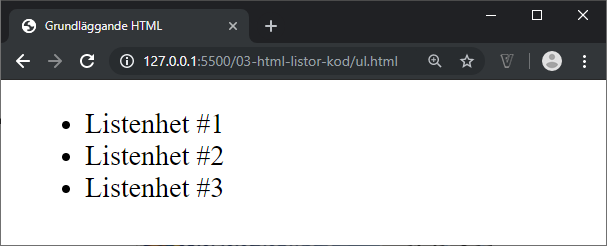

# HTML - 03 - Listor
## Webbutveckling 1

---

# Ordnade listor

```html [ ]
<ol>
  <li>...</li>
</ol>
```

```html [ ]
<ol>
  <li>Listenhet #1</li>
  <li>Listenhet #2</li>
  <li>Listenhet #3</li>
</ol>
```

--


---

# Oordnade listor

```html [ ]
<ul>
  <li>...</li>
</ul>
```

```html [ ]
<ul>
  <li>Listenhet #1</li>
  <li>Listenhet #2</li>
  <li>Listenhet #3</li>
</ul>
```

--



---

# Nästlade listor


Hur ska vi koda för att få följande lista?

--

## Alternativ 1 - Felaktig!

```html [ ]
<ul>
  <li>Orange Goblin</li>
  <li>Ramones</li>
    <ul>
      <li>Road to ruin</li>
      <li>Leave home</li>
    </ul>
  <li>Slayer</li>
</ul>
```

--

## Alternativ 2 - Korrekt!

```html [ ]
<ul>
  <li>Orange Goblin</li>
  <li>Ramones
    <ul>
      <li>Road to ruin</li>
      <li>Leave home</li>
    </ul>
  </li>
  <li>Slayer</li>
</ul>
```

Underlistan **måste** återfinnas inuti en listpunkt.

---

# Beskrivningslistor

```html [ ]
<dl>...</dl>
```

Skapar en beskrivningslista.

```html [ ]
<dt>...</dt>
```

Används för att ange den term man vill beskriva.

```html [ ]
<dd>...</dd>
```

Används för själva beskrivningen.

--

```html [ ]
<dl>
  <dt>Hamburgare</dt>
  <dd>Bröd-Kött-Bröd</dd>

  <dt>Halv special</dt>
  <dd>Bröd-Korv-Mos</dd>
</dl>
```

**Observera!** Det finns inget som säger att **dt** måste komma före **dd**, det går givetvis lika bra att först ange beskrivningen (**dd**) och sedan termen (**dt**).

--


--

```html [ ]
<dl>
  <dt><dfn>RSS</dfn></dt>
  <dd>An XML format …</dd>

  <dt><dfn>Weblog</dfn></dt>
  <dd>Contraction of …</dd>
</dl>
```


--

```html [ ]
<dl>
  <dt lang="en-GB">
    <dfn>colour</dfn>
  </dt>
  <dt lang="en-US">
    <dfn>color</dfn>
  </dt>
  <dd>The visual… </dd>
</dl>
```


--

```html [ ]
<dl>
  <dt>Term</dt>
  <dd>Beskrivning 1</dd>
  <dd>Beskrivning 2</dd>
</dl>

```


---

# Riktlinjer

* [Använd rätt html-element när ni gör listor](https://webbriktlinjer.se/riktlinjer/104-gor-listor-med-de-html-element-som-ar-till-for-att-skapa-listor/)

---

# Slut!