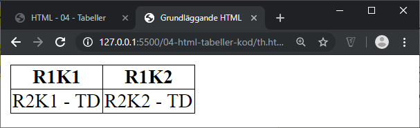
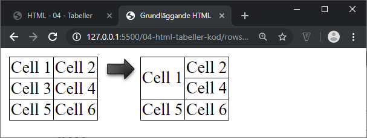

# HTML - 04 - Tabeller
## Webbutveckling 1

---

# Grundläggande tabelltaggar

```html
<table>…</table> 
```

Skapar tabellen

```html
<tr>…</tr> 
```

Skapar en rad (table row)

```html
<td>…</td> 
```

Skapar en cell (table data)

--

```html
<table>
  <tr>
    <td>R1K1</td>
  </tr>
</table>
```

Minsta möjliga tabell har 1 rad och 1 cell!


**Problem!** Vi ser inga kantlinjer.

--

```html
  <title>Grundläggande HTML</title>

  <style>
  table {
    border-collapse: collapse;
  }
  td, th {
    border: 1px solid #000;
  }
  </style>
</head>
```

I de uppgifter som innehåller tabeller lägger du till följande, det vill säga taggen **style** och allt dess innehåll. **Observera placeringen!**

--

```css
table {
  border-collapse: collapse;
}
td, th {
  border: 1px solid #000;
}
```

Använder du **codepen** så kopierar du in följande i rutan CSS.

--


---

# En större tabell

```html
<table>
  <tr>
    <td>R1K1</td>
    <td>R1K2</td>
    <td>R1K3</td>
  </tr>
  <tr>
    <td>R2K1</td>
    <td>R2K2</td>
    <td>R2K3</td>
  </tr>
</table>
```

Två rader med tre celler i varje.

--


---

# Rubrikceller

```html
<table>
  <tr>
    <th>R1K1</th>
    <th>R1K2</th>
  </tr>
  <tr>
    <td>R2K1 - TD</td>
    <td>R2K2 - TD</td>
  </tr>
</table>
```

**th**-taggen används för celler som beskriver datan i **td**-cellerna.

--



---

# Tabellrubrik

```html
<table>
  <caption>Tabellrubrik</caption>
  <tr>
    <th>R1K1</th>
    <th>R1K2</th>
  </tr>
  <tr>
    <td>R2K1 - TD</td>
    <td>R2K2 - TD</td>
  </tr>
</table>
```

--


---

# Sammanslagning av celler


--

```html
<table>
  <tr>
    <td>Cell 1</td>
    <td>Cell 2</td>
  </tr>
  <tr>
    <td>Cell 3</td>
    <td>Cell 4</td>
  </tr>
  <tr>
    <td>Cell 5</td>
    <td>Cell 6</td>
  </tr>
</table>
```

Första tabellen innan sammanslagning.

--

```html
<table>
  <tr>
    <td colspan="2">Cell 1</td>
  </tr>
  <tr>
    <td>Cell 3</td>
    <td>Cell 4</td>
  </tr>
  <tr>
    <td>Cell 5</td>
    <td>Cell 6</td>
  </tr>
</table>
```

Med attributet **colspan** kan vi slå samman flera celler till en och det kolumnvis.

--



--

```html
<table>
  <tr>
    <td>Cell 1</td>
    <td>Cell 2</td>
  </tr>
  <tr>
    <td>Cell 3</td>
    <td>Cell 4</td>
  </tr>
  <tr>
    <td>Cell 5</td>
    <td>Cell 6</td>
  </tr>
</table>
```

Första tabellen innan sammanslagning.

--

```html
<table>
  <tr>
    <td rowspan="2">Cell 1</td>
    <td>Cell 2</td>
  </tr>
  <tr>
    <td>Cell 3</td>
  </tr>
  <tr>
    <td>Cell 5</td>
    <td>Cell 6</td>
  </tr>
</table>
```

Med attributet **rowspan** kan vi slå samman flera celler till en och det radvis.
