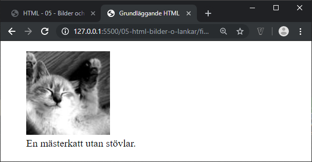
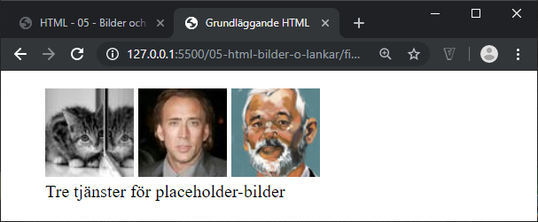

# HTML - 05 - Bilder och länkar
## Webbutveckling 1

---

# Interna länkar

Länkar internt inom samma webbplats.

```html [ ]
<a href="index.html">Hem</a>
```

**Relativ.** Utgår från aktuell mapp.

Den här metoden är det vanligaste.

--

```html [ ]
<a href="https://www.abc.se/index.html">Hem</a>
```

**Absolut.** Utgår från hela webbplatsen.

---

# Externa länkar

Länkar till andra webbplatser

```html [ ]
<a href="https://www.abc.se">ABC-klubben</a>
```

**Extern relativ länk.**

Fungerar så länge webbplatsen finns kvar.

Laddar extern webbplats startsida.

Rekommenderad metod.

--

```html [ ]
<a href="https://www.abc.se/index.html">ABC-klubben</a>
```

**Extern absolut länk.**

Fungerar endast så länge inte den andra webbplatsen ändrar namn på filen, t.ex till index.html i det här fallet

--

## Riktlinjer

* [Skriv tydliga länkar](https://webbriktlinjer.se/riktlinjer/5-skriv-tydliga-lankar/)
* [Länka alla sidor till startsidan](https://webbriktlinjer.se/riktlinjer/31-alla-sidor-ska-ha-lankar-till-startsidan-och-andra-sidor-som-ar-viktiga-for-orienteringen/)

---

# Bilder

```html [ ]

```

Attributen **src** och **alt** måste finnas med.

Attributen **width** och **height** är valbara, men bör finnas med. Anges i pixels utan enhet.

**Vanligaste bildformaten:** *jpg, gif, png, svg, webp* (se [MDN Web Docs](https://developer.mozilla.org/en-US/docs/Web/HTML/Element/img))

---

# Klickbar bild med länk

```html [ ]
<a href="index.html">

</a>
```

Klickbar bild som länkar till något...

---

# Picture-taggen

```html [ ]
<picture>...</picture>
```

Innerhåller 0 eller flera **source**-taggar samt en **img**-tagg för att kunna tillhandahålla olika versioner av en bild beroende på klienten.

Klientens webbläsare kommer att gå igenom de source-taggar som finns för att välja ut den mest optimala bilden. Om ingen optimal bild finns väljs bilden i img-taggen.

--

```html [ ]
<picture>
  <source srcset="half.jpg"
          media="(min-width: 800px)">
  <source srcset="full.jpg"
          media="(min-width: 1500px)">
  
</picture>
```

I det här fallet kommer klientens webbläsare att välja en av de tre bilderna utifrån bredden på webbläsarfönstret.

---

# Figure-taggen

```html [ ]
<figure>...</figure>
```

Används för gruppera ett eller flera objekt, till exempel bilder.

Oftast tillsammans med taggen **figcaption** som används för att ange figurbeskrivning.

--

```html [ ]
<figure>
  
  <figcaption>En mästerkatt utan stövlar.</figcaption>
</figure>
```



--

```html [ ]
<figure>
  
  
  
  <figcaption>
    Tre tjänster för placeholder-bilder
  </figcaption>
</figure>
```



---

# Slut!
