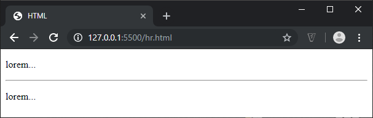

# HTML - 06 - Gott och blandat
## Webbutveckling 1

---

# Namn på verk

--

```html [ ]
<cite>...</cite>
```

Används för att ange en titel på ett verk, t ex:
* Böcker
* Filmer
* TV-serier
* Sånger
* Spel
* Skulpturer
* ...

--

```html [ ]
<p>En av mina favoritfilmer är 
<cite><a href="http://www.imdb.com/title/tt0089907/">Return of the livning dead</a></cite></p>
```


---

# Överstykningspenna

--

```html [ ]
<mark>...</mark>
```
Används för att markera något i en text i referenssyfte, på grund av dess betydelse i ett annat sammanhang.

--

```html [ ]
<blockquote lang="en-GB">
  <p>Look around and you will find, no-one's really 
  <mark>colour</mark> blind.</p>
</blockquote>

<p>Utifrån <em>stavningen</em> i citatet kan vi dra slutsatsen att person som skrivit det inte är amerikan.</p>
```


---

# Tidsangivelse

--

```html [ ]
<time>...</time>
```

```html [ ]
<p>Idag är det <time datetime="2017-09-10">måndag</time></p>
<p>Under <time>2012</time> var patentstriderna inom...</p>
```


---

# Finstilt text

--

```html [ ]
<small>...</small>
```

```html [ ]
<p><small lang="en">&copy; copyright 2010 Example Corp.</small></p>

<p><small><strong>För köp av ABC:S produkter...</strong></small></p>
```


---

# Tematisk brytning

--

```html [ ]
<hr>
```

Används för tematiska brytningar.

Inte speciellt vanlig idag.

--

```html [ ]
<p>lorem...</p>
<hr>
<p>lorem...</p>
```



---

# Förformaterad text

--

```html [ ]
<pre>…</pre>
```

Behåller radbrytningar och mellanslag.

Visas vanligen som Courier eller annat monospacetypsnitt (alla tecken tar lika mycket plats).

--

```html [ ]
<pre>
<code>
&lt;?php
$tal1 = 1;
$tal2 = 2;

$summa = $tal1 + $tal2;

print $summa;
?&gt;
</code>
</pre>
```

--


---

# Detaljer

--

```html [ ]
<details>
  <summary>Details</summary>
  Det vi vill <i>toggla</i>
</details>
```


--


---

# Slut!
