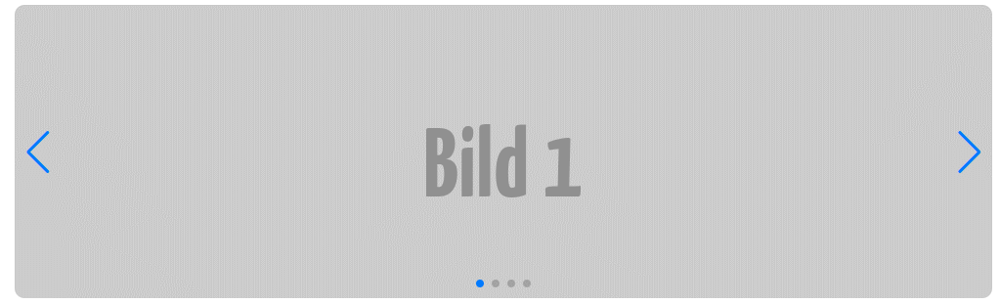

# Bildspel med Swiper.js

--

Vi kommer här att kapa ett bildspel med hjälp av **[Swiper.js](https://swiperjs.com/)**, ett lättanvänt och kraftfullt bibliotek för att skapa responsiva och interaktiva bildspel.

--



---

# Filer

--

Vi behöver skapa filerna **index.html**, **style.css** och **slider.js**

---

# index.html

--

## Steg 1 - Grunderna

```html [8-13, 16-20, 22-24]
<!DOCTYPE html>
<html lang="sv">
  <head>
    <meta charset="UTF-8" />
    <meta name="viewport" content="width=device-width, initial-scale=1.0" />
    <title>Bildspel med Swiper.js</title>

    <link
      rel="stylesheet"
      href="https://cdn.jsdelivr.net/npm/swiper@11/swiper-bundle.min.css"
    />

    <link rel="stylesheet" href="style.css" />
  </head>
  <body>
    <div class="swiper-container">
      <div class="swiper-wrapper">
        <!-- Här ska vi ha bilderna -->
      </div>
    </div>

    <!-- Skripten -->
    <script src="https://cdn.jsdelivr.net/npm/swiper@11/swiper-bundle.min.js"></script>
    <script src="swiper.js"></script>
  </body>
</html>
```

--

## Steg 2 - Bilderna

```html [18-41]
<!DOCTYPE html>
<html lang="sv">
  <head>
    <meta charset="UTF-8" />
    <meta name="viewport" content="width=device-width, initial-scale=1.0" />
    <title>Bildspel med Swiper.js</title>

    <link
      rel="stylesheet"
      href="https://cdn.jsdelivr.net/npm/swiper@11/swiper-bundle.min.css"
    />

    <link rel="stylesheet" href="style.css" />
  </head>
  <body>
    <div class="swiper-container">
      <div class="swiper-wrapper">
        <div class="swiper-slide">
          
        </div>

        <div class="swiper-slide">
          
        </div>

        <div class="swiper-slide">
          
        </div>

        <div class="swiper-slide">
          
        </div>
      </div>

    <!-- Skripten -->
    <script src="https://cdn.jsdelivr.net/npm/swiper@11/swiper-bundle.min.js"></script>
    <script src="swiper.js"></script>
  </body>
</html>
```

--

## Steg 3 - Navigationen

```html [44-49]
<!DOCTYPE html>
<html lang="sv">
  <head>
    <meta charset="UTF-8" />
    <meta name="viewport" content="width=device-width, initial-scale=1.0" />
    <title>Bildspel med Swiper.js</title>

    <link
      rel="stylesheet"
      href="https://cdn.jsdelivr.net/npm/swiper@11/swiper-bundle.min.css"
    />

    <link rel="stylesheet" href="style.css" />
  </head>
  <body>
    <div class="swiper-container">
      <div class="swiper-wrapper">
        <div class="swiper-slide">
          
        </div>

        <div class="swiper-slide">
          
        </div>

        <div class="swiper-slide">
          
        </div>

        <div class="swiper-slide">
          
        </div>
      </div>

      <!-- Navigationsknappar -->
      <div class="swiper-button-next"></div>
      <div class="swiper-button-prev"></div>

      <!-- Sidindikatorer -->
      <div class="swiper-pagination"></div>
    </div>

    <!-- Skripten -->
    <script src="https://cdn.jsdelivr.net/npm/swiper@11/swiper-bundle.min.js"></script>
    <script src="swiper.js"></script>
  </body>
</html>
```

---

# style.css

--

```css []
.swiper {
  max-width: 1000px;
  height: 300px;
  margin: 0 auto;
}

.swiper-slide img {
  width: 100%;
  height: 100%;
  object-fit: cover;
  border-radius: 10px;
}
```

---

# swiper.js

--

```js
document.addEventListener("DOMContentLoaded", function () {
  const swiper = new Swiper(".swiper", {
    loop: true,
    navigation: {
      nextEl: ".swiper-button-next",
      prevEl: ".swiper-button-prev",
    },
    pagination: {
      el: ".swiper-pagination",
      clickable: true,
    },
    autoplay: {
      delay: 2000,
      disableOnInteraction: false,
    },
  });
});
```

---

# Slut!
