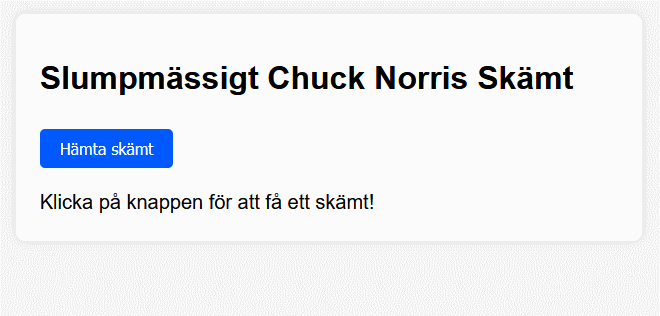

# Använda JavaScript med <br>Chuck Norris API

---

# Mål

--

Vi kommer att gå igenom hur du kan använda JavaScript för att hämta data från [Chuck Norris API](https://api.chucknorris.io/) och visa ett skämt på en webbsida.

--



---

# API

--

Ett **API** är en uppsättning funktioner och protokoll som gör det möjligt för programvara att kommunicera med andra program eller tjänster.

API:er fungerar som en mellanhand som gör det möjligt att skicka och ta emot data mellan olika system.

---

# index.html

```html [8, 11-15]
<!DOCTYPE html>
<html lang="sv">
  <head>
    <meta charset="UTF-8" />
    <meta name="viewport" content="width=device-width, initial-scale=1.0" />
    <title>Chuck Norris Skämt</title>
    <link rel="stylesheet" href="style.css" />
    <script src="app.js" defer></script>
  </head>
  <body>
    <div class="container">
      <h1>Slumpmässigt Chuck Norris Skämt</h1>
      <p id="joke">Klicka på knappen för att få ett skämt!</p>
      <button id="jokeBtn">Hämta skämt</button>
    </div>
  </body>
</html>
```

--

## defer?

Skriptet laddas parallellt med att HTML-dokumentet tolkas.

När hela dokumentet är laddat och klart, körs (exekveras) skriptet i den ordning det visas i HTML-koden.

---

# style.css

--

```css []
body {
  background-color: #f4f4f4;
  margin: 0;
  padding: 0;
}

.container {
  font-family: Arial, "Helvetica Neue", Helvetica, sans-serif;

  background: white;

  border-radius: 10px;
  box-shadow: 0px 0px 10px rgba(0, 0, 0, 0.1);

  width: 65ch;

  padding: 1.5rem;
  margin-inline: auto;
  margin-block-start: 2rem;
}

#joke {
  font-size: 1.25rem;
  line-height: 1.45;

  margin-block-end: 0;
}

button {
  background: #0059ff;

  font-size: 1rem;
  color: white;

  border: none;
  border-radius: 5px;

  padding: 10px 20px;
  margin-block-start: 10px;

  cursor: pointer;
}

button:hover {
  background: #001bcc;
}
```

---

# app.js

--

```js []
// Hämta referenser till HTML-element
const jokeEl = document.getElementById("joke");
const jokeBtn = document.getElementById("jokeBtn");

// Funktion som hämtar ett skämt från API:et
async function fetchJoke() {
  try {
    const response = await fetch("https://api.chucknorris.io/jokes/random");
    const data = await response.json();
    jokeEl.textContent = data.value;
  } catch (error) {
    jokeEl.textContent = "Kunde inte hämta skämt. Försök igen senare!";
  }
}

// Lägg till en klickhändelse på knappen
jokeBtn.addEventListener("click", fetchJoke);
```

--

## Förklaring av koden

--

### Hämtar HTML-element

**document.getElementById('joke')**
**document.getElementById('jokeBtn')**

Används för att koppla (skapa en referens) JavaScript till HTML-elementen.

--

### Skapar en funktion för att hämta data

**fetch()** används för att hämta data från API:et.

**await response.json()** omvandlar API-svaret till [JSON-format](https://www.w3schools.com/js/js_json_intro.asp).

**jokeEl.textContent = data.value;** visar skämtet i HTML-elementet.

--

### Lägger till en klickhändelse på knappen

**jokeBtn.addEventListener('click', fetchJoke);** gör att skämtet hämtas när knappen klickas.

---

# SLUT!
