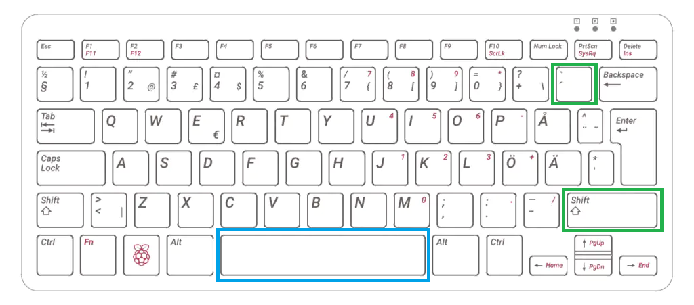
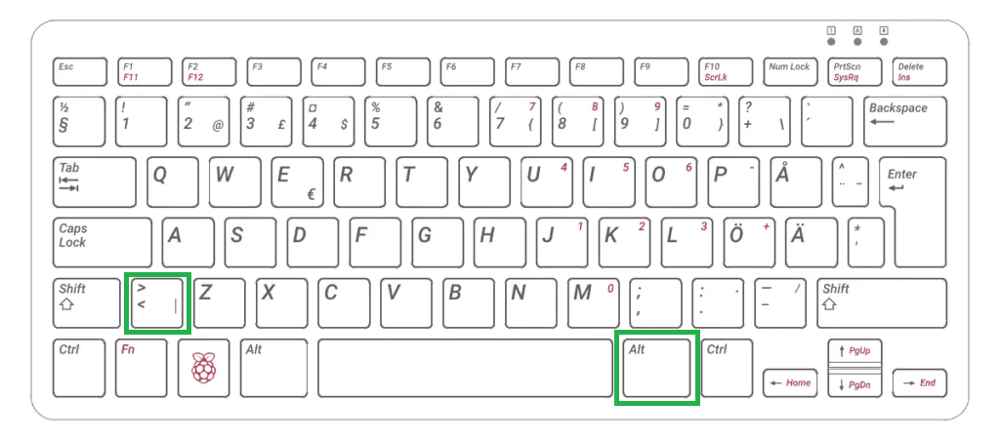
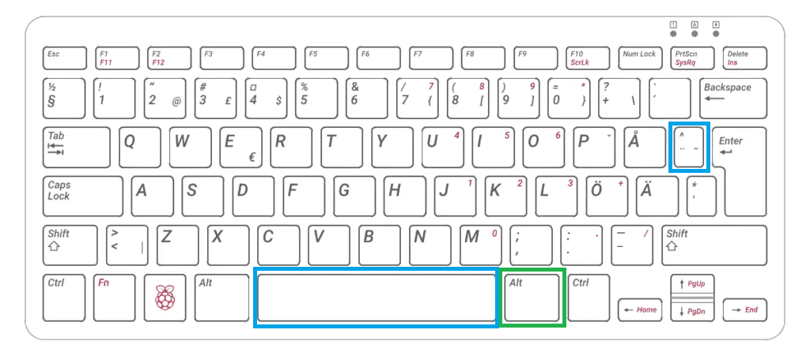

# Markdown

---

# Vad är Markdown?

--

Ett lättviktigt markup-språk (precis som HTML)

--

Enkel syntax för att formatera text

--

Används ofta för dokumentation, README-filer och wiki-sidor

--

Filändelsen är **md**, t.ex **README.md**

--

Inbyggt stöd i VSC.

---

# Rubriker

--

```markdown []
# Rubrik 1

## Rubrik 2

### Rubrik 3
```

Här har vi en **h1**, **h2** och en **h3:a**

Vi har, precis som i HTML, nivå 1-6

---

# Stycken

--

```markdown []
Här kommer ett stycke med text om Markdown.

Här kommer det ett till stycke med text om JavaScript.
```

Stycken separeras med en radbrytning.

---

# Fet stil

--

```markdown []
**Fet text**
```

---

# Kursiv stil

--

```markdown []
_Kursiv text_
```

---

# Genomstruken text

--

```markdown []
~~Genomstruken text~~
```

---

# Länkar

--

```markdown []
[GitHub](https://github.com)
```

---

# Bilder

--

```markdown []

```

---

# Listor

--

## Oordnade listor

```markdown []
- Punkt 1
- Punkt 2
  - Underpunkt
```

--

## Numrerade listor

```markdown []
1. Första punkten
1. Andra punkten
```

--

## Uppgiftslistor

```markdown []
- [x] Klara av första uppgiften
- [ ] Göra klart nästa del
```

---

# Kodblock

--

## Inline-kod

```markdown []
`detta är kod`
```

Använder sig av **backtick** (grav accent, omvänt citattecken)

--

## Block av kod

````markdown []
```javascript
console.log("Hej världen!");
```
````

Använder sig av tre **backtick** samt namnet på språket.

---

# Blockcitat

--

```markdown
> Detta är ett citat.
```

---

# Tabeller

--

```markdown []
| Kolumn 1 | Kolumn 2 |
| -------- | -------- |
| Värde 1  | Värde 2  |
| Värde 3  | Värde 4  |
```

Vi skapar tabeller med hjälp av rör **|** och bindestreck **-**.

Första raden i exemplet är **beskrivande celler** (th) och öviga är **dateceller** (td)

--

## Justering av text i tabeller

**Vänsterjustering**

Kolon till vänster **:---**

**Högerjustering**

Kolon till höger **---:**

**Centrering**

Kolon på båda sidor **:---:**

--

```markdown []
| Vänster | Centrerad |  Höger |
| :------ | :-------: | -----: |
| Text 1  |  Text 2   | Text 3 |
| Text 4  |  Text 5   | Text 6 |
```

---

# Tangentbordskombinationer

--

## Backtick, `



Tryck **SHIFT + BACKTICK**, släpp upp och tryck **mellanslag**

--

## Rör, |



Tryck **HÖGER ALT (GR) + >**

--

## Tilde, ~



Tryck **HÖGER ALT (GR) + ^**, släpp upp och tryck **mellanslag**

---

# Lokal VSC

--

Installera [Markdown Shortcuts](https://marketplace.visualstudio.com/items?itemName=mdickin.markdown-shortcuts) för att få tillgång till fler kortkommandon.

---

# "Bra att ha"-källor

--

## GitHub Markdown

[Basic writing and formatting syntax](https://docs.github.com/en/get-started/writing-on-github/getting-started-with-writing-and-formatting-on-github/basic-writing-and-formatting-syntax)

[Working with advanced formatting](https://docs.github.com/en/get-started/writing-on-github/working-with-advanced-formatting)

--

## Övrigt

[markdowntutorial.com - Interaktiv kurs](https://www.markdowntutorial.com/)

[commonmark.org - Interaktiv kurs](https://commonmark.org/help/tutorial/)

[commonmark.org - "Fusklapp"](https://commonmark.org/help/)

---

# SLUT!
