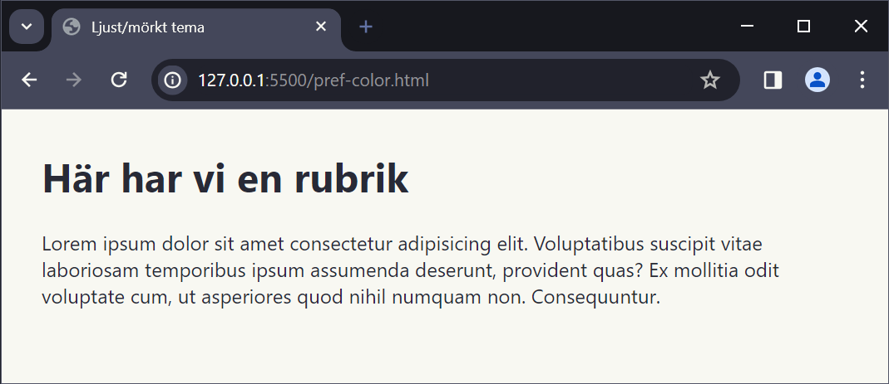
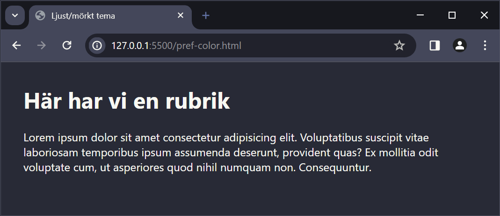

# Mörkt/ljust tema

---

# Systemval

--

```css []
:root {
  --clr-background: #f8f8f2;
  --clr-text: #282a36;
}

@media (prefers-color-scheme: dark) {
  :root {
    --clr-background: #282a36;
    --clr-text: #f8f8f2;
  }
}

body {
  background-color: var(--clr-background);
  color: var(--clr-text);
}
```

--



--



---

# Switchare

--

Ett sätt att hantera tema är att använda **JavaScript** och **localStorage**.

Bygger på artikeln [Musthaq Ahamad - Dark and Light theme switcher using CSS variables and pure JavaScript](https://medium.com/@haxzie/dark-and-light-theme-switcher-using-css-variables-and-pure-javascript-zocada-dd0059d72fa2)

--

## HTML-kod

--

### Första sidan

```html []
<html lang="sv" class="theme-light">
  ...
<input
  type="checkbox"
  name="themeSwitcher"
  id="themeSwitcher"
  class="themeSwitcher"
/>
<label for="themeSwitcher">Ändra tema</label>

<p><a href="page.html">En annan del av webbplatsen</a></p>

<script src="theme.js"></script>
```

--

### Andra sidan

```html []
<html lang="sv" class="theme-light">
  ...
<input
  type="checkbox"
  name="themeSwitcher"
  id="themeSwitcher"
  class="themeSwitcher"
/>
<label for="themeSwitcher">Ändra tema</label>

<p><a href="index.html">Till startsidan</a></p>

<script src="theme.js"></script>
```

--

## CSS:en

--

```css []
.theme-light {
  --clr-background: #f8f8f2;
  --clr-text: #282a36;
}

.theme-dark {
  --clr-background: #282a36;
  --clr-text: #f8f8f2;
}

body {
  background-color: var(--clr-background);
  color: var(--clr-text);
}
```

--

## JS

--

```js []
function setTheme(themeName) {
  localStorage.setItem("theme", themeName);
  document.documentElement.className = themeName;
}

function toggleTheme() {
  if (localStorage.getItem("theme") === "theme-dark") {
    setTheme("theme-light");
  } else {
    setTheme("theme-dark");
  }
}

const themeSwitcher = document.querySelector(".themeSwitcher");

themeSwitcher.addEventListener("change", () => {
  toggleTheme();
});

if (localStorage.getItem("theme") === "theme-dark") {
  setTheme("theme-dark");
  themeSwitcher.checked = false;
} else {
  setTheme("theme-light");
  themeSwitcher.checked = true;
}
```

---

# Fördjupning

--

[MDN - prefers-color-scheme](https://developer.mozilla.org/en-US/docs/Web/CSS/@media/prefers-color-scheme)

[Musthaq Ahamad - Dark and Light theme switcher using CSS variables and pure JavaScript](https://medium.com/@haxzie/dark-and-light-theme-switcher-using-css-variables-and-pure-javascript-zocada-dd0059d72fa2)

---

# Slut