# Media Query

---

# Media Query?

--

En Media Query används för att göra webbsidor **responsiva** så att de ser bra ut på olika enheter och skärmstorlekar.

---

# Media Query Syntax - Några exempel

--

## Anpassning efter skärm(fönster)storlek

--

```css[]
body {
  background-color: rebeccapurple;
}

@media only screen and (max-width: 600px) {
  body {
    background-color: dodgerblue;
  }
}
```

--

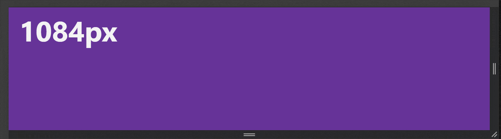

Här ser vi att bakgrundsfärgen ändras när fönstret blir mindre än 600 pixlar i bredd.

--

## Anpassning efter enhetens orientering

--

```css []
body {
  background-color: rebeccapurple;
}

@media only screen and (orientation: landscape) {
  body {
    background-color: dodgerblue;
  }
}
```

--

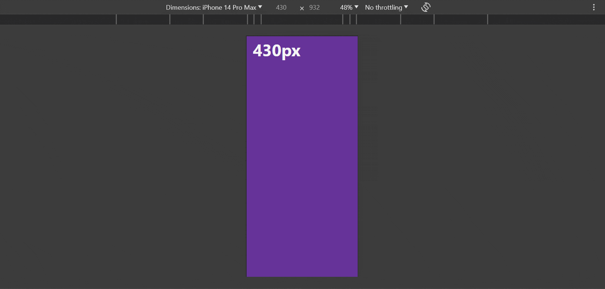

Här ser vi att bakgrundsfärgen ändras när skärmen roteras.

--

## Modernt sätt att ange bredd

--

```css []
body {
  background-color: rebeccapurple;
}

@media (width < 900px) {
  body {
    background-color: darkorange;
  }
}

@media (width < 600px) {
  body {
    background-color: dodgerblue;
  }
}
```

--

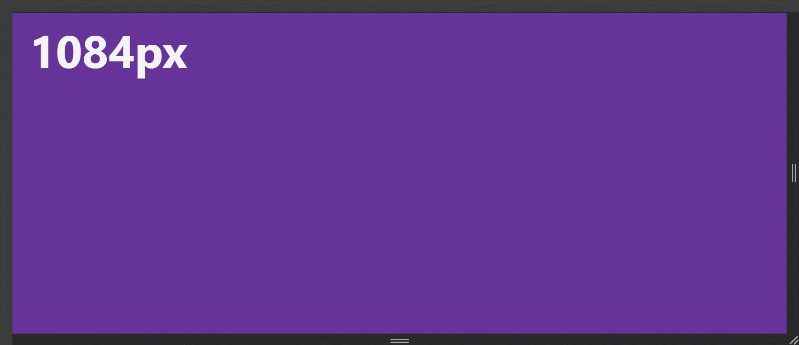

Här ser vi att bakgrundsfärgen ändras när fönstret blir mindre än 900 respektive 600 pixlar i bredd.

--

```css []
body {
  background-color: rebeccapurple;
}

@media (600px < width < 900px) {
  body {
    background-color: dodgerblue;
  }
}
```

--


Här ser vi att bakgrundfärgen ändras när fönstret är mellan 600 och 900 pixlar i bredd.

---

# Desktop first

--

Ett vanligt sätt att arbeta med media queries är att börja med desktop versionen och sedan skala ner till mindre brytpunkter.

--

## HTML-koden

--

```html []
<div class="wrapper">
  <header class="header">Header</header>
  <nav class="globalnav">Globalnav</nav>
  <main class="main">Main</main>
  <aside class="aside">Aside</aside>
  <footer class="footer">Footer</footer>
</div>
```

--

## CSS-koden

--

```css []
.wrapper {
  min-height: 100dvh;

  display: grid;
  grid-template-columns: minmax(300px, 2fr) 8fr minmax(200px, 2fr);
  grid-template-rows: auto 1fr auto;
}

.header {
  grid-column: 1 / -1;
}

.footer {
  grid-column: 1 / -1;
}
```

--

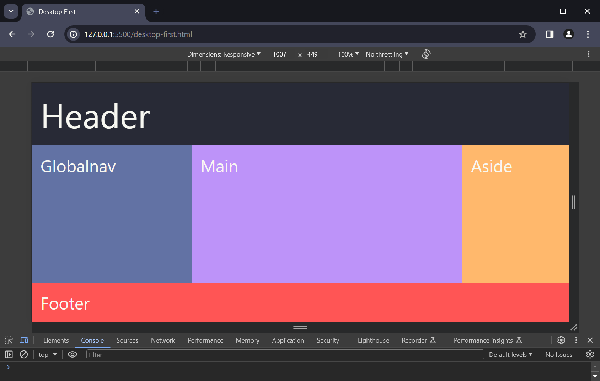

--

```css []
@media (width < 1000px) {
  .wrapper {
    grid-template-columns: 10fr minmax(200px, 2fr);
    grid-template-rows: auto auto 1fr auto;
  }

  .globalnav {
    grid-column: 1 / -1;
  }
}
```

--

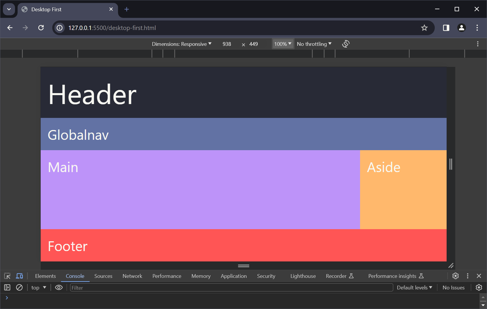

--


--

```css []
@media (width < 600px) {
  .wrapper {
    grid-template-columns: 1fr;
  }

  .globalnav {
    grid-column: 1 / -1;
  }

  .aside {
    display: none;
  }
}
```

--

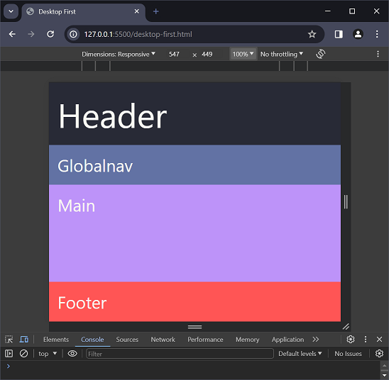

--

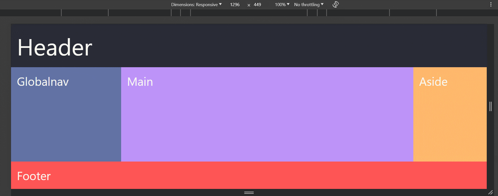

---

# Mobile First

--

En annan vanlig teknik är att börja med mobilversionen och sedan skala upp med brytpunkter till desktop.

--

## HTML-koden

--

```html []
<div class="wrapper">
  <header class="header">Header</header>
  <nav class="globalnav">Globalnav</nav>
  <main class="main">Main</main>
  <aside class="aside">Aside</aside>
  <footer class="footer">Footer</footer>
</div>
```

--

## CSS-koden

--

```css []
.wrapper {
  min-height: 100dvh;
  background-color: #faebd7;

  display: grid;
  grid-template-columns: 1fr;
  grid-template-rows: auto auto 1fr auto;
}

.aside {
  display: none;
}
```

--

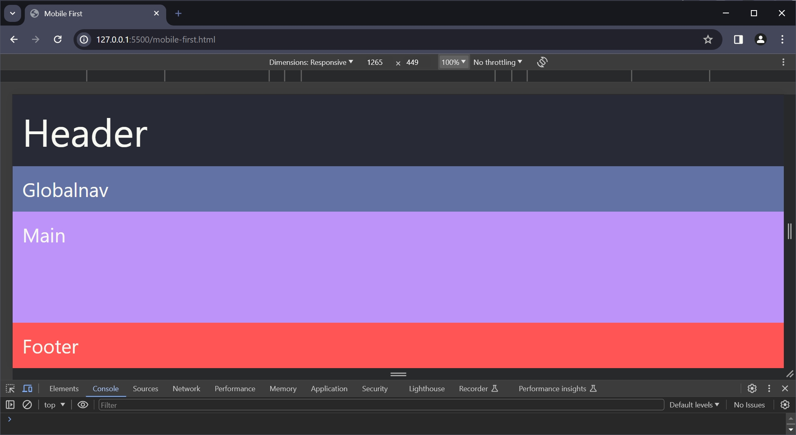

--

```css []
@media (width > 600px) {
  .wrapper {
    grid-template-columns: 10fr minmax(200px, 2fr);
    grid-template-rows: auto auto 1fr auto;
  }

  .header {
    grid-column: 1 / -1;
  }

  .globalnav {
    grid-column: 1 / -1;
  }

  .aside {
    display: block;
  }

  .footer {
    grid-column: 1 / -1;
  }
}
```

--

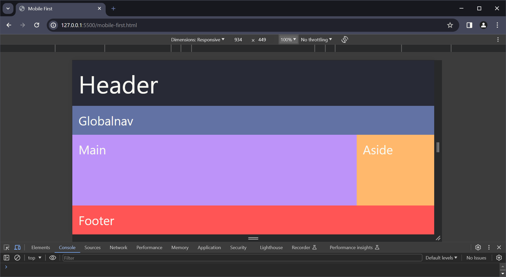

--

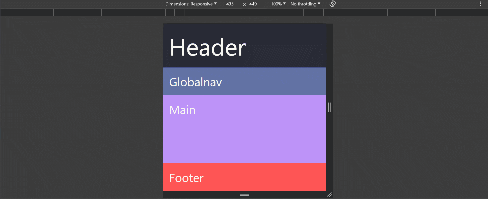

--

```css []
@media (width > 1000px) {
  .wrapper {
    display: grid;
    grid-template-columns: minmax(300px, 2fr) 8fr minmax(200px, 2fr);
    grid-template-rows: auto 1fr auto;
  }

  .globalnav {
    grid-column: 1 / 2;
  }
}
```

--

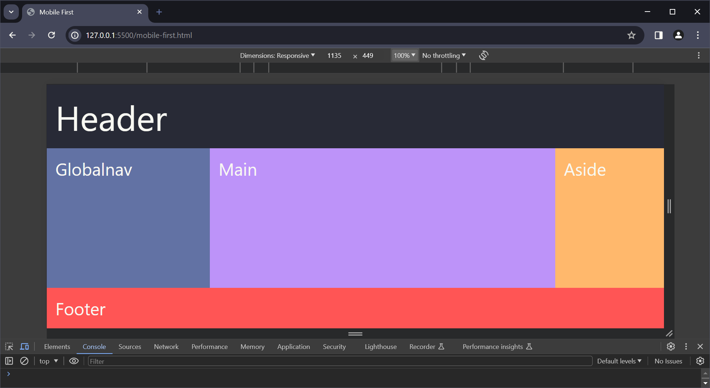

--

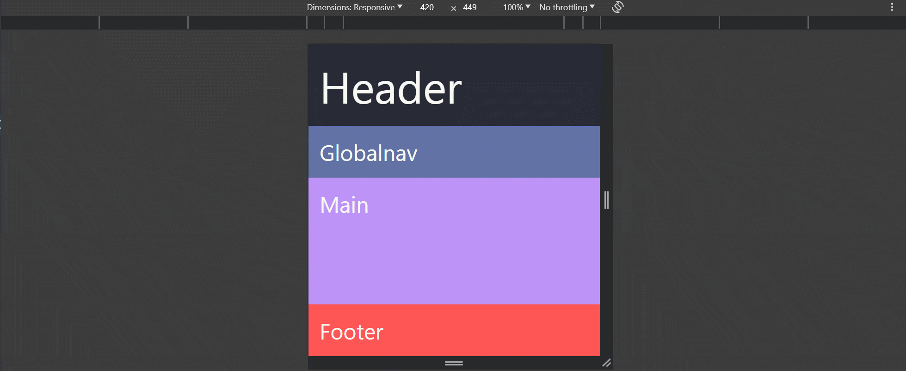

---

# Slut