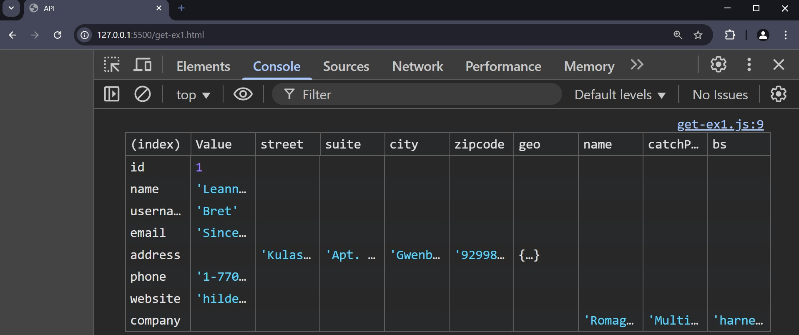
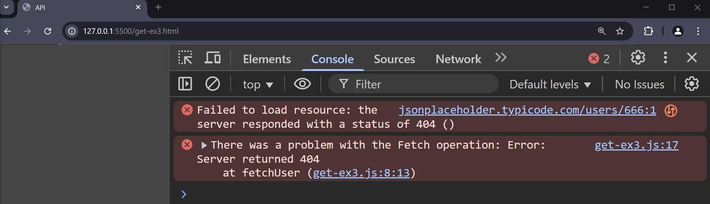
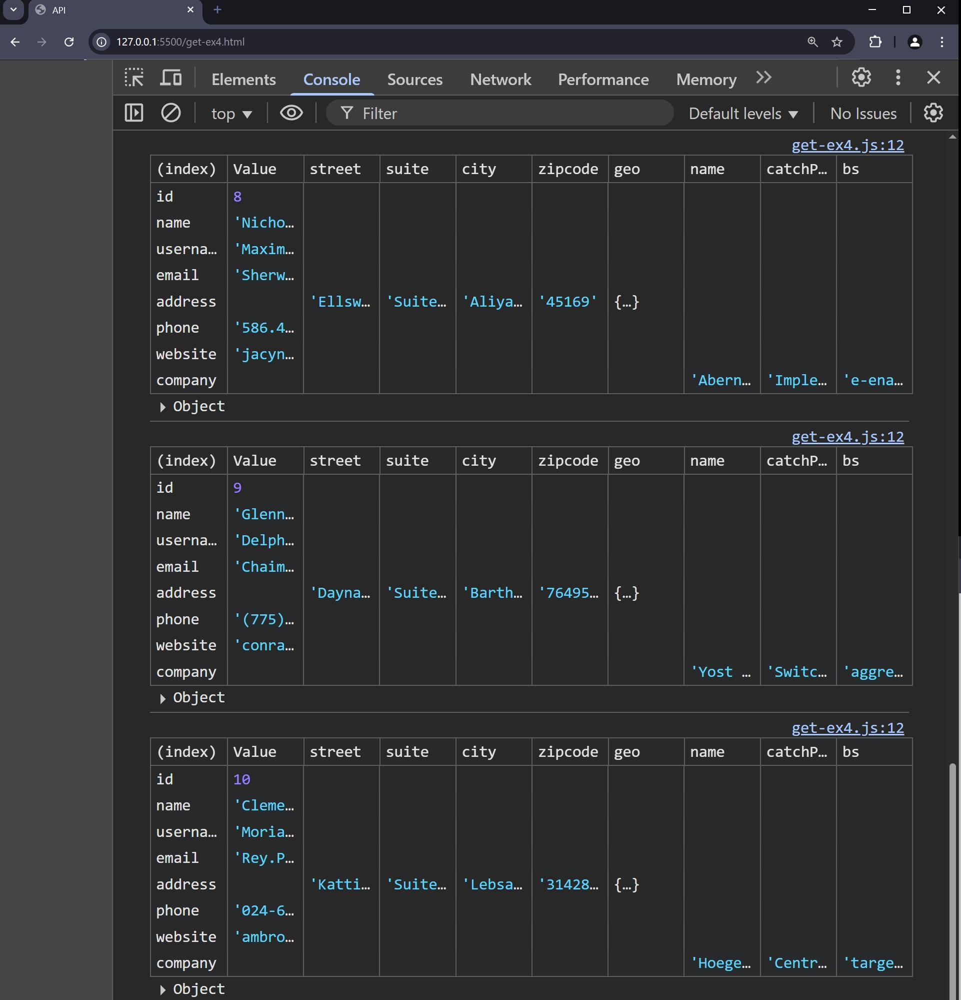
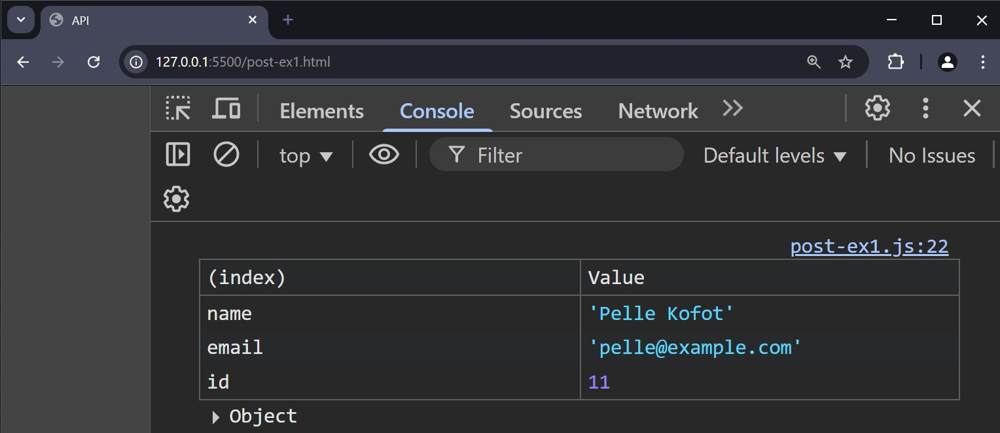
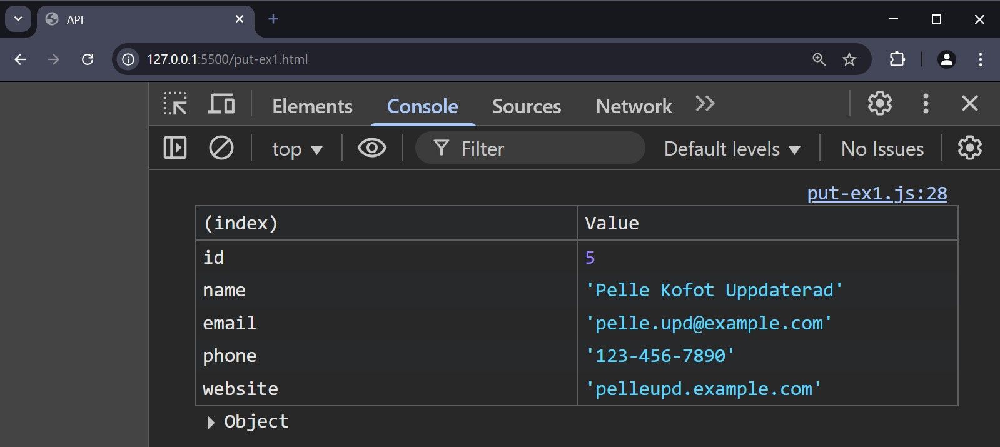
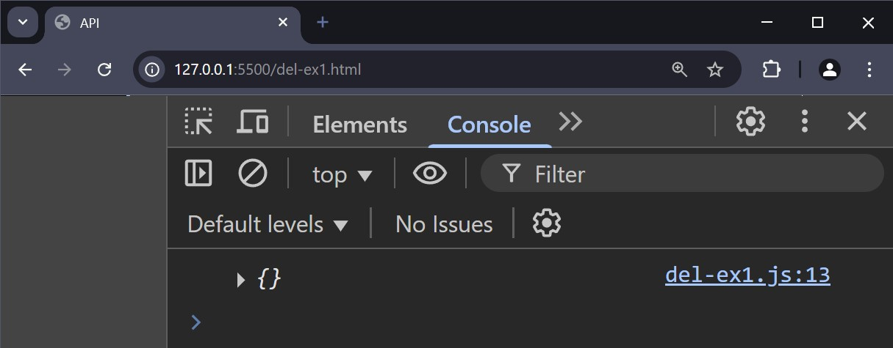

# API

--

## Application Programming Interface

--

Ett sätt för olika system att kommunicera med varandra.

---

# REST API

--

## Introduktion

API som bygger på **REST**-arkitekturen (Representational State Transfer)

Använder **standardiserade HTTP-metoder** för att utföra operationer på resurser.

Är **stateless** vilket innebär att varje förfrågan innehåller all information som behövs.

Representerar data i vanliga format som **JSON** eller **XML**

--

## HTTP-metoder

**GET**: För att hämta data

**POST**: För att skicka data

**PUT**: För att uppdatera data

**DELETE**: För att radera data

---

# JSON

--

JavaScript Object Notation

Är ett format för att utbyta data mellan en server och en klient, och det är oberoende av programmeringsspråk.

Använder sig av en enkel textbaserad syntax för att representera datastrukturer.

--

```json []
{
  "name": "Pelle Kanin",
  "age": 30,
  "isStudent": false,
  "languages": ["JavaScript", "Python", "PHP"],
  "address": {
    "street": "Storgatan 34",
    "city": "Nycopia",
    "country": "Sverige"
  }
}
```

---

# GET

--

## GET - Exempel 1

```js []
async function fetchUser() {
  try {
    const response = await fetch(
      "https://jsonplaceholder.typicode.com/users/1"
    );
    const data = await response.json();
    console.table(data);
  } catch (error) {
    console.log(error);
  }
}

fetchUser();
```

--

```js
async function fetchUser()
```

Definierar en asynkron funktion.

**async** betyder att funktionen kommer att använda **await** inuti sig, vilket gör att den kan hantera asynkrona operationer på ett enklare sätt.

--

```js
try {
  ...
}
catch (error) {
  ...
}
```

Inom **try**-blocket försöker koden att köra en asynkron uppgift (hämta data).

Om något går fel, till exempel om nätverksanropet misslyckas, fångas felet av **catch**-blocket och skrivs ut i konsolen.

--

```js
const response = await fetch("...");
```

**fetch()** används för att göra ett HTTP-anrop till API:et

**await** gör så att koden "väntar" på att svaret från API:et ska komma innan den går vidare till nästa rad.

**response** kommer att innehålla svaret från servern, men detta svar måste omvandlas till JSON-format.

--

```js
const data = await response.json();
```

Omvandlar svaret från **fetch** till ett JavaScript-objekt (JSON-format) genom att använda **response.json()**.

Eftersom **json()** är en asynkron funktion, används **await** för att vänta på att operationen ska slutföras innan vi går vidare.

--

```js
console.table(data);
```

Skriver ut data i en tabellform i webbläsarens konsol.

--

```js
catch (error) {
  console.log(error);
}
```

Om något går fel vid någon punkt i **try**-blocket, kommer felet att fångas här och skrivas ut i konsolen.

--

```js
fetchUser();
```

Anropar funktionen **fetchUser** för att köra den.

--



--

## GET - Exempel 2

```html []
<div class="app">
  <h1 class="name"></h1>
  <p class="email"></p>
</div>
```

--

```js [8-9]
async function fetchUser() {
  try {
    const response = await fetch(
      "https://jsonplaceholder.typicode.com/users/1"
    );
    const data = await response.json();

    document.querySelector(".name").textContent = data.name;
    document.querySelector(".email").textContent = data.email;
  } catch (error) {
    console.log(error);
  }
}

fetchUser();
```

--


--

## GET - Exempel 3

```js [7-9]
async function fetchUser() {
  try {
    const response = await fetch(
      "https://jsonplaceholder.typicode.com/users/666"
    );

    if (!response.ok) {
      throw new Error("Server returned " + response.status);
    }

    const data = await response.json();

    document.querySelector(".name").textContent = data.name;
    document.querySelector(".email").textContent = data.email;
  } catch (error) {
    console.error("There was a problem with the Fetch operation:", error);
  }
}

fetchUser();
```

--



--

## GET - Exempel 4

```js [3, 11-13]
async function fetchUsers() {
  try {
    const response = await fetch("https://jsonplaceholder.typicode.com/users/");

    if (!response.ok) {
      throw new Error("Server returned " + response.status);
    }

    const data = await response.json();

    data.forEach((user) => {
      console.table(user);
    });
  } catch (error) {
    console.error("There was a problem with the Fetch operation:", error);
  }
}

fetchUsers();
```

--



--

## GET - Exempel 5

```js [11-26]
async function fetchUsers() {
  try {
    const response = await fetch("https://jsonplaceholder.typicode.com/users/");

    if (!response.ok) {
      throw new Error("Server returned " + response.status);
    }

    const data = await response.json();

    const app = document.querySelector(".app");
    const list = document.createElement("ul");
    let users = document.createDocumentFragment();

    data.forEach((user) => {
      const listitem = document.createElement("li");
      const link = document.createElement("a");
      link.textContent = user.name;
      link.href = `https://jsonplaceholder.typicode.com/users/${user.id}`;

      listitem.appendChild(link);
      users.appendChild(listitem);
    });

    list.appendChild(users);
    app.appendChild(list);
  } catch (error) {
    console.error("There was a problem with the Fetch operation:", error);
  }
}

fetchUsers();
```

--


---

# POST

--

```js []
async function createUser() {
  try {
    const response = await fetch("https://jsonplaceholder.typicode.com/users", {
      method: "POST",
      headers: {
        "Content-Type": "application/json",
      },
      body: JSON.stringify({
        name: "Pelle Kofot",
        email: "pelle@example.com",
      }),
    });

    if (!response.ok) {
      throw new Error("Server returned " + response.status);
    }

    const data = await response.json();
    console.table(data);
  } catch (error) {
    console.error("There was a problem with the Fetch operation:", error);
  }
}

createUser();
```

--

Här görs ett HTTP-anrop (en **POST**-förfrågan) där vi skickar med datan vi vill skriva till servern.

**await** används för att vänta på att fetch-anropet ska slutföras. Detta gör att funktionen inte fortsätter förrän svar (**response**) har mottagits från servern.

--



---

# PUT

--

```js []
async function updateUser() {
  try {
    const response = await fetch(
      "https://jsonplaceholder.typicode.com/users/5",
      {
        method: "PUT",
        headers: {
          "Content-Type": "application/json",
        },
        body: JSON.stringify({
          id: 5,
          name: "Pelle Kofot Uppdaterad",
          email: "pelle.upd@example.com",
          phone: "123-456-7890",
          website: "pelleupd.example.com",
        }),
      }
    );

    if (!response.ok) {
      throw new Error("Server returned " + response.status);
    }

    const data = await response.json();
    console.table(data);
  } catch (error) {
    console.error("There was a problem with the Fetch operation:", error);
  }
}

updateUser();
```

--



---

# DELETE

--

```js []
async function deleteUser() {
  try {
    const response = await fetch(
      "https://jsonplaceholder.typicode.com/users/5",
      {
        method: "DELETE",
      }
    );

    const data = await response.json();
    console.log(data);
  } catch (error) {
    console.error("There was a problem with the Fetch operation:", error);
  }
}

deleteUser();
```

--



---

# SLUT!
