# API

--

## Application Programming Interface

--

Ett sätt för olika system att kommunicera med varandra.

---

# REST API

--

## Introduktion

API som bygger på **REST**-arkitekturen (Representational State Transfer)

Använder **standardiserade HTTP-metoder** för att utföra operationer på resurser.

Är **stateless** vilket innebär att varje förfrågan innehåller all information som behövs.

Representerar data i vanliga format som **JSON** eller **XML**

--

## HTTP-metoder

**GET**: För att hämta data

**POST**: För att skicka data

**PUT**: För att uppdatera data

**DELETE**: För att radera data

---

# JSON

--

JavaScript Object Notation

Är ett format för att utbyta data mellan en server och en klient, och det är oberoende av programmeringsspråk.

Använder sig av en enkel textbaserad syntax för att representera datastrukturer.

--

```json []
{
  "name": "Pelle Kanin",
  "age": 30,
  "isStudent": false,
  "languages": ["JavaScript", "Python", "PHP"],
  "address": {
    "street": "Storgatan 34",
    "city": "Nycopia",
    "country": "Sverige"
  }
}
```

---

# Fetch

--

## Modernt

Ett modernt sätt att arbeta med webbaserade API:er.

--

## Enkelhet

**Fetch API** använder ett enkelt och intuitivt gränssnitt för att göra HTTP-förfrågningar och hantera svar.

--

## Promises-baserad

**Fetch API** använder **Promises**, vilket gör det möjligt att hantera asynkrona operationer på ett mer läsbart och hanterbart sätt.

--

## Inbyggd stöd för JSON

**Fetch API** gör det enkelt att skicka och ta emot **JSON-data**, vilket är vanligt i modern webbutveckling.

---

# Exempel 1

--

```js []
fetch("https://jsonplaceholder.typicode.com/users/1")
  .then((response) => console.table(response))
  .catch((error) => console.log(error));
```

--

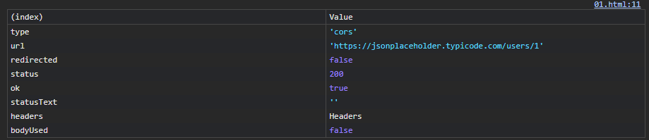

--

## CORS

**CORS** (Cross-Origin Resource Sharing) är en mekanism som tillåter webbläsare att göra säkra _cross-origin-requests_ mellan olika webbplatser.

En **origin** definieras av protokollet (HTTP, HTTPS), domännamnet och portnumret på en webbplats.

---

# Exempel 2

--

```js [3]
fetch("https://jsonplaceholder.typicode.com/users/1")
  .then((response) => response.json())
  .then((data) => console.table(data))
  .catch((error) => console.log(error));
```

--

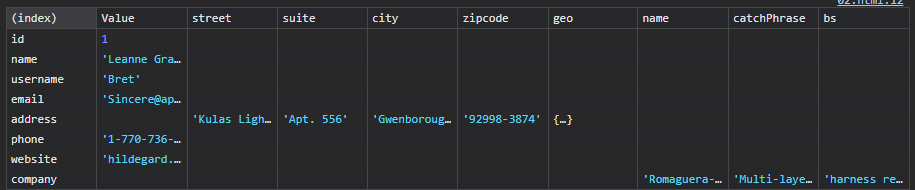

---

# Exempel 3

--

```html []
<div class="app">
  <h1 class="name"></h1>
  <p class="email"></p>
</div>
```

--

```js [3-6]
fetch("https://jsonplaceholder.typicode.com/users/1")
  .then((response) => response.json())
  .then((data) => {
    document.querySelector(".name").textContent = data.name;
    document.querySelector(".email").textContent = data.email;
  })
  .catch((error) => console.log(error));
```

--

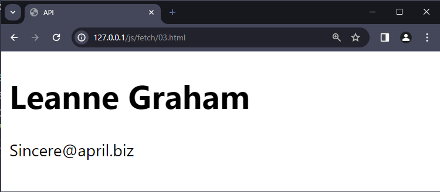

---

# Exempel 4

--

```js [2-8, 13-15]
fetch("https://jsonplaceholder.typicode.com/users/666")
  .then((response) => {
    if (!response.ok) {
      throw new Error("Server returned " + response.status);
    }

    return response.json();
  })
  .then((data) => {
    document.querySelector(".name").textContent = data.name;
    document.querySelector(".email").textContent = data.email;
  })
  .catch((error) => {
    console.error("There was a problem with the Fetch operation:", error);
  });
```

--

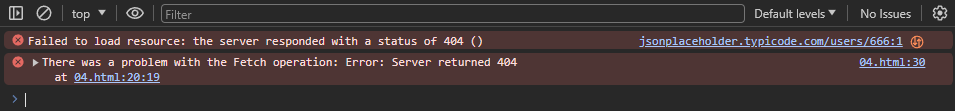

---

# Exempel 5

--

```js [9-13]
fetch("https://jsonplaceholder.typicode.com/users/")
  .then((response) => {
    if (!response.ok) {
      throw new Error("Server returned " + response.status);
    }

    return response.json();
  })
  .then((data) => {
    data.forEach((post) => {
      console.table(post);
    });
  })
  .catch((error) => {
    console.error("There was a problem with the Fetch operation:", error);
  });
```

--

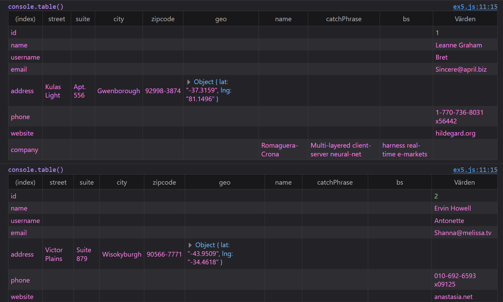

--

```js [9-13]
fetch("https://jsonplaceholder.typicode.com/users/")
  .then((response) => {
    if (!response.ok) {
      throw new Error("Server returned " + response.status);
    }

    return response.json();
  })
  .then((data) => {
    data.forEach((post) => {
      console.log(post.name);
    });
  })
  .catch((error) => {
    console.error("There was a problem with the Fetch operation:", error);
  });
```

--

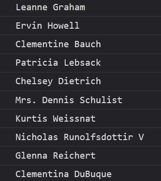

--

```js [9-25]
fetch("https://jsonplaceholder.typicode.com/users/")
  .then((response) => {
    if (!response.ok) {
      throw new Error("Server returned " + response.status);
    }

    return response.json();
  })
  .then((data) => {
    const app = document.querySelector(".app");
    const list = document.createElement("ul");
    let users = document.createDocumentFragment();

    data.forEach((post) => {
      const listitem = document.createElement("li");
      const link = document.createElement("a");
      link.textContent = post.name;
      link.href = `https://jsonplaceholder.typicode.com/users/${post.id}`;

      listitem.appendChild(link);
      users.appendChild(listitem);
    });

    list.appendChild(users);
    app.appendChild(list);
  })
  .catch((error) => {
    console.error("There was a problem with the Fetch operation:", error);
  });
```

--


--

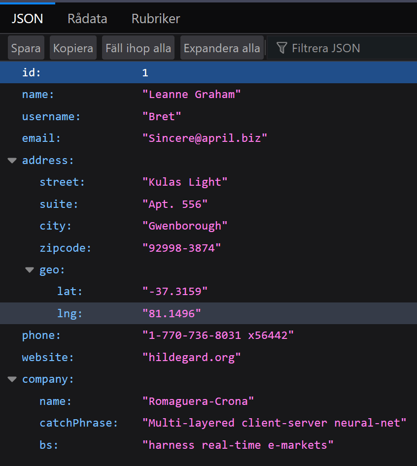

---

# Exempel 6

--

```js [1-10]
fetch("https://jsonplaceholder.typicode.com/users", {
  method: "POST",
  headers: {
    "Content-Type": "application/json",
  },
  body: JSON.stringify({
    name: "Pelle Kofot",
    email: "pelle@example.com",
  }),
})
  .then((response) => {
    if (!response.ok) {
      throw new Error("Server returned " + response.status);
    }

    return response.json();
  })
  .then((data) => console.table(data));
```

--

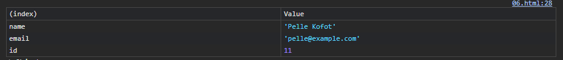

--

## JSON.stringify()

Är en inbyggd funktion i JavaScript som används för att konvertera JavaScript-objekt till en JSON-sträng.

--

```js []
{
  name: "Pelle Kofot",
  email: "pelle@example.com",
}
```

```js []
{"name":"Pelle Kofot","email":"pelle@example.com"}

```

---

# Exempel 7

--

```js []
fetch("https://jsonplaceholder.typicode.com/users/5", {
  method: "PUT",
  headers: {
    "Content-Type": "application/json",
  },
  body: JSON.stringify({
    name: "Pelle Kofot",
    email: "pelle@example.com",
  }),
})
  .then((response) => {
    if (!response.ok) {
      throw new Error("Server returned " + response.status);
    }

    return response.json();
  })
  .then((data) => console.table(data));
```

--


---

# Exempel 8

--

```js []
fetch("https://jsonplaceholder.typicode.com/users/5", {
  method: "DELETE",
})
  .then((response) => response.json())
  .then((data) => console.log(data));
```

--

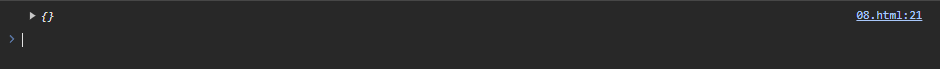

---

# Formulär

--

```html []
<form class="adduser">
  <fieldset>
    <legend>Användare</legend>

    <div class="fh">
      <label for="name">Namn:</label>
      <input
        type="text"
        id="name"
        name="name"
        placeholder="Namnet på användaren"
        required
      />
    </div>

    <div class="fh">
      <label for="email">E-post:</label>
      <input
        type="email"
        id="email"
        name="email"
        placeholder="Användarens e-postadress"
        required
      />
    </div>
  </fieldset>

  <div class="fb">
    <button type="submit">Skicka</button>
    <button type="reset">Rensa</button>
  </div>
</form>
```

--

```js []
const form = document.querySelector(".adduser");

form.addEventListener("submit", (e) => {
  e.preventDefault();

  const name = document.getElementById("name").value;
  const email = document.getElementById("email").value;

  console.log("name", name);
  console.log("email", email);
});
```

--

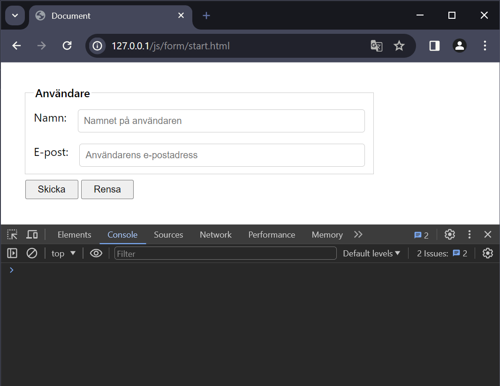

--

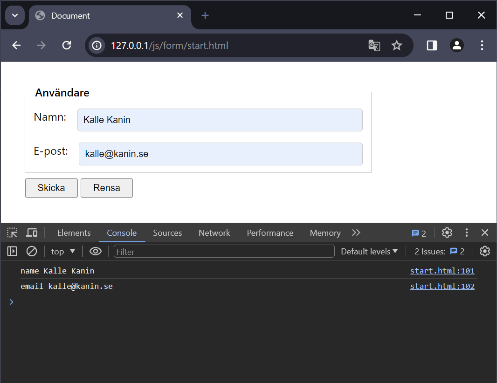

---

# Resurser

--

## API:er

[{JSON} Placeholder](https://jsonplaceholder.typicode.com/)

[chucknorris.io](https://api.chucknorris.io/)

--

## Fördjupning

[JavaScript Fetch API](https://www.w3schools.com/js/js_api_fetch.asp)

[A Guide To Learn Fetch API](https://rapidapi.com/guides/learn-fetch-api)

[Error handling with the Fetch API](https://rapidapi.com/guides/error-handling-fetch)

[JavaScript Fetch API For Beginners – Explained With Code Examples](https://www.freecodecamp.org/news/javascript-fetch-api-for-beginners/)

--

[How To Use the JavaScript Fetch API to Get Data](https://www.digitalocean.com/community/tutorials/how-to-use-the-javascript-fetch-api-to-get-data)

[How to Fetch Data from an API Using the Fetch API in JavaScript](https://www.freecodecamp.org/news/how-to-fetch-data-from-an-api-using-the-fetch-api-in-javascript/)

[What Is Fetch API in JavaScript? How to Use It (with Examples)](https://blog.hubspot.com/website/javascript-fetch-api)

---

# SLUT!
